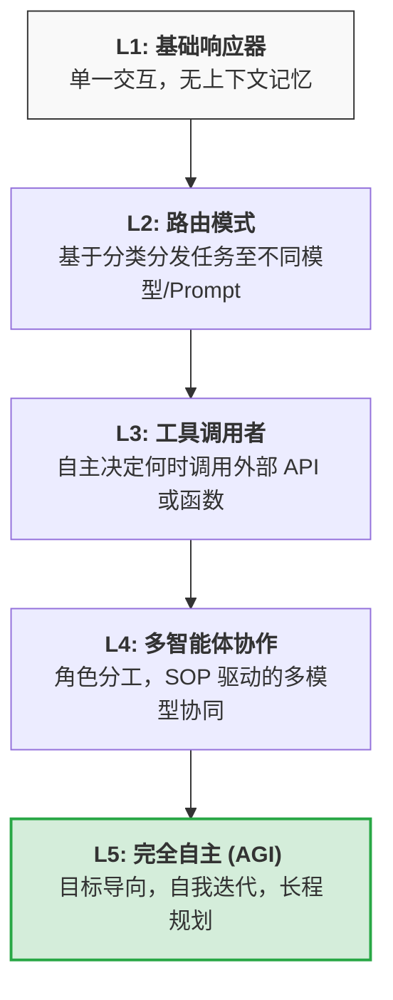
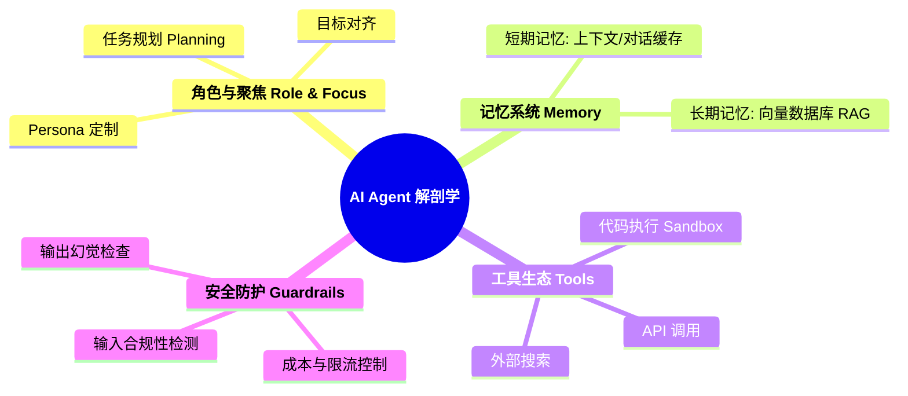

# Agent 概念

## Agent 核心概念和解析

Agent 5级自主性分类体系

```mermaid
graph TD
    L1[<b>L1: 基础响应器</b><br/>单一交互，无上下文记忆] --> L2
    L2[<b>L2: 路由模式</b><br/>基于分类分发任务至不同模型/Prompt] --> L3
    L3[<b>L3: 工具调用者</b><br/>自主决定何时调用外部 API 或函数] --> L4
    L4[<b>L4: 多智能体协作</b><br/>角色分工，SOP 驱动的多模型协同] --> L5
    L5[<b>L5: 完全自主 #40;AGI#41; </b><br/>目标导向，自我迭代，长程规划]

    style L1 fill:#f9f9f9,stroke:#333
    style L5 fill:#d4edda,stroke:#28a745,stroke-width:2px
```

Agent 核心内部机理

```mermaid
mindmap
  root((<b>AI Agent 解剖学</b>))
    <b>角色与聚焦 Role & Focus</b>
      Persona 定制
      目标对齐
      任务规划 Planning
    <b>记忆系统 Memory</b>
      短期记忆: 上下文/对话缓存
      长期记忆: 向量数据库 RAG
    <b>工具生态 Tools</b>
      API 调用
      代码执行 Sandbox
      外部搜索
    <b>安全防护 Guardrails</b>
      输入合规性检测
      输出幻觉检查
      成本与限流控制
```

Agent 趋势

- ReAct（推理+行动）
- Reflexion（自我反思）
- AutoGPT（自主规划）
- Multi-Agent（协作涌现）