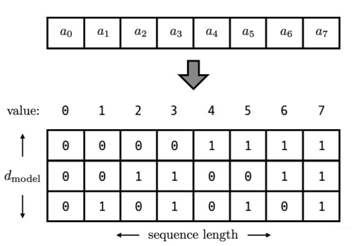

# 位置编码

# 什么是位置编码

位置对于 self-attention 来说，是无法分辩的信息，因为 self-attention 的运算是无向的。因此需要把 tokens 的位置信息告诉模型

在 transformer 的 encoder 和 decoder 的输入层中，使用了 Positional Encoding，使得最终的输入满足：$input = input\_embedding + positional\_encoding$

# 位置编码演变

## 整数标记

一种自然而然的想法是，给第一个 token 标记1，给第二个 token 标记2，以此类推。

这种方法产生了以下几个主要问题：

- 模型可能遇见比训练时所用的序列更长的序列。不利于模型的泛化
- 模型的位置表示是无界的。随着序列长度的增加，位置值会越来越大

## [0,1] 标记

比如有 3 个 token，那么位置信息就表示成 `[0, 0.5, 1]`

但这样产生的问题是，当序列长度不同时，token 间的相对距离是不一样的。例如在序列长度为 3 时，token 间的相对距离为 0.5；在序列长度为 4 时，token 间的相对距离就变为 0.33

## 二进制向量标记

考虑到位置信息作用在 input embedding 上，因此比起用单一的值，更好的方案是用一个和 input embedding 维度一样的向量来表示位置。这时我们就很容易想到二进制编码。

如下图，假设d_model = 3，那么我们的位置向量可以表示成：

但是这种编码方式也存在问题：这样编码出来的位置向量，处在一个离散的空间中，不同位置间的变化是不连续的

## **周期函数（sin）来表示位置**

我们需要一个有界又连续的函数，最简单的，正弦函数 sin 就可以满足这一点。我们可以考虑把位置向量当中的每一个元素都用一个 sin 函数来表示，则第 t 个 token 的位置向量可以表示为：

$PE_t = [sin(\frac{1}{2^0}t),sin(\frac{1}{2^1}t),...sin(\frac{1}{2^{d_{model}-1}}t)]$，其中 $w_i = \frac{1}{10000^{i/(d_{model}-1)}}$

问题：由于 sin 是周期函数，如果函数的频率偏大，引起波长偏短，则不同 t 下的位置向量可能出现重合的情况。

## **用 sin 和 cos 交替来表示位置**

目前为止，我们的位置向量实现了如下功能：

1. 每个 token 的向量唯一（每个sin函数的频率足够小）
2. 位置向量的值是有界的，且位于连续空间中。模型在处理位置向量时更容易泛化，即更好处理长度和训练数据分布不一致的序列（sin 函数本身的性质）

我们对位置向量再提出一个要求，**不同的位置向量是可以通过线性转换得到的**。这样，我们不仅能表示一个 token 的绝对位置，还可以表示一个 token 的相对位置，即我们想要：

$PE_{t+\Delta t} = T_{\Delta t} \times PE_t$

其中，T 表示一个线性变换矩阵，如果将 t 想象成角度，则式子可进一步写成：

$\begin{pmatrix}\sin(t+\Delta t) \\\cos(t+\Delta t)\end{pmatrix}=\begin{pmatrix}\cos \Delta t & \sin \Delta t \\-\sin \Delta t & \cos \Delta t\end{pmatrix}\begin{pmatrix}\sin t \\\cos t\end{pmatrix}$

因此可以把原来元素全都是 sin 函数的 $PE_t$ 做一个替换,分别用 sin 和 cos 的函数对来表示它们：

$PE_{t} = [sin(w_0t),cos(w_0t),sin(w_1t)...,sin(w_{\frac{d_{model}}{2}-1})t]$

在这样的表示下，我们可以很容易用一个线性变换，把 $PE_t$ 转换为 $PE_{t+\Delta t}$：$PE_{t+\Delta t} = T_{\Delta t} * PE_t$

# **Transformer 中的位置编码**

- t 是这个 token 在序列中的实际位置
- $PE_t$ 是第 t 个 token 的位置向量，$PE_t^{(i)}$ 表示这个位置向量里的第 i 个元素
- $d_{model}$ 是这个 token 的维度（论文为 512）

$PE_t^{i} = \begin{cases} sin(w_kt),\text{ if } i = 2k
 \\ cos(w_kt),\text{ if } i = 2k+1
\end{cases}$

其中：$w_k=\frac{1}{10000^{2k/d_{model}}}$ , $i = 0,1,2,...,\frac{d_{model}}{2}-1$

该编码方式的性质：

- 两个位置编码的点积仅取决于偏移量 $\Delta t$，也即两个位置编码的点积可以反应出两个位置编码间的距离$PE_t^T*PE_{t+\Delta t}=\sum_{i=0}^{\frac{d_{model}}{2}-1}{cos(w_i\Delta t)}$
- 位置编码的点积是无向的，即 $PE^T_t * PE_{t+\Delta t} = PE^T_t*PE_{t-\Delta t}$

当位置编码随着 input 被喂进 attention 层时，采用的映射为：$PE^T_tW_Q^TW_KPE_{t+k}$