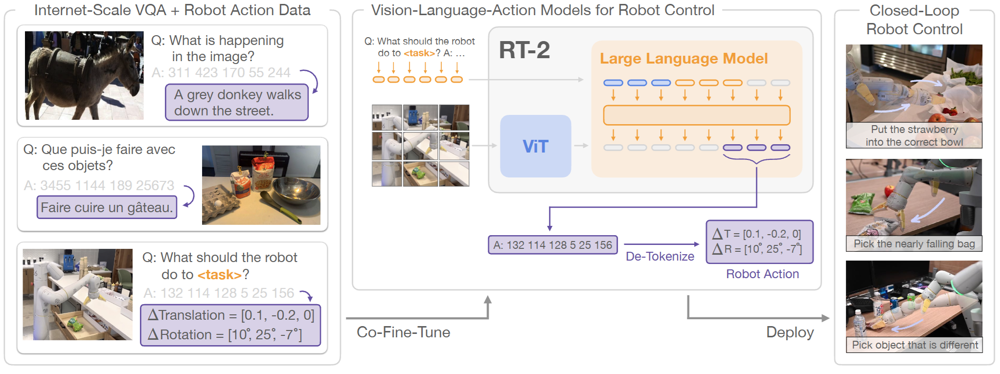
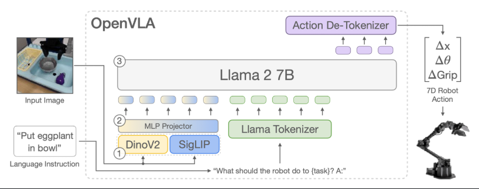
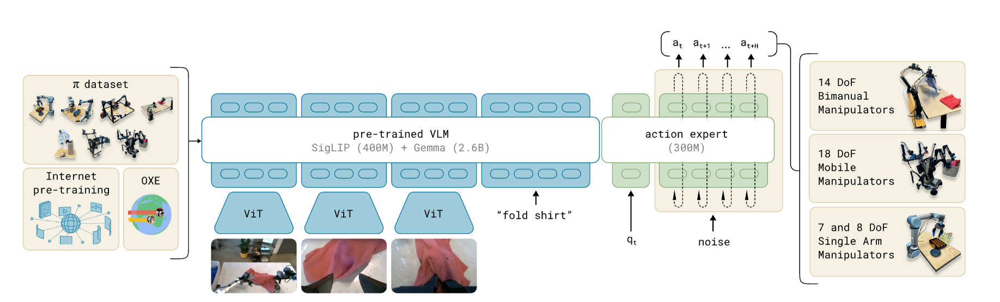
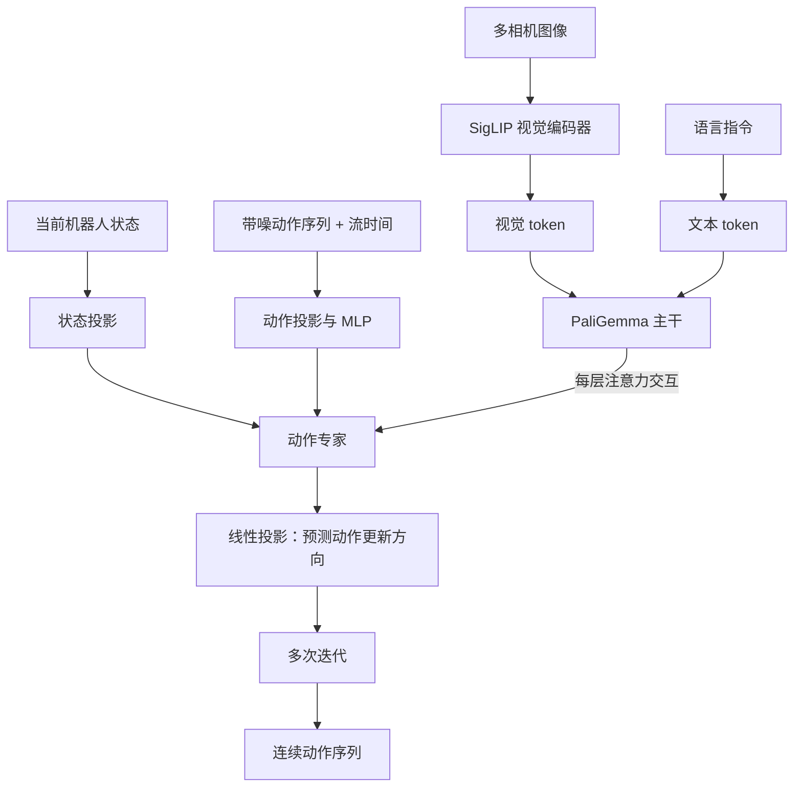

# VLA

## 参考

1. [https://www.douyin.com/user/self?from_tab_name=main&modal_id=7683189704405077274](https://www.douyin.com/user/self?from_tab_name=main&modal_id=7683189704405077274&showTab=record)
2. [https://zhuanlan.zhihu.com/p/1924508906606015431?theme=dark](https://zhuanlan.zhihu.com/p/1924508906606015431?theme=dark)

## 基础概念

VLA：Vision Language Action

输入：相机画面、语言指令、机器人现在的状态

输出：机器人的动作

| 名词         | 含义                     | 数值形态                                  |
| ---------- | ---------------------- | ------------------------------------- |
| 自由度 DoF    | 能独立运动的维度，单臂通常为 6—7 个关节 | 6 DoF 通常包含 3 个平移 + 3 个旋转，不是每个关节 6 个角度 |
| 夹爪 gripper | 末端两指开合                 | 1 个数，0—1 之间                           |
| 本体状态 q_t   | 机器人当前各关节编码器实际测得的位置     | q_t，关节角向量                             |
| 动作 a_t     | 控制器希望机器人各关节运动到的目标位置    | a_t，与 q_t 同维                          |
| 控制频率 Hz    | 每秒发多少条动作               | 50 Hz                                 |
| 固定相机       | 装在底座或支架，看全景            | RGB 图像                                |

### 训练数据格式

#### 1. Episode：一次完整的演示

一个 `episode` 表示一次完整的机器人操作演示，例如“把衬衫叠好”。它由一串按时间对齐的帧组成（t 个格式）：

```text
episode = [frame_0, frame_1, frame_2, ..., frame_T]
```

每个时间步 `t` 通常包含：

| 字段                               | 含义                            | 示例形状/内容            |
| -------------------------------- | ----------------------------- | ------------------ |
| `observation.images.base`        | 固定在机器人外部的相机图像                 | `224 × 224 × 3`    |
| `observation.images.left_wrist`  | 左腕部相机图像                       | `224 × 224 × 3`    |
| `observation.images.right_wrist` | 右腕部相机图像                       | `224 × 224 × 3`    |
| `observation.state`              | 当前机器人的本体状态，通常就是关节位置向量 `q_t`   | 例如 `(14,)`         |
| `action`                         | 控制器要执行的目标动作，通常是目标关节位置向量 `a_t` | 例如 `(14,)`         |
| `language_instruction`           | 对这次任务的文字描述                    | `"fold the shirt"` |

`language_instruction` 通常对同一个 episode 保持不变；图像、状态和动作则随时间步变化。

> `(14,)` 表示这个示例的状态/动作向量包含 14 个数，具体维度取决于机器人关节和夹爪的数量，并不是固定值。

#### 2. 训练样本：当前观测预测未来动作

训练时可以从一个 episode 的时间步 `t` 取出一个样本：

```text
obs   = episode[t]              # 当前单帧观测，通常不包含历史帧
chunk = episode[t:t+50].action  # 从当前时刻开始，未来 50 步动作
```

模型的学习目标可以概括为：

```text
(图像观测, q_t, 语言指令) -> (a_t, a_{t+1}, ..., a_{t+49})
```

因此，模型不一定只预测下一步动作，也可以一次预测一段动作序列（action chunk）。控制器随后按控制频率逐步执行这些目标位置，并在新的观测到来后再次预测。

#### 3. LeRobot 数据集的目录结构

用于 OpenPI 微调时，数据通常以 LeRobot 格式保存，示意如下：

```text
my_dataset/
├── data/
│   └── chunk-000/
│       └── episode_000000.parquet   # state、action、时间戳等表格数据
├── videos/
│   └── chunk-000/
│       ├── observation.images.base/.mp4
│       ├── observation.images.left_wrist/.mp4
│       └── observation.images.right_wrist/.mp4
└── meta/
    ├── info.json                    # fps、相机列表、字段和 shape 等信息
    ├── episodes.jsonl               # 每个 episode 的长度、任务等信息
    └── stats.json                   # 数据统计量，用于归一化
```

其中：

- `data` 保存状态、动作、时间戳等结构化数据；
- `videos` 保存各个相机的视频，视频帧与数据表中的时间步对齐；
- `meta` 保存数据集的描述信息、episode 索引以及归一化所需的统计量；
- `chunk-000` 是数据分块编号，数据量较大时可以有多个 chunk。

## RT-2

[RT-2](https://arxiv.org/pdf/2307.15818) 是 VLA 的 **开山之作**，由 Google DeepMind 推出

**RT-2** 的核心想法就是把网络上学到的视觉和语言知识 “**迁移**” 到机器人操作上，打造一个既能理解指令、又能直接输出动作的模型。

### 模型架构

RT-2 的 **模型架构** 是这篇论文的 **亮点之一，它并不是从零开始建模，而是基于现有的视觉-语言模型（Vision-Language Model，VLM），通过一些改动，让它能直接 输出机器人动作**



#### 基础模型 PaLI-X 和 PaLM-E

RT-2 直接基于两个强大的 VLM 模型：**PaLI-X** 和 **PaLM-E**

- **PaLI-X（55B）**
  - **视觉部分**：使用一个大 ViT-22B，专门处理输入图片。如果输入多张图片，每张图会生成一组 token，总共是 `图片数量 × 每张图的 patch 数` 个 token
  - **语言部分**：用了一个 3.2B 的编码器-解码器（encoder-decoder）结构，类似 UL2/T5 模型。将图像 token 投影到语言空间后，与文本 token 拼接并共同编码，再由解码器生成输出
  - **整体规模**：PaLI-X 有两个版本，**RT-2-PaLI-X-5B** 和 **RT-2-PaLI-X-55B**。RT-2 用这两个版本，分别适配不同的计算资源需求
  - **输入输出**：PaLI-X 的输入是 **图片序列+文字提示** 输出是 **文字 token**
- **PaLM-E**
  - **架构特点**：**PaLM-E** 是个解码器（decoder-only）模型，整体有 12B 参数（RT-2-PaLM-E-12B）。它的视觉部分用了一个 4B 的 ViT（ViT-4B）。语言部分使用 8B 参数的 PaLM
  - **多模态融合**：把所有输入（图片、文字、甚至其他传感器数据）都投影到语言空间，统一处理
  - **与 PaLI-X 的区别**：PaLI-X 更偏向视觉处理，PaLM-E 更擅长语言和多模态融合。

### 动作表示

- 动作离散化
  - 将机器人每个动作空间 7 个维度（6 个自由度 + 夹爪开合程度）分成 256 个离散区间，每个区间对应一个整数（0 到 255），代表动作取值范围
  - 终止信号是个二进制值（0 或 1），表示是否结束任务。
  - 这样，一个动作就变成了 8 个整数的组合（终止信号 + 6 个自由度 + 夹爪状态）
- 动作编码成字符串
  - 8 个整数被拼接成一个字符串，用空格分隔，格式为 `terminate Δpos_x Δpos_y Δpos_z Δrot_x Δrot_y Δrot_z gripper_extension`，如  `1 128 92 14 151 01 127` （终止信号 + 6 个自由度 + 夹爪状态）
  - 模型输出的字符串可以给机器人解码为动作指令
- 将离散动作值（0–255）映射为语言模型的 token：
  - PaLI-X：直接复用词表中已有的数字 token。
  - PaLM-E：将 256 个最不常用的 token 重新定义为动作 token，这种方法称为“符号调整”（symbol tuning）。

### 训练

RT-2 采用 **联合微调（co-fine-tuning）**，同时使用视觉-语言数据和机器人演示数据，在保留网络知识的同时学习机器人动作。

- 数据来源：WebLI、视觉问答和图片描述数据，以及 RT-1 的机器人演示数据。
- 数据比例：PaLI-X 的机器人数据占 50%，PaLM-E 占 66%，提高模型对动作生成的关注。
- 输出约束：机器人任务仅生成动作 token，视觉-语言任务使用完整词表。
- 训练目标：预测下一个 token；在机器人任务中，相当于通过行为克隆学习动作。

### 局限性

1. 动作局限：数据量不足，泛化性差
2. 计算成本：大模型计算量大，实时性低
3. 精细操作：精准操作，复杂推理差

## OpenVLA

[OpenVLA](https://arxiv.org/abs/2406.09246) 是一个 7B 模型，专门为机器人操控任务设计。在 Open X-Embodiment 数据集上训练了 97 万个机器人操作片段，学会了如何根据图片和语言指令控制机器人完成各种任务。

它不仅能控制多种不同的机器人，还能通过少量数据微调，快速适应新的任务或机器人环境。它比之前的一些闭源模型（比如 RT-2-X，55B）小了好几倍，但性能却提升了 16.5%

### 模型架构



- 视觉编码器
  - OpenVLA 的视觉编码器约有 0.6B，结合了 SigLIP 和 DINOv2：前者提供图文语义特征，后者补充物体形状、位置等空间信息
  - 输入的 224 ×** **224 图像经两个编码器分别处理，输出特征按 patch 拼接，为机器人操控提供更全面的视觉表示。实验表明，双编码器优于单编码器，而进一步提高图像分辨率未带来明显收益。
- 投影器
  - 使用两层 MLP 将视觉特征映射至语言嵌入
- 决策大脑
  - OpenVLA 使用 Llama 2 7B 作为决策主干，将每个动作维度在 1%～99% 分位数范围内划分为 256 个区间，并映射为动作 token

### 局限性

- 推理速度慢, 并且每次输出只推理一个时间步的 action
- 下游任务泛化性差

## π0

[π0](https://arxiv.org/abs/2410.24164) 模型的核心是把预训练的视觉-语言模型和专门为机器人控制设计的动作专家结合起来，通过 flow-matching 生成连续动作

- 预训练 VLM 打底：π0 基于 PaliGemma-3B，一个预训练视觉语言模型
- 动作专家 Action Expert 加流匹配：π0 通过独立的 Action Expert，约 300M，结合机器人状态与流匹配生成连续的多时间步动作序列，支持最高 **50 Hz** 的高频控制，适用于折叠衣物等精细操作
- 跨平台：π0 在 7 种不同的机器人配置上训练，涵盖单臂、双臂和移动机械臂，涉及 68 种任务。这种多样化的训练让它能适应不同的机器人动作空间和任务需求，通用性很强（数据量大）

### 模型架构





图像和文字使用 PaliGemma 的参数；状态和动作使用动作专家的参数。

同时三个模块（图文、当前状态、带造状态）只能看见当前与之前的数据（可以复用 kv cache）

<table>
  <tr><th>发起注意力的 token</th><th>图像与文字</th><th>当前状态</th><th>带噪动作</th></tr>
  <tr><td>图像与文字</td><td>✓</td><td>—</td><td>—</td></tr>
  <tr><td>当前状态</td><td>✓</td><td>✓</td><td>—</td></tr>
  <tr><td>带噪动作</td><td>✓</td><td>✓</td><td>✓</td></tr>
</table>


> 每层通过注意力交换信息：
> VLM 路：     [图像 token，文字 token]  
> 动作专家路： [状态 token，带噪动作 token]  
> 
> 每层中，两路分别用自己的参数计算 Q、K、V
> 然后将投影后的 Q、K、V **沿序列维度拼接**，进行一次带掩码的注意力计算：
> $$
> Q = [Q_v; Q_a],\quad
> K = [K_v; K_a],\quad
> V = [V_v; V_a]
> $$
> 
> $$
> Y = \operatorname{softmax}
> \left(
> \frac{QK^\top}{\sqrt{d_h}} + M
> \right)V
> $$


### 训练方式：预训练 + 后训练

- 预训练：
  - 数据来源：全部数据（有教差数据，结合后训练可以做错误恢复），结合开源数据集 OXE、DROID 和 Bridge v2，覆盖多种机器人和任务场景。
  - 加权策略：为了平衡数据集，论文用 的方法（通过对样本数量 n 取 0.43 次幂来降低数据量较多的任务的权重从而平衡不同任务在训练中的影响）给数据加权，样本多的任务权重会降低一些。
- 后训练：
  - 针对具体任务，用高质量的数据进行微调

为什么用 flow-matching？
- 动作分布是多峰的

### 局限性和讨论
- 数据配比不明确：预训练数据如何组合、加权仍需探索。
- 任务稳定性不足：部分任务成功率有限，所需数据量和类型难以预估。
- 泛化能力待验证：在更多真实场景、任务和机器人上的适应能力仍需研究。

## π0.5

## 参考资料
