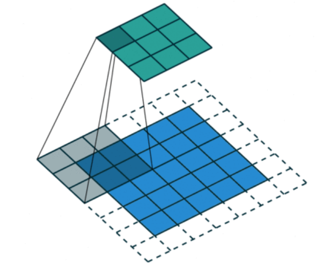
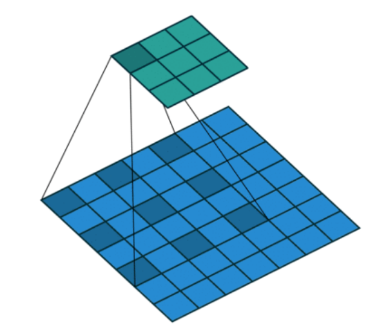
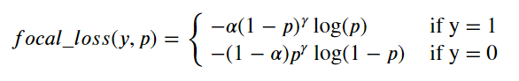

# 6、Pytorch 中阶 API

## 6.1、Dataset 和 DataLoader

Pytorch 使用 Dataset 和 DataLoader 这两个工具类来构建数据管道。它们的作用是将数据整理成适合训练模型的格式，一个 batch 一个 batch 的取出给模型

### 6.1.1、Dataset 和 DataLoader 原理

#### 获取一个 batch 的步骤

假定数据集的特征和标签分别表示为张量`X`和`Y`，数据集可以表+示为 `(X,Y)`, 假定 batch 大小为 `m`

1. 首先确定数据集长度： `n`
2. 从 `0` 到 `n-1` 的范围中抽样出 `m` 个数（batch 大小）  
   假定 `m=4`, 拿到的结果是一个列表，类似：`indices = [1,4,8,9]`
3. 从数据集中去取这`m`个数对应下标的元素  
   拿到的结果是一个元组列表，类似：`samples = [(X[1],Y[1]),(X[4],Y[4]),(X[8],Y[8]),(X[9],Y[9])]`
4. 将结果整理成两个张量作为输出  
   类似 `batch = (features,labels)`  
   其中 `features = torch.stack([X[1],X[4],X[8],X[9]])`，`labels = torch.stack([Y[1],Y[4],Y[8],Y[9]])`

#### Dataset 和 DataLoader 的功能分工

`Dataset` 是一个抽象类，用于表示数据集

- 上述步骤 1 确定数据集的长度是由 Dataset 的 **`__len__` ** 方法实现
- 步骤 2 从`0`到 `n-1` 的范围中抽样出 `m` 个数的方法是由 DataLoader 的 `sampler`和 `batch_sampler`参数指定
  - `sampler` 参数指定单个元素抽样方法，一般无需用户设置，程序默认在 DataLoader 的参数 `shuffle=True` 时采用随机抽样，`shuffle=False` 时采用顺序抽样
  - `batch_sampler` 参数将多个抽样的元素整理成一个列表，一般无需用户设置，默认方法在 DataLoader 的参数 `drop_last=True` 时会丢弃数据集最后一个长度不能被 batch 大小整除的批次，在 `drop_last=False` 时保留最后一个批次
- 步骤 3 根据下标取数据集中的元素 是由 Dataset 的 **`__getitem__` **方法实现
- 步骤 4 的逻辑由DataLoader的参数`collate_fn`指定。一般情况下也无需用户设置。

Dataset 和 DataLoader 的一般使用方式如下

- TensorDataset(data, labels)
- DataLoader(ds,batch_size=4,drop_last,shuffle...)

```py
import torch 
from torch.utils.data import TensorDataset,Dataset,DataLoader
from torch.utils.data import RandomSampler,BatchSampler 

# TensorDataset(data, labels)
ds = TensorDataset(torch.randn(1000,3),torch.randint(low=0,high=2,size=(1000,)).float())
dl = DataLoader(ds,batch_size=4,drop_last = False)

# 获取数据加载器中的第一个批次（features和labels）
features,labels = next(iter(dl))
print("features = ",features )
print("labels = ",labels )  
```

DataLoader 内部调用方式步骤拆解如下：

```py
# step1: 确定数据集长度 (Dataset 的 __len__ 方法实现)
ds = TensorDataset(torch.randn(1000,3),torch.randint(low=0,high=2,size=(1000,)).float())
print("n = ", len(ds)) # len(ds)等价于 ds.__len__()

# step2: 确定抽样 indices (DataLoader 中的 Sampler 和 BatchSampler 实现)
sampler = RandomSampler(data_source = ds) # 创建随机采样器
batch_sampler = BatchSampler(sampler = sampler, batch_size = 4, drop_last = False) # 创建批次采样器
# 取出第一个批次的索引 indices
for idxs in batch_sampler:
    indices = idxs
    break 
print("indices = ",indices)

# step3: 取出一批样本 batch (Dataset 的 __getitem__ 方法实现)
batch = [ds[i] for i in  indices]  #  ds[i] 等价于 ds.__getitem__(i)
print("batch = ", batch)

# step4: 整理成 features 和 labels (DataLoader 的 collate_fn 方法实现)
def collate_fn(batch):
    features = torch.stack([sample[0] for sample in batch])
    labels = torch.stack([sample[1] for sample in batch])
    return features,labels 

features,labels = collate_fn(batch)
print("features = ",features)
print("labels = ",labels)

```

### 6.1.2、Dataset 使用

Dataset 创建数据集的方法：

- 使用 torch.utils.data.**TensorDataset** 根据 Tensor 创建数据集（numpy 的 array，Pandas 的 DataFrame 需要先转换成 Tensor）

  ```py
  from torch.utils.data import TensorDataset
  train_ds = TensorDataset(features,labels)
  ```

- 使用 torchvision.datasets.ImageFolder 根据图片目录创建图片数据集

- 继承 torch.utils.data.Dataset 创建自定义数据集

常用手法：

- torch.utils.data.random_split 将一个数据集分割成多份，常用于分割训练集，验证集和测试集
- 调用 Dataset 的加法运算符(`+`)将多个数据集合并成一个数据集

#### 根据 Tensor 创建数据集

```py
import numpy as np 
import torch 
from torch.utils.data import TensorDataset,Dataset,DataLoader,random_split 

# 根据 Tensor 创建数据集
from sklearn import datasets 
iris = datasets.load_iris()
ds_iris = TensorDataset(torch.tensor(iris.data),torch.tensor(iris.target))

# 分割成训练集和预测集
n_train = int(len(ds_iris)*0.8)
n_val = len(ds_iris) - n_train
ds_train,ds_val = random_split(ds_iris,[n_train,n_val])

# 使用 DataLoader 加载数据集
dl_train,dl_val = DataLoader(ds_train,batch_size = 8),DataLoader(ds_val,batch_size = 8)
for features,labels in dl_train:
    print(features,labels)
    break

# 演示加法运算符（`+`）的合并作用
ds_data = ds_train + ds_val

print('len(ds_train) = ',len(ds_train)) # 120
print('len(ds_valid) = ',len(ds_val)) # 30
print('len(ds_train+ds_valid) = ',len(ds_data)) # 150
print(type(ds_data))
```

#### 根据图片目录创建图片数据集

```py
import numpy as np 
import torch 
from torch.utils.data import DataLoader
from torchvision import transforms,datasets 

# 常用的图片增强操作
from PIL import Image
img = Image.open('./data/cat.jpeg')
# 随机数值翻转
transforms.RandomVerticalFlip()(img)
# 随机旋转
transforms.RandomRotation(45)(img)
# 定义图片增强操作，用于将多个图像变换（transforms）组合成一个单一的变换
transform_train = transforms.Compose([
   transforms.RandomHorizontalFlip(), # 随机水平翻转
   transforms.RandomVerticalFlip(), # 随机垂直翻转
   transforms.RandomRotation(45),  # 随机在45度角度内旋转
   transforms.ToTensor() # 转换成张量
  ]
)
transform_valid = transforms.Compose([
    transforms.ToTensor()
  ]
)

# 根据图片目录创建数据集
def transform_label(x):
    return torch.tensor([x]).float()

ds_train = datasets.ImageFolder("./eat_pytorch_datasets/cifar2/train/",transform = transform_train,target_transform= transform_label)
ds_val = datasets.ImageFolder("./eat_pytorch_datasets/cifar2/test/",transform = transform_valid,target_transform= transform_label)


print(ds_train.class_to_idx) # {'0_airplane': 0, '1_automobile': 1}

# 使用 DataLoader 加载数据集
dl_train = DataLoader(ds_train,batch_size = 50,shuffle = True)
dl_val = DataLoader(ds_val,batch_size = 50,shuffle = True)
for features,labels in dl_train:
    print(features.shape) # torch.Size([50, 3, 32, 32])
    print(labels.shape) # torch.Size([50, 1])
    break
```

#### 创建自定义数据集

通过继承 torch.utils.data.Dataset 创建自定义数据集的方式来对 cifar2 构建数据管道

```py
from pathlib import Path 
from PIL import Image 

class Cifar2Dataset(Dataset):
    def __init__(self,imgs_dir,img_transform):
        self.files = list(Path(imgs_dir).rglob("*.jpg"))
        self.transform = img_transform
        
    def __len__(self,):
        return len(self.files)
    
    def __getitem__(self,i):
        file_i = str(self.files[i])
        img = Image.open(file_i)
        tensor = self.transform(img)
        label = torch.tensor([1.0]) if  "1_automobile" in file_i else torch.tensor([0.0])
        return tensor,label 
    
    
train_dir = "./eat_pytorch_datasets/cifar2/train/"
test_dir = "./eat_pytorch_datasets/cifar2/test/"

# 定义图片增强
transform_train = transforms.Compose([
   transforms.RandomHorizontalFlip(), # 随机水平翻转
   transforms.RandomVerticalFlip(), # 随机垂直翻转
   transforms.RandomRotation(45),  # 随机在45度角度内旋转
   transforms.ToTensor() # 转换成张量
  ]
)

transform_val = transforms.Compose([
    transforms.ToTensor()
  ]
)

ds_train = Cifar2Dataset(train_dir,transform_train)
ds_val = Cifar2Dataset(test_dir,transform_val)

dl_train = DataLoader(ds_train,batch_size = 50,shuffle = True)
dl_val = DataLoader(ds_val,batch_size = 50,shuffle = True)

for features,labels in dl_train:
    print(features.shape) # torch.Size([50, 3, 32, 32])
    print(labels.shape) # torch.Size([50, 1])
    break
```

### 6.1.3、使用 DataLoader 加载数据集

DataLoader 能够控制 batch 的大小，batch 中元素的采样方法，以及将 batch 结果整理成模型所需输入形式的方法，并且能够使用多进程读取数据

DataLoader 的函数签名如下

```py
DataLoader(
    dataset, # 传入 Dataset
    batch_size=1, # 取 Dataset 时，一次取多大
    shuffle=False,
    sampler=None,
    batch_sampler=None,
    num_workers=0,
    collate_fn=None,
    pin_memory=False,
    drop_last=False,
    timeout=0,
    worker_init_fn=None,
    multiprocessing_context=None,
)
```

一般情况下，我们仅仅会配置 dataset, batch_size, shuffle, num_workers,pin_memory, drop_last 这六个参数，

有时候对于一些复杂结构的数据集，还需要自定义 collate_fn 函数，其他参数一般使用默认值即可。

DataLoader 除了可以加载我们前面讲的 torch.utils.data.Dataset 外，还能够加载另外一种数据集 torch.utils.data.IterableDataset。

和 Dataset 数据集相当于一种列表结构不同，IterableDataset 相当于一种迭代器结构。 它更加复杂，一般较少使用。

- dataset : 数据集
- batch_size: 批次大小
- shuffle: 是否乱序
- sampler: 样本采样函数，一般无需设置。
- batch_sampler: 批次采样函数，一般无需设置。
- num_workers: 使用多进程读取数据，设置的进程数。
- collate_fn: 整理一个批次数据的函数。
- pin_memory: 是否设置为锁业内存。默认为False，锁业内存不会使用虚拟内存(硬盘)，从锁业内存拷贝到GPU上速度会更快。
- drop_last: 是否丢弃最后一个样本数量不足batch_size批次数据。
- timeout: 加载一个数据批次的最长等待时间，一般无需设置。
- worker_init_fn: 每个worker中dataset的初始化函数，常用于 IterableDataset。一般不使用

```py
# 构建输入数据管道
ds = TensorDataset(torch.arange(1,50))
dl = DataLoader(ds,
                batch_size = 10,
                shuffle= True,
                num_workers=2,
                drop_last = True)
# 迭代数据
for batch, in dl:
    print(batch)
    
'''
tensor([45, 49, 27,  7, 32, 48, 19, 38, 35, 30])
tensor([44, 37, 21, 39, 29, 13,  8, 31, 33,  5])
tensor([34, 28,  2, 23, 15, 42, 43, 40, 22,  6])
tensor([36,  3, 46,  9, 26, 16, 12, 17, 18,  1])
'''
```

## 6.2、模型层 torch.nn

深度学习模型由各种模型层组合

**torch.nn** 中内置了非常丰富的各种模型层。它们都属于 nn.Module 的子类，具备参数管理功能

也可以通过继承 nn.Module 基类构建自定义的模型层

pytorch 不区分模型和模型层，都是通过继承 nn.Module 进行构建

只要继承 nn.Module 基类并实现 forward 方法即可自定义模型层

> torch.nn.function 中有很多功能，与 nn.Module 一样。  
> 一般情况下，如果模型有可学习的参数（w，b），最好用 nn.Module，其他情况（激活函数，loss function） nn.function 相对更简单些

### 6.2.1、基础层

- nn.Linear：全连接层。参数个数 = 输入层特征数 × 输出层特征数(weight)＋ 输出层特征数(bias)
- nn.Embedding：嵌入层。一种比 Onehot 更加有效的对离散特征进行编码的方法。一般用于将输入中的单词映射为稠密向量。嵌入层的参数需要学习。
- nn.Flatten：压平层，用于将多维张量样本压成一维张量样本。
- nn.BatchNorm1d：一维批标准化层。通过线性变换将输入批次缩放平移到稳定的均值和标准差。可以增强模型对输入不同分布的适应性，加快模型训练速度，有轻微正则化效果。一般在激活函数之前使用。可以用 afine 参数设置该层是否含有可以训练的参数。
- nn.BatchNorm2d：二维批标准化层。 常用于 CV 领域。
- nn.BatchNorm3d：三维批标准化层。
- nn.Dropout：一维随机丢弃层。一种正则化手段。
- nn.Dropout2d：二维随机丢弃层。
- nn.Dropout3d：三维随机丢弃层。
- nn.Threshold：限幅层。当输入大于或小于阈值范围时，截断之。
- nn.ConstantPad2d： 二维常数填充层。对二维张量样本填充常数扩展长度。

- nn.ReplicationPad1d： 一维复制填充层。对一维张量样本通过复制边缘值填充扩展长度。
- nn.ZeroPad2d：二维零值填充层。对二维张量样本在边缘填充0值.
- nn.GroupNorm：组归一化。一种替代批归一化的方法，将通道分成若干组进行归一。不受 batch 大小限制。
- nn.LayerNorm：层归一化。常用于 NLP 领域，不受序列长度不一致影响。
- nn.InstanceNorm2d: 样本归一化。一般在图像风格迁移任务中效果较好。

各种归一化层：

- 结构化数据 BatchNorm1D 归一化
- 图片数据的各种归一化（一般常用BatchNorm2D）
- 文本数据的 LayerNorm 归一化
- 可自适应学习的归一化 SwitchableNorm

参考论文：https://arxiv.org/pdf/1806.10779.pdf

对 BatchNorm 需要注意的几点：

- 原始论文认为将 BatchNorm 放在激活函数前效果较好，后面的研究一般认为将 BatchNorm 放在激活函数之后更好
- BatchNorm在训练过程和推理过程的逻辑不一样，训练过程 BatchNorm 的均值和方差和根据 mini-batch 中的数据估计的，而推理过程中 BatchNorm 的均值和方差是用的训练过程中的全体样本估计的。因此预测过程是稳定的，相同的样本不会因为所在批次的差异得到不同的结果，但训练过程中则会受到批次中其他样本的影响所以有正则化效果
- 如果受到 GPU 内存限制，不得不使用很小的 batch_size，训练阶段时使用的 mini-batch 上的均值和方差的估计和预测阶段时使用的全体样本上的均值和方差的估计差异可能会较大，效果会变差。这时候，可以尝试 LayerNorm 或者 GroupNorm 等归一化方法

BatchNorm 使用：

```py
import torch 
from torch import nn 
batch_size, channel, height, width = 32, 16, 128, 128
tensor = torch.arange(0,32*16*128*128).view(32,16,128,128).float() 
# 创建了 2D 批量归一化层
bn = nn.BatchNorm2d(num_features=channel,affine=False)
bn_out = bn(tensor)
channel_mean = torch.mean(bn_out[:,0,:,:]) # 提取张量中第一个通道的所有像素，计算该通道像素的均值和标准差
channel_std = torch.std(bn_out[:,0,:,:]) 
print("channel mean:",channel_mean.item()) # 1.043081283569336e-07
print("channel std:",channel_std.item()) # 1.0000009536743164
```

### 6.2.2、卷积网络相关层

- nn.Conv1d：普通一维卷积，常用于文本。参数个数 = 输入通道数 × 卷积核尺寸(如3)×卷积核个数 + 卷积核尺寸(如3）
- nn.Conv2d：普通二维卷积，常用于图像。参数个数 = 输入通道数×卷积核尺寸(如3乘3)×卷积核个数 + 卷积核尺寸(如3乘3)。) 通过调整 dilation 参数大于 1，可以变成空洞卷积，增加感受野。 通过调整 groups 参数不为1，可以变成分组卷积。分组卷积中每个卷积核仅对其对应的一个分组进行操作。 当 groups 参数数量等于输入通道数时，相当于 tensorflow 中的二维深度卷积层tf.keras.layers.DepthwiseConv2D。 利用分组卷积和1乘1卷积的组合操作，可以构造相当于 Keras 中的二维深度可分离卷积层tf.keras.layers.SeparableConv2D。
- nn.Conv3d：普通三维卷积，常用于视频。参数个数 = 输入通道数×卷积核尺寸(如3乘3乘3)×卷积核个数 + 卷积核尺寸(如3乘3乘3) 。
- nn.MaxPool1d: 一维最大池化。
- nn.MaxPool2d：二维最大池化。一种下采样方式。没有需要训练的参数。
- nn.MaxPool3d：三维最大池化。
- nn.AdaptiveMaxPool2d：二维自适应最大池化。无论输入图像的尺寸如何变化，输出的图像尺寸是固定的。 该函数的实现原理，大概是通过输入图像的尺寸和要得到的输出图像的尺寸来反向推算池化算子的padding,stride等参数。
- nn.FractionalMaxPool2d：二维分数最大池化。普通最大池化通常输入尺寸是输出的整数倍。而分数最大池化则可以不必是整数。分数最大池化使用了一些随机采样策略，有一定的正则效果，可以用它来代替普通最大池化和 Dropout 层。
- nn.AvgPool2d：二维平均池化。
- nn.AdaptiveAvgPool2d：二维自适应平均池化。无论输入的维度如何变化，输出的维度是固定的。
- nn.ConvTranspose2d：二维卷积转置层，俗称反卷积层。并非卷积的逆操作，但在卷积核相同的情况下，当其输入尺寸是卷积操作输出尺寸的情况下，卷积转置的输出尺寸恰好是卷积操作的输入尺寸。在语义分割中可用于上采样。
- nn.Upsample：上采样层，操作效果和池化相反。可以通过mode参数控制上采样策略为"nearest"最邻近策略或"linear"线性插值策略。
- nn.Unfold：滑动窗口提取层。其参数和卷积操作nn.Conv2d相同。实际上，卷积操作可以等价于nn.Unfold和nn.Linear以及nn.Fold的一个组合。 其中nn.Unfold操作可以从输入中提取各个滑动窗口的数值矩阵，并将其压平成一维。利用nn.Linear将nn.Unfold的输出和卷积核做乘法后，再使用 nn.Fold操作将结果转换成输出图片形状。
- nn.Fold：逆滑动窗口提取层。

各种常用的卷积层和上采样层：

- 普通卷积

  

- 空洞卷积

  

- 分组卷积 

- 深度可分离卷积

- 转置卷积

- 上采样层

```py
import torch 
from torch import nn 
import torch.nn.functional as F 

# 卷积输出尺寸计算公式 o = (i + 2*p -k')//s  + 1 
# 对空洞卷积 k' = d(k-1) + 1
# o 是输出尺寸，i 是输入尺寸，p 是 padding 大小， k 是卷积核尺寸， s是 stride 步长, d是 dilation 空洞参数

inputs = torch.arange(0,25).view(1,1,5,5).float() # i = 5
filters = torch.tensor([[[[1.0,1],[1,1]]]]) # k = 2

outputs = F.conv2d(inputs, filters) # o = (5+2*0-2)//1+1 = 4
outputs_s2 = F.conv2d(inputs, filters, stride=2)  #o = (5+2*0-2)//2+1 = 2
outputs_p1 = F.conv2d(inputs, filters, padding=1) #o = (5+2*1-2)//1+1 = 6
outputs_d2 = F.conv2d(inputs,filters, dilation=2) #o = (5+2*0-(2(2-1)+1))//1+1 = 3


import torch 
from torch import nn 

features = torch.randn(8,64,128,128)
print("features.shape:",features.shape)
print("\n")

# 普通卷积
print("--conv--")
conv = nn.Conv2d(in_channels=64,out_channels=32,kernel_size=3)
conv_out = conv(features)
print("conv_out.shape:",conv_out.shape) 
print("conv.weight.shape:",conv.weight.shape)
print("\n")

# 分组卷积
print("--group conv--")
conv_group = nn.Conv2d(in_channels=64,out_channels=32,kernel_size=3,groups=8)
group_out = conv_group(features)
print("group_out.shape:",group_out.shape) 
print("conv_group.weight.shape:",conv_group.weight.shape)
print("\n")

# 深度可分离卷积
print("--separable conv--")
depth_conv = nn.Conv2d(in_channels=64,out_channels=64,kernel_size=3,groups=64)
oneone_conv = nn.Conv2d(in_channels=64,out_channels=32,kernel_size=1)
separable_conv = nn.Sequential(depth_conv,oneone_conv)
separable_out = separable_conv(features)
print("separable_out.shape:",separable_out.shape) 
print("depth_conv.weight.shape:",depth_conv.weight.shape)
print("oneone_conv.weight.shape:",oneone_conv.weight.shape)
print("\n")

# 转置卷积
print("--conv transpose--")
conv_t = nn.ConvTranspose2d(in_channels=32,out_channels=64,kernel_size=3)
features_like = conv_t(conv_out)
print("features_like.shape:",features_like.shape)
print("conv_t.weight.shape:",conv_t.weight.shape)

import torch 
from torch import nn 

inputs = torch.arange(1, 5, dtype=torch.float32).view(1, 1, 2, 2)
print("inputs:")
print(inputs)
print("\n")

nearest = nn.Upsample(scale_factor=2, mode='nearest')
bilinear = nn.Upsample(scale_factor=2,mode="bilinear",align_corners=True)

print("nearest(inputs)：")
print(nearest(inputs))
print("\n")
print("bilinear(inputs)：")
print(bilinear(inputs)) 
```

### 6.2.3、循环网络相关层

- nn.LSTM：长短记忆循环网络层【支持多层】。最普遍使用的循环网络层。具有携带轨道，遗忘门，更新门，输出门。可以较为有效地缓解梯度消失问题，从而能够适用长期依赖问题。设置 bidirectional = True 时可以得到双向 LSTM。需要注意的时，默认的输入和输出形状是(seq,batch,feature), 如果需要将 batch 维度放在第 0 维，则要设置 batch_first 参数设置为 True
- nn.GRU：门控循环网络层【支持多层】。LSTM的低配版，不具有携带轨道，参数数量少于LSTM，训练速度更快
- nn.RNN：简单循环网络层【支持多层】。容易存在梯度消失，不能够适用长期依赖问题。一般较少使用
- nn.LSTMCell：长短记忆循环网络单元。和 nn.LSTM 在整个序列上迭代相比，它仅在序列上迭代一步。一般较少使用
- nn.GRUCell：门控循环网络单元。和 nn.GRU 在整个序列上迭代相比，它仅在序列上迭代一步。一般较少使用
- nn.RNNCell：简单循环网络单元。和 nn.RNN 在整个序列上迭代相比，它仅在序列上迭代一步。一般较少使用

各种 RNN 序列模型层(RNN,GRU,LSTM 等)可以用函数表示如下: $h_t = f(h_{t-1},x_t)$

公式的含义：t 时刻循环神经网络的输出向量 ℎ𝑡 由 t-1 时刻的输出向量 ℎ~𝑡−1~ 和 t 时刻的输入 𝑖~𝑡~ 变换而来

- LSTM 结构解析（参考文章：《人人都能看懂的 LSTM》https://zhuanlan.zhihu.com/p/32085405）

  LSTM 通过引入了三个门来控制信息的传递，分别是遗忘门，输入门 和输出门 。三个门的作用为：

  1. 遗忘门: 遗忘门 𝑓~𝑡~ 控制上一时刻的内部状态 需要遗忘多少信息；
  2. 输入门: 输入门 𝑖~𝑡~ 控制当前时刻的候选状态 有多少信息需要保存；
  3. 输出门: 输出门 𝑜~𝑡~ 控制当前时刻的内部状态 有多少信息需要输出给外部状态 ；

- GRU 结构解析（参考文章：《人人都能看懂的 GRU》https://zhuanlan.zhihu.com/p/32481747）

  GRU 的结构比 LSTM 更为简单一些，GRU 只有两个门，更新门和重置门 

  1. 更新门：更新门用于控制每一步ℎ𝑡ℎ𝑡被更新的比例，更新门越大，ℎ~𝑡~ 更新幅度越大。
  2. 重置门：重置门用于控制更新候选向量 ℎ̃~𝑡~ 中前一步的状态 ℎ~𝑡−1~ 被重新放入的比例，重置门越大，更新候选向量中 ℎ~𝑡−1~ 被重新放进来的比例越大

  公式中的小圈表示哈达玛积，也就是两个向量逐位相乘

  其中 1式和 2式计算的是更新门 𝑢~𝑡~ 和重置门 𝑟~𝑡~，是两个长度和 ℎ~𝑡~ 相同的向量。

  注意到 4式实际上和 ResNet 的残差结构是相似的，都是 f(x) = x + g(x) 的形式，可以有效地防止长序列学习反向传播过程中梯度消失问题。

```py
import torch 
from torch import nn 

inputs = torch.randn(8,200,64) #batch_size, seq_length, features

gru = nn.GRU(input_size=64,hidden_size=32,num_layers=1,batch_first=True)
gru_output,gru_hn = gru(inputs)
print("--GRU--")
print("gru_output.shape:",gru_output.shape)
print("gru_hn.shape:",gru_hn.shape)
print("\n")

print("--LSTM--")
lstm = nn.LSTM(input_size=64,hidden_size=32,num_layers=1,batch_first=True)
lstm_output,(lstm_hn,lstm_cn) = lstm(inputs)
print("lstm_output.shape:",lstm_output.shape)
print("lstm_hn.shape:",lstm_hn.shape)
print("lstm_cn.shape:",lstm_cn.shape)

from torchkeras import summary
summary(gru,input_data=inputs);
summary(lstm,input_data=inputs);
```

### 6.2.4、Transformer 相关层

- nn.Transformer：Transformer网络结构。Transformer网络结构是替代循环网络的一种结构，解决了循环网络难以并行，难以捕捉长期依赖的缺陷。它是目前NLP任务的主流模型的主要构成部分。
- nn.TransformerEncoder：Transformer编码器结构。由多个 nn.TransformerEncoderLayer编码器层组成。
- nn.TransformerDecoder：Transformer解码器结构。由多个 nn.TransformerDecoderLayer解码器层组成。
- nn.TransformerEncoderLayer：Transformer的编码器层。主要由Multi-Head self-Attention, Feed-Forward前馈网络, LayerNorm归一化层, 以及残差连接层组成。
- nn.TransformerDecoderLayer：Transformer的解码器层。主要由Masked Multi-Head self-Attention, Multi-Head cross-Attention, Feed-Forward前馈网络, LayerNorm归一化层, 以及残差连接层组成。
- nn.MultiheadAttention：多头注意力层。用于在序列方向上融合特征。使用的是Scaled Dot Production Attention，并引入了多个注意力头。

参考阅读材料：  
Transformer知乎原理讲解：https://zhuanlan.zhihu.com/p/48508221  
Transformer哈佛博客代码讲解：http://nlp.seas.harvard.edu/annotated-transformer/

```py
import torch 
from torch import nn 

# 验证 MultiheadAttention 和 head 数量无关
inputs = torch.randn(8,200,64) # batch_size, seq_length, features
attention_h8 = nn.MultiheadAttention(
    embed_dim = 64,
    num_heads = 8,
    bias=True,
    batch_first=True
)
attention_h16 = nn.MultiheadAttention(
    embed_dim = 64,
    num_heads = 16,
    bias=True,
    batch_first=True
)
out_h8 = attention_h8(inputs,inputs,inputs)
out_h16 = attention_h16(inputs,inputs,inputs)

from torchkeras import summary 
summary(attention_h8,input_data_args=(inputs,inputs,inputs));
summary(attention_h16,input_data_args=(inputs,inputs,inputs));
```

```py
import torch 
from torch import nn 
from copy import deepcopy

# 多头注意力的一种简洁实现

class ScaledDotProductAttention(nn.Module):
    "Compute 'Scaled Dot Product Attention'"
    def __init__(self):
        super(ScaledDotProductAttention, self).__init__()

    def forward(self,query, key, value, mask=None, dropout=None):
        d_k = query.size(-1)
        scores = query@key.transpose(-2,-1) / d_k**0.5     
        if mask is not None:
            scores = scores.masked_fill(mask == 0, -1e20)
        p_attn = F.softmax(scores, dim = -1)
        if dropout is not None:
            p_attn = dropout(p_attn)
        return p_attn@value, p_attn
    
class MultiHeadAttention(nn.Module):
    def __init__(self, h, d_model, dropout=0.1):
        "Take in model size and number of heads."
        super(MultiHeadAttention, self).__init__()
        assert d_model % h == 0
        # We assume d_v always equals d_k
        self.d_k = d_model // h
        self.h = h
        self.linears = nn.ModuleList([deepcopy(nn.Linear(d_model, d_model)) for _ in range(4)])
        
        self.attn = None
        self.dropout = nn.Dropout(p=dropout)
        self.attention = ScaledDotProductAttention()
        
    def forward(self, query, key, value, mask=None):
        "Implements Figure 2"
        if mask is not None:
            # Same mask applied to all h heads.
            mask = mask.unsqueeze(1)
        nbatches = query.size(0)
        
        # 1) Do all the linear projections in batch from d_model => h x d_k 
        query, key, value = \
            [l(x).view(nbatches, -1, self.h, self.d_k).transpose(1, 2)
             for l, x in zip(self.linears, (query, key, value))]
        
        # 2) Apply attention on all the projected vectors in batch. 
        x, self.attn = self.attention(query, key, value, mask=mask, 
                                 dropout=self.dropout)
        
        # 3) "Concat" using a view and apply a final linear. 
        x = x.transpose(1, 2).contiguous() \
             .view(nbatches, -1, self.h * self.d_k)
        return self.linears[-1](x)
    
```

### 6.2.5、自定义模型层

如果 Pytorch 的内置模型层不能够满足需求，我们也可以通过继承 nn.Module 基类构建自定义的模型层

实际上，pytorch 不区分模型和模型层，都是通过继承 nn.Module 进行构建。

因此，我们只要继承 nn.Module 基类并实现 forward 方法即可自定义模型层。

下面是 Pytorch 的 nn.Linear 层的源码，我们可以仿照它来自定义模型层。

```py
import torch
from torch import nn
import torch.nn.functional as F

class Linear(nn.Module):
    __constants__ = ['in_features', 'out_features']

    def __init__(self, in_features, out_features, bias=True):
        super(Linear, self).__init__()
        self.in_features = in_features
        self.out_features = out_features
        self.weight = nn.Parameter(torch.Tensor(out_features, in_features))
        if bias:
            self.bias = nn.Parameter(torch.Tensor(out_features))
        else:
            self.register_parameter('bias', None)
        self.reset_parameters()

    def reset_parameters(self):
        nn.init.kaiming_uniform_(self.weight, a=math.sqrt(5))
        if self.bias is not None:
            fan_in, _ = nn.init._calculate_fan_in_and_fan_out(self.weight)
            bound = 1 / math.sqrt(fan_in)
            nn.init.uniform_(self.bias, -bound, bound)

    def forward(self, input):
        return F.linear(input, self.weight, self.bias)

    def extra_repr(self):
        return 'in_features={}, out_features={}, bias={}'.format(
            self.in_features, self.out_features, self.bias is not None
        )
```

## 6.3、损失函数 losses

一般来说，监督学习的目标函数由损失函数和正则化项组成。(Objective = Loss + Regularization)

Pytorch 中的损失函数一般在训练模型时候指定

> Pytorch 中内置的损失函数的参数和 tensorflow 不同，是 y_pred 在前，y_true 在后，而 Tensorflow 是 y_true 在前，y_pred 在后

- 对于 **回归模型**，通常使用的内置损失函数是 **均方损失函数 nn.MSELoss**

- 对于 **二分类模型**，通常使用的是 **二元交叉熵损失函数nn.BCELoss** (输入已经是 sigmoid 激活函数之后的结果) 或者 nn.BCEWithLogitsLoss (输入尚未经过 nn.Sigmoid 激活函数) 

- 对于 **多分类模型**，一般推荐使用 **交叉熵损失函数 nn.CrossEntropyLoss** (y_true 需要是一维的，是类别编码。y_pred 未经过 nn.Softmax 激活)

  此外，如果多分类的 y_pred 经过了 nn.LogSoftmax 激活，可以使用 nn.NLLLoss 损失函数(The negative log likelihood loss)。 这种方法和直接使用 nn.CrossEntropyLoss 等价

如果有需要，也可以自定义损失函数，自定义损失函数需要接收两个张量 y_pred，y_true 作为输入参数，并输出一个标量作为损失函数值

Pytorch 中的正则化项一般通过自定义的方式和损失函数一起添加作为目标函数

如果仅仅使用 L2 正则化，也可以利用优化器的 weight_decay 参数来实现相同的效果

### 6.3.1、内置损失函数

内置的损失函数一般有类的实现和函数的实现两种形式

类的实现形式通常是调用函数的实现形式并用 nn.Module 封装后得到的

我们常用的是类的实现形式。它们封装在 torch.nn 模块下，并且类名以 Loss 结尾

常用的一些内置损失函数说明如下：

- nn.MSELoss（均方误差损失，也叫做 L2 损失，用于回归）
- nn.L1Loss （L1 损失，也叫做绝对值误差损失，用于回归）
- nn.SmoothL1Loss (平滑 L1 损失，当输入在 -1 到 1 之间时，平滑为 L2 损失，用于回归)
- nn.BCELoss (二元交叉熵，用于二分类，输入已经过 nn.Sigmoid 激活，对不平衡数据集可以用 weigths 参数调整类别权重)
- nn.BCEWithLogitsLoss (二元交叉熵，用于二分类，输入未经过 nn.Sigmoid 激活)
- nn.CrossEntropyLoss (交叉熵，用于多分类，要求label为稀疏编码，输入未经过 nn.Softmax 激活，对不平衡数据集可以用 weigths 参数调整类别权重)
- nn.NLLLoss (负对数似然损失，用于多分类，要求 label 为稀疏编码，输入经过 nn.LogSoftmax 激活)
- nn.KLDivLoss (KL 散度损失，也叫相对熵，等于交叉熵减去信息熵，用于标签为概率值的多分类，要求输入经过 nn.LogSoftmax 激活)
- nn.CosineSimilarity(余弦相似度，可用于多分类)
- nn.AdaptiveLogSoftmaxWithLoss (一种适合非常多类别且类别分布很不均衡的损失函数，会自适应地将多个小类别合成一个 cluster)

二元交叉熵、多元交叉熵、对数损失 LogLoss、负对数似然损失 NLLLoss、KL 散度之间的区别和联系：略

```py
import numpy as np
import pandas as pd
import torch 
from torch import nn 
import torch.nn.functional as F 

# nn.BCELoss() 和 nn.BCEWithLogitsLoss() 关系
y_pred = torch.tensor([5.0,3,10,-5,-3,-10.0])
y_true = torch.tensor([1.0,1,1,0,0,0])

bce = nn.BCELoss()(torch.sigmoid(y_pred),y_true)
print(bce)


bce_logits = nn.BCEWithLogitsLoss()(y_pred,y_true)
print(bce_logits)

# nn.CrossEntropyLoss() 和  nn.NLLLoss() 关系
y_pred = torch.tensor([[10.0,0.0,-10.0],[8.0,8.0,8.0]])
y_true = torch.tensor([0,2])

# 直接调用交叉熵损失
ce = nn.CrossEntropyLoss()(y_pred,y_true)
print(ce)

# 等价于先计算 nn.LogSoftmax 激活，再调用 nn.NLLLoss
y_pred_logsoftmax = nn.LogSoftmax(dim = 1)(y_pred)
nll = nn.NLLLoss()(y_pred_logsoftmax,y_true)
print(nll)

# nn.CrossEntropyLoss() 和  KLDivLoss 关系
import torch.nn.functional as F 

y_pred = torch.tensor([[10.0,0.0,-10.0],[8.0,8.0,8.0]],requires_grad=True)
y_true = torch.tensor([0,2])

ce = nn.CrossEntropyLoss(reduction="mean")(y_pred,y_true)
print(ce)


#KLDivLoss要求target为向量形式编码且preds经过LogSoftmax激活
pred = F.log_softmax(y_pred,dim=1)
target = F.one_hot(y_true).float()
kl = nn.KLDivLoss(reduction="batchmean")(pred,target)
print(kl)
```

### 6.3.2、自定义损失函数

自定义损失函数接收两个张量 y_pred , y_true 作为输入参数，并输出一个标量作为损失函数值

也可以对 nn.Module 进行子类化，重写 forward 方法实现损失的计算逻辑，从而得到损失函数的类的实现

#### 自定义损失函数 FocalLoss 范例

Focal Loss是一种对 binary_crossentropy 的改进损失函数形式

它在样本不均衡和存在较多易分类的样本时相比 binary_crossentropy 具有明显的优势

它有两个可调参数，alpha 参数和 gamma 参数。其中 alpha 参数主要用于衰减负样本的权重，gamma 参数主要用于衰减容易训练样本的权重。从而让模型更加聚焦在正样本和困难样本上。这就是为什么这个损失函数叫做 Focal Loss。



```py
import torch 
from torch import nn 
class FocalLoss(nn.Module):

    def __init__(self,gamma=2.0,alpha=0.75):
        super().__init__()
        self.gamma = gamma
        self.alpha = alpha

    def forward(self,y_pred,y_true):
        bce = torch.nn.BCELoss(reduction = "none")(y_pred,y_true)
        p_t = (y_true * y_pred) + ((1 - y_true) * (1 - y_pred))
        alpha_factor = y_true * self.alpha + (1 - y_true) * (1 - self.alpha)
        modulating_factor = torch.pow(1.0 - p_t, self.gamma)
        loss = torch.mean(alpha_factor * modulating_factor * bce)
        return loss
    
    
# 困难样本
y_pred_hard = torch.tensor([[0.5],[0.5]])
y_true_hard = torch.tensor([[1.0],[0.0]])

# 容易样本
y_pred_easy = torch.tensor([[0.9],[0.1]])
y_true_easy = torch.tensor([[1.0],[0.0]])

focal_loss = FocalLoss()
bce_loss = nn.BCELoss()


print("focal_loss(easy samples):", focal_loss(y_pred_easy,y_true_easy)) # tensor(0.0005)
print("bce_loss(easy samples):", bce_loss(y_pred_easy,y_true_easy)) # tensor(0.1054)

print("focal_loss(hard samples):", focal_loss(y_pred_hard,y_true_hard)) # tensor(0.0866)
print("bce_loss(hard samples):", bce_loss(y_pred_hard,y_true_hard)) # tensor(0.6931)


#可见 focal_loss 让容易样本的权重衰减到原来的 0.0005/0.1054 = 0.00474
#而让困难样本的权重只衰减到原来的 0.0866/0.6931=0.12496

# 因此相对而言，focal_loss可以衰减容易样本的权重。

```

#### SCELoss 案例

Symmetric Cross Entropy Loss 也是一种对交叉熵损失的改进损失，主要用在标签中存在明显噪声的场景。

```py
def ce(y,p):
    p = torch.clamp(p,min=1e-4,max=1-1e-4)
    y = torch.clamp(y,min=1e-4,max=1-1e-4)
    return -y*torch.log(p) - (1-y)*torch.log(1-p)

def rce(y,p):
    return ce(p,y)

# 正常标签
y = torch.tensor(1.0)
p = torch.tensor(0.8)
print(rce(y,p)/ce(y,p)) # tensor(8.2502)


# 噪声标签
y = torch.tensor(0.0)
p = torch.tensor(0.8)
print(rce(y,p)/ce(y,p)) # tensor(4.5786)
```

```py
import torch 
from torch import nn
import  torch.nn.functional as F 

class SCELoss(nn.Module):
    def __init__(self, num_classes=10, a=1, b=1):
        super(SCELoss, self).__init__()
        self.num_classes = num_classes
        self.a = a #两个超参数
        self.b = b
        self.cross_entropy = nn.CrossEntropyLoss()

    def forward(self, pred, labels):
        # CE 部分，正常的交叉熵损失
        ce = self.cross_entropy(pred, labels)
        # RCE
        pred = F.softmax(pred, dim=1)
        pred = torch.clamp(pred, min=1e-4, max=1.0)
        label_one_hot = F.one_hot(labels, self.num_classes).float().to(pred.device)
        label_one_hot = torch.clamp(label_one_hot, min=1e-4, max=1.0) #最小设为 1e-4，即 A 取 -4
        rce = (-1 * torch.sum(pred * torch.log(label_one_hot), dim=1))

        loss = self.a * ce + self.b * rce.mean()
        return loss
    
```

### 6.3.3、L1 和 L2正则化项

L1 正则、L2 正则、Dropout、Early_stopping 是神经网络常用的正则化方法（正则化：防止模型在训练数据上过拟合）

通常认为 L1 正则化可以产生稀疏权值矩阵，即产生一个参数稀疏的模型。而 L2 正则化可以让模型的参数取绝对值较小的数

考虑两种正则化函数的等值面与原始 Loss 函数的等值面的关系。

- 以二维情况为例，L1 正则化函数的等值面是个菱形，L2 正则化函数的等值面是个圆形。最优参数必定取在正则化函数的某条等值面和原始Loss函数的某条等值面的切点处。

- 从求导角度考虑，最优参数是个极值点，要求该处 正则化函数的梯度等于 原始Loss函数的梯度的负数。

  而梯度方向必定垂直于等值面的切线方向，所以可以推断必定极值点必定在正则化函数某条等值面和原始Loss函数的某条等值面的切点处。

- 从数值角度考虑，如果该极值点不在两个等值面的切点，那么沿着原始函数Loss的等值面(原始Loss不变)，一定可以找到一个点正则化函数取值更小。

  这样就用反证法证明了最优参数必定取在正则化函数的某条等值面和原始Loss函数的某条等值面的切点处。

由于 L1 正则化函数的等值面是个菱形，更容易和凸的 Loss 函数的等值面相切在坐标轴上，所以倾向于取得参数稀疏的模型，而 L2 正则化则更倾向于使得极小点到坐标原点的距离更近，但不会导致参数稀疏。

```py
import torch 
# L2 正则化
def L2Loss(model,alpha):
    l2_loss = torch.tensor(0.0, requires_grad=True)
    for name, param in model.named_parameters():
        if 'bias' not in name: # 一般不对偏置项使用正则
            l2_loss = l2_loss + (0.5 * alpha * torch.sum(torch.pow(param, 2)))
    return l2_loss

# L1 正则化
def L1Loss(model,beta):
    l1_loss = torch.tensor(0.0, requires_grad=True)
    for name, param in model.named_parameters():
        if 'bias' not in name:
            l1_loss = l1_loss +  beta * torch.sum(torch.abs(param))
    return l1_loss
```

### 6.3.4、L1L2 正则项使用完整范例

以一个二分类问题为例，演示给模型的目标函数添加自定义L1和L2正则化项的方法。

这个范例同时演示了以下 FocalLoss 的使用。

1. 准备数据

   ```py
   import numpy as np 
   import pandas as pd 
   from matplotlib import pyplot as plt
   import torch
   from torch import nn
   import torch.nn.functional as F
   from torch.utils.data import Dataset,DataLoader,TensorDataset
   import torchkeras 
   %matplotlib inline
   %config InlineBackend.figure_format = 'svg'
   
   # 正负样本数量
   n_positive,n_negative = 1000,6000
   
   # 生成正样本, 小圆环分布
   r_p = 5.0 + torch.normal(0.0,1.0,size = [n_positive,1]) 
   theta_p = 2*np.pi*torch.rand([n_positive,1])
   Xp = torch.cat([r_p*torch.cos(theta_p),r_p*torch.sin(theta_p)],axis = 1)
   Yp = torch.ones_like(r_p)
   
   # 生成负样本, 大圆环分布
   r_n = 8.0 + torch.normal(0.0,1.0,size = [n_negative,1]) 
   theta_n = 2*np.pi*torch.rand([n_negative,1])
   Xn = torch.cat([r_n*torch.cos(theta_n),r_n*torch.sin(theta_n)],axis = 1)
   Yn = torch.zeros_like(r_n)
   
   # 汇总样本
   X = torch.cat([Xp,Xn],axis = 0)
   Y = torch.cat([Yp,Yn],axis = 0)
   
   
   # 可视化
   plt.figure(figsize = (6,6))
   plt.scatter(Xp[:,0],Xp[:,1],c = "r")
   plt.scatter(Xn[:,0],Xn[:,1],c = "g")
   plt.legend(["positive","negative"]);
   
   # 创建 TensorDataset，用于存储特征和标签
   ds = TensorDataset(X,Y)
   # 将数据集按 7:3 比例划分为训练集和验证集，并创建 DataLoader 用于批量数据加载
   ds_train,ds_val = torch.utils.data.random_split(ds,[int(len(ds)*0.7),len(ds)-int(len(ds)*0.7)])
   dl_train = DataLoader(ds_train,batch_size = 100,shuffle=True,num_workers=2)
   dl_val = DataLoader(ds_val,batch_size = 100,num_workers=2)
   #获取一个批次的数据
   features,labels = next(iter(dl_train))
   ```

2. 定义模型

   ```py
   class Net(nn.Module):
       def __init__(self):
           super().__init__()
           # 简单的三层全连接神经网络。fc1、fc2 和 fc3 分别是三层的全连接层
           self.fc1 = nn.Linear(2,4)
           self.fc2 = nn.Linear(4,8) 
           self.fc3 = nn.Linear(8,1)
           
       def forward(self,x):
           x = F.relu(self.fc1(x))
           x = F.relu(self.fc2(x))
           y = self.fc3(x)
           return y
           
   net = Net() 
   
   from torchkeras import summary
   
   summary(net,features);
   ```

3. 训练模型

   ```py
   # L2正则化
   def L2Loss(model,alpha):
       l2_loss = torch.tensor(0.0, requires_grad=True)
       for name, param in model.named_parameters():
           if 'bias' not in name: #一般不对偏置项使用正则
               l2_loss = l2_loss + (0.5 * alpha * torch.sum(torch.pow(param, 2)))
       return l2_loss
   
   # L1正则化
   def L1Loss(model,beta):
       l1_loss = torch.tensor(0.0, requires_grad=True)
       for name, param in model.named_parameters():
           if 'bias' not in name:
               l1_loss = l1_loss +  beta * torch.sum(torch.abs(param))
       return l1_loss
   ```

   ```py
   from torchkeras import KerasModel
   from torchkeras.metrics import AUC
   
   net = Net()
   
   # 将L2正则和L1正则添加到FocalLoss损失，一起作为目标函数
   def focal_loss_with_regularization(y_pred,y_true):
       y_probs = torch.sigmoid(y_pred)
       focal = FocalLoss()(y_probs,y_true) 
       l2_loss = L2Loss(net,0.001) #注意设置正则化项系数
       l1_loss = L1Loss(net,0.001)
       total_loss = focal + l2_loss + l1_loss
       return total_loss
   
   
   optimizer = torch.optim.Adam(net.parameters(),lr = 0.002)
   model = KerasModel(net=net,
                      loss_fn = focal_loss_with_regularization ,
                      metrics_dict = {"auc":AUC()},
                      optimizer= optimizer )
   
   
   dfhistory = model.fit(train_data=dl_train,
         val_data=dl_val,
         epochs=20,
         ckpt_path='checkpoint',
         patience=3,
         monitor='val_auc',
         mode='max',
         plot=True,
         cpu=True
       )
   ```

   ```py
   # 结果可视化
   fig, (ax1,ax2) = plt.subplots(nrows=1,ncols=2,figsize = (12,5))
   ax1.scatter(Xp[:,0],Xp[:,1], c="r")
   ax1.scatter(Xn[:,0],Xn[:,1],c = "g")
   ax1.legend(["positive","negative"]);
   ax1.set_title("y_true");
   
   Xp_pred = X[torch.squeeze(torch.sigmoid(net.forward(X))>=0.5)]
   Xn_pred = X[torch.squeeze(torch.sigmoid(net.forward(X))<0.5)]
   
   ax2.scatter(Xp_pred[:,0],Xp_pred[:,1],c = "r")
   ax2.scatter(Xn_pred[:,0],Xn_pred[:,1],c = "g")
   ax2.legend(["positive","negative"]);
   ax2.set_title("y_pred");
   ```

### 6.3.5、通过优化器实现 L2 正则化

如果仅仅需要使用 L2 正则化，那么也可以利用优化器的 weight_decay 参数来实现。

weight_decay 参数可以设置参数在训练过程中的衰减，这和 L2 正则化的作用效果等价

Pytorch 的优化器支持一种称之为 Per-parameter options 的操作，就是对每一个参数进行特定的学习率，权重衰减率指定，以满足更为细致的要求。

```py
weight_params = [param for name, param in model.named_parameters() if "bias" not in name]
bias_params = [param for name, param in model.named_parameters() if "bias" in name]

optimizer = torch.optim.SGD([{'params': weight_params, 'weight_decay':1e-5},
                             {'params': bias_params, 'weight_decay':0}],
                            lr=1e-2, momentum=0.9)
```

## 6.4、TensorBoard 可视化

在炼丹过程中，如果能够使用丰富的图像来展示模型的结构，指标的变化，参数的分布，输入的形态等信息，无疑会提升我们对问题的洞察力，并增加许多炼丹的乐趣。

ensorBoard 正是这样一个神奇的炼丹可视化辅助工具。它原是 TensorFlow 的小弟，但它也能够很好地和 Pytorch 进行配合。甚至在 Pytorch 中使用 TensorBoard 比 TensorFlow 中使用 TensorBoard 还要来的更加简单和自然。

### 6.4.0、Tensorboard 可视化概述

pytorch 中利用 TensorBoard 可视化的大概过程：

- 首先在 Pytorch 中指定一个目录创建一个 torch.utils.tensorboard.SummaryWriter 日志写入器
- 据需要可视化的信息，利用日志写入器将相应信息日志写入我们指定的目录
- 最后就可以传入日志目录作为参数启动 TensorBoard

主要介绍 Pytorch 中利用 TensorBoard 进行如下方面信息的可视化的方法

- 可视化模型结构： writer.add_graph
- 可视化指标变化： writer.add_scalar
- 可视化参数分布： writer.add_histogram
- 可视化原始图像： writer.add_image 或 writer.add_images
- 可视化人工绘图： writer.add_figure

作者在 torchkeras 库中集成了一个 torchkeras.callback.TensorBoard 回调函数工具，

利用该工具配合 torchkeras.LightModel 可以用极少的代码在 TensorBoard 中实现绝大部分常用的可视化功能。

包括：

- 可视化模型结构
- 可视化指标变化
- 可视化参数分布
- 可视化超参调整
