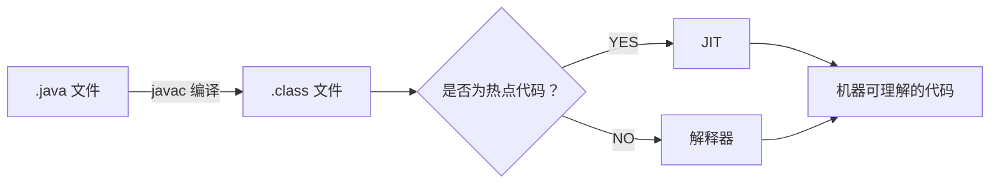
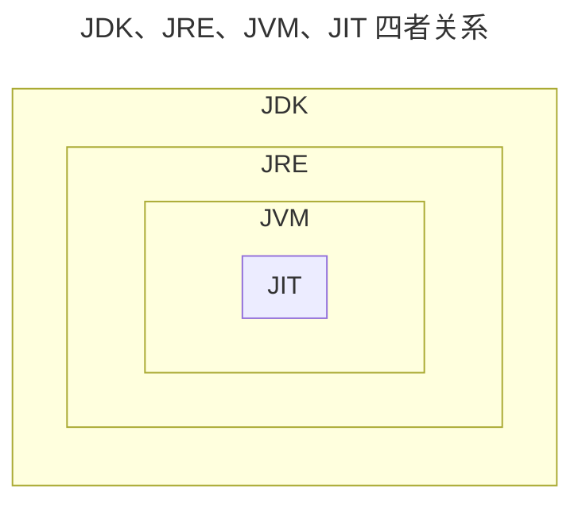

# JVM 相关知识点汇总

## 1、JVM vs JDK vs JRE

### 1、JVM 概述

Java 虚拟机（JVM）是运行 Java 字节码的虚拟机。  

JVM 有针对不同系统的特定实现（Windows，Linux，macOS），目的是使用相同的字节码，它们都会给出相同的结果。  

字节码和不同系统的 JVM 实现是 Java 语言“一次编译，随处可以运行”的关键所在。

**JVM 并不是只有一种！只要满足 JVM 规范，每个公司、组织或者个人都可以开发自己的专属 JVM。**   
也就是说我们平时接触到的 HotSpot VM（Sun/Oracle JDK 和 OpenJDK 中所带的虚拟机） 仅仅是是 JVM 规范的一种实现而已

> Oracle JDK 是基于 OpenJDK 源代码构建的  
> 关于 Oracle JDK 与 OpenJDK https://www.cnblogs.com/shoufeng/p/9719995.html
>
> 维基百科上就有常见 JVM 的对比：[Comparison of Java virtual machinesopen in new window](https://en.wikipedia.org/wiki/Comparison_of_Java_virtual_machines) ，感兴趣的可以去看看。并且，你可以在 [Java SE Specificationsopen in new window](https://docs.oracle.com/javase/specs/index.html) 上找到各个版本的 JDK 对应的 JVM 规范。

### 2、JDK 和 JRE

- JDK（Java Development Kit）= JRE + 开发工具集（javac.exe,java..exe,javadoc.exe...）  
- JRE（Java Runtime Environment Java运行环境）= JVM + Java SE 标准类库（Java Class Library）

JDK（Java Development Kit），它是功能齐全的 Java SDK（软件开发套件 Software development kit），是提供给开发者使用的，能够创建和编译 Java 程序。  

它包含了 JRE，同时还包含了编译 java 源码的编译器 javac 以及一些其他工具比如 javadoc（文档注释工具）、jdb（调试器）、jconsole（基于 JMX 的可视化监控⼯具）、javap（反编译工具）等等。

JRE（Java Runtime Environment） 是 Java 运行时环境。它是运行已编译 Java 程序所需的所有内容的集合，主要包括 Java 虚拟机（JVM）、Java 基础类库（Class Library）。

JRE 是 Java 运行时环境，仅包含 Java 应用程序的运行时环境和必要的类库。  

JDK 则包含了 JRE，同时还包括了 javac、javadoc、jdb、jconsole、javap 等工具，可以用于 Java 应用程序的开发和调试。  

如果需要进行 Java 编程工作，比如编写和编译 Java 程序、使用 Java API 文档等，就需要安装 JDK。  
而对于某些需要使用 Java 特性的应用程序，如 JSP 转换为 Java Servlet、使用反射等，也需要 JDK 来编译和运行 Java 代码。  
因此，即使不打算进行 Java 应用程序的开发工作，也有可能需要安装 JDK。

### 3、字节码

在 Java 中，JVM 可以理解的代码就叫做字节码（即扩展名为 `.class` 的文件），它不面向任何特定的处理器，只面向虚拟机。

Java 语言通过字节码的方式，在一定程度上解决了传统解释型语言执行效率低的问题，同时又保留了解释型语言可移植的特点。所以， Java 程序运行时相对来说还是高效的（不过，和 C++，Rust，Go 等语言还是有一定差距的），而且，由于字节码并不针对一种特定的机器，因此，Java 程序无须重新编译便可在多种不同操作系统的计算机上运行。

`.class->机器码` 这一步。在这一步 JVM 类加载器首先加载字节码文件，然后通过解释器**逐行解释执行**，这种方式的执行速度会相对比较慢。 

而且，有些方法和代码块是经常需要被调用的(也就是所谓的热点代码)，所以后面引进了 JIT（just-in-time compilation） 编译器，而 JIT 属于运行时编译。当 JIT 编译器完成第一次编译后，其会将字节码对应的机器码保存下来，下次可以直接使用。  

而我们知道，机器码的运行效率肯定是高于 Java 解释器的。这也解释了我们为什么经常会说 Java 是编译与解释共存的语言

:::info
HotSpot 采用了惰性评估(Lazy Evaluation)的做法，根据二八定律，消耗大部分系统资源的只有那一小部分的代码（**热点代码**），而这也就是 JIT 所需要编译的部分。  

JVM 会根据代码每次被执行的情况收集信息并相应地做出一些优化，因此执行的次数越多，它的速度就越快。

JDK 9 引入了一种新的编译模式 AOT(Ahead of Time Compilation)，它是直接将字节码编译成机器码，这样就避免了 JIT 预热等各方面的开销。JDK 支持分层编译和 AOT 协作使用。
:::

JVM 大致结构模型：

  

:::info
为什么不全部使用 AOT 呢?

AOT 可以提前编译节省启动时间，那为什么不全部使用这种编译方式呢？

长话短说，这和 Java 语言的动态特性有千丝万缕的联系了。举个例子，CGLIB 动态代理使用的是 ASM 技术，而这种技术大致原理是运行时直接在内存中生成并加载修改后的字节码文件也就是 .class 文件，如果全部使用 AOT 提前编译，也就不能使用 ASM 技术了。为了支持类似的动态特性，所以选择使用 JIT 即时编译器。
:::

### 4、Java 语言“编译与解释并存”的原因

高级编程语言按照程序的执行方式分为两种：
- 编译型：编译型语言 会通过编译器将源代码 **一次性翻译** 成可被该平台执行的机器码。一般情况下，编译语言的执行速度比较快，开发效率比较低。常见的编译性语言有 C、C++、Go、Rust 等等。
- 解释型：解释型语言会通过解释器 **一句一句的将代码解释**（interpret）为机器代码后再执行。解释型语言开发效率比较快，执行速度比较慢。常见的解释性语言有 Python、JavaScript、PHP 等等。

