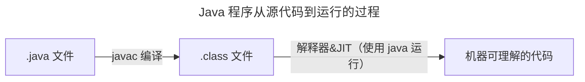
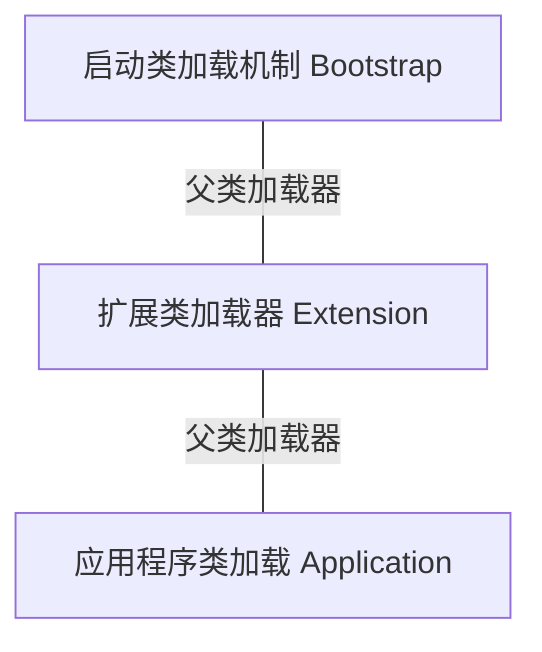

## 初识虚拟机
JVM 全称 Java Virtual Machine，即 Java 虚拟机  
Java 虚拟机的职责是运行字节码文件

JVM 三大核心功能：
- JVM 包内存管理
  - 自动为对象，方法等分配内存
  - 自动垃圾回收机制，回收不再使用的对象
- 解释执行虚拟机指令
  - 对字节码文件中的指令实时解释成机器码，让计算机执行
- 及时编译
  - 对热点代码进行优化，提升执行效率

常见的 Java 虚拟机：

JVM 的组成：
- 类加载器 ClassLoader
- 运行时数据区（JVM 管理的内存）
- 执行引擎（即使编译器、解释器、垃圾回收器）
- 本地接口（通常为 native 修饰）

## 字节码文件的组成
- 基本信息：
  - 魔数、字节码文件对应的 Java 版本号
  - 访问标识（public final 等）
  - 父类和接口
- 常量池
  - 保存字符串常量、类或接口名、字段名
- 字段
  - 当前类或接口声明的字段信息
- 方法
  - 当前类或接口声明的方法信息
- 属性
  - 类的属性、比如源码文件名、内部类的列表等

## 类的生命周期
类的生命周期：  
加载、连接、初始化、使用、卸载
### 加载阶段
1. 类加载器根据类的全限定名通过不同的渠道以二进制流的方式获取字节码信息
2. 类加载器在加载完之后，Java 虚拟机会将字节码中的信息保存到方法区中
3. 类加载器在加载完类之后，Java 虚拟机会将字节码中的信息保存到内存的方法区中  
   生成一个 InstanceKlass 对象，保存类的所有信息，里面包含实现特定功能比如多态的信息
4. 同时，Java 虚拟机还在堆中生成一份与方法区中数据类似的 Java.lang.Class 对象  
   作用在 Java 代码中去获取类的信息以及存储静态字段的数据（JDK 8 以后）

### 连接阶段
1. 验证：验证验证内容是否满足《Java 虚拟机规范》
2. 准备：给静态变量赋初值
3. 解析：将常量池中的符号引用替换成指向内存的直接引用

### 初始化阶段
- 初始化阶段会执行静态代码块中的代码，并为静态变量赋值  
- 初始化阶段会执行字节码文件中的 clinit 部分的字节码指令

## 类加载器
类加载器是什么：  
类加载器（ClassLoader）是 Java 虚拟机提供给应用程序去实现获取类和接口字节码数据的技术  
类加载器只参与加载过程中的字节码获取并加载内存这一部分

类加载器的作用：  
类加载器（ClassLoader）负责在类加载过程中的字节码获取并加载到内存这一部分。通过加载字节码数据放入内存转换为 byte[]，接下来调用虚拟机底层将 byte[] 转换成方法区和堆中的数据

类加载器分为两类：一类是 Java 代码中实现，一类是 Java 虚拟机底层源码实现
- 虚拟机底层源码实现：
  - 源代码位于 Java 虚拟机源码中，实现语言与底层语言一致（如 C++）
  - 用于加载程序运行时的基础类，如 java.lang.String
- Java 代码中实现：
  - JDK 中默认提供或自定义
  - 所有 Java 中实现的类加载器都要继承 ClassLoader 这个抽象类

### JDK8 及以前的类加载器
虚拟机底层实现（C++）：
- 启动类加载器 BootStrap：加载 Java 中最核心的类
Java 实现：
- 扩展类加载器 Extension：允许扩展 Java 中比较通用的类
- 应用程序类加载器 Application：加载应用使用的类

#### 启动类加载器 BootStrap
什么是启动类加载器：启动类加载器（Bootstrap ClassLoader）时有 Hotspot 虚拟机提供的、使用 C++ 编写的类加载器    
启动类加载器的作用：默认加载 Java 「安装目录/jre/lib」 下的文件，比如 rt.jar（包含 java.lang 中的常用类），tools.jar，resource.jar 等  

通过启动类加载器加载用户 jar 包：
- 使用参数进行扩展：
  使用 `-Xbootclasspath/xxx:jar包目录/jar包名` 进行扩展

#### Java 实现
- 扩展类加载器 Extension
什么是扩展类加载器、应用程序类加载器：扩展类加载器和应用程序类加载器都是 JDK 中提供的、使用 Java 编写的类加载器  
它们的源码位于 sun.misc.Launcher 中，是一个静态内部类，继承自 URLClassLoader     
继承 URLClassLoader 的作用：具备通过目录或指定 jar 包将字节码文件加载到内存中  

- 扩展类加载器 Extension   
  加载 Java 安装目录 /jre/lib/ext 下的文件  
  通过扩展类加载器加载用户 jar 包：使用 `-Djava.ext.dirs=jar包目录` 扩展，这种方式会覆盖掉原始目录，可使用 `;` (windows) `:` (macos/linux) 追加原始目录

- 应用程序类加载器  
  加载 classpath 下的类文件

### 双亲委派机制
由于 Java 虚拟机有多个类加载器，双亲委派机制的核心就是解决一个类到底由谁加载的问题

双亲委派机制的作用：
- 保证类加载的安全性（避免恶意代码薙魂 JDK 中的核心类库）
- 避免重复加载（避免一个类被加载多次）

类加载器的双亲委派机制：当一个类加载器接受到加载类的任务时，会自底向上查找是否加载过，再由顶向下进行加载

### 自定义类加载器
自定义类加载器的父加载器是应用程序类加载器 Application

### JDK9 及以后的类加载器
JDK 引入了 module 的概念，类加载器在设计上发生了好多变化
1. 启动类加载器使用 Java 编写，位于 jdk.internal.loader.ClassLoaders 类中   
   Java 中的 BootClassLoader 继承自 BuiltinClassLoader 实现从模块中找到要加载的字节码资源文件  
   启动类加载器依然无法获得通过 java 代码获取到，返回的仍然是 null，保持了统一  
2. 扩展类加载器被替换成了平台类加载器（Platform Class Loader）
   平台类加载器遵循模块化方法加载字节码文件，所以继承关系从 URLClassLoader 变成了 BuiltinClassLoader，BuiltinClassLoader 实现了从模块中加载字节码文件。平台类加载器的存在更过的是为了与老版本的设计方案兼容，自身没有特殊的逻辑

## 运行时数据区（Jvm 管理的内存）
Java 虚拟机在运行 java 程序过程中管理的内存其余，称为运行时数据区  

分类：
- 程序计数器（线程不共享）
- Java 虚拟机栈（线程不共享）
- 本地方法栈（线程不共享）
- 方法区（线程共享）
- 堆（线程共享）

### 程序计数器
程序计数器（Program Counter Register）也叫 PC 寄存器，每个线程会通过程序计数器记录当前要执行的字节码指令的地址    

### Java 虚拟机栈
Java 虚拟机栈采用栈的数据结构管理「方法调用」中的基本数据（方法以先进后出的形式）每一个方法的调用使用一个「栈帧」（Stack Frame）来保存  

栈帧的组成：局部变量表、操作数栈、帧数据

- 局部变量表：局部变量表的作用是方法执行过程中存放所有的局部变量
- 操作数栈：操作数栈是栈帧中虚拟机在执行指令过程中用来存放临时数据的一块区域
- 帧数据：帧数据主要包含动态链接、方法出口、异常表的引用

栈内存溢出：  
Java 虚拟机栈如果栈帧过多，占用内存超过栈内存分配的最大的大小就会出现内存溢出  
Java 虚拟机栈内存溢出时会出现 StackOverflowError 错误

修改 Java 虚拟机栈的大小，可以使用虚拟机参数 -Xss
- `-Xss 栈大小`
- 单位：字节（默认，必须是 1024 的倍数）、k/K、m/M、g/G

### 本地方法栈
- Java 虚拟机栈存储 Java 方法调用时的栈帧、本地方法栈存储 native 本地方法的栈帧
- 在 Hotsot 虚拟机中，Java 虚拟机栈和本地方法栈实现上使用同一个栈空间

### 堆
- Java 程序中堆内存是空间最大的一块内存区域，创建出来的对象都在堆上
- 栈中的局部变量表可以存放堆上对象的引用，静态变量也可以存放堆对象的引用，通过静态变量可以实现对象在线程之间的共享

堆内存大小有上限，达到上限抛出 OutOfMermory 错误

堆空间的三个值：
- used：当前已使用的堆内存
- total：java 虚拟机已分配的可用堆内存
- max：java 虚拟机可分配的最大堆内存

要修改堆的大小，可以使用虚拟机参数 -Xmx（max 最大值）和 -Xms（初始的 total）  
单位：字节（默认，必须是 1024 的倍数）、k/K、m/M、g/G  
限制：Xmx 必须大于 2 MB，Xms 必须大于 1 MB  
开发时，建议将 -Xmx 和 -Xms 设置为相同的值

### 方法区

方法区是存放基础信息的位置，线程共享，主要包括：
- 类的元信息
- 运行时常量池
- 字符串常量池

详细描述：
- 元信息：存储每个类的 「基本信息（元信息）」，一般称之为 InstanceKclass 对象，在类的「加载阶段」完成  
- 运行时常量池：
  常量池中存放的是字节码中的常量池的内容    
  字节码文件中通过编号表的方式找到常量，这种常量池称为「静态常量池」。当常量池加载到内存中后，可用过内存地址快速定位到常量池中的内容，这种常量池称为运行时常量池

方法区是《Java 虚拟机规范》中设计的虚拟概念，每款 Java 虚拟机在实现上都各不相同。Hotspot 设计如下：
- JDK 7及之前的版本：将方法区在「堆区域中的永久代空间」，堆的大小由虚拟机参数来控制
- JDK 8 及之后的版本：将方法区存放在「元空间」中，元空间位于 OS 的直接内存中，默认不超过 OS 承受上限，可以一直分配

JDK 7 堆大小虚拟机参数： -XX:MaxPermSize=值  
JDK 8 限制大小参数：-XX:MaxMetaspaceSize=值

字符串常量池：

字符串常量池用于存放字符串

JDK7 及之后的版本中，静态变量存放在堆中的 Class 对象中，脱离了永久代

### 直接内存
如果需要手动调整直接内存大小，可以使用 `-XX:MaxDirectMemorySize=大小`   
单位：k/K、m/M、g/G  
默认不设置该参数的情况下，JVM 自动选择最大分配的大小

### 不同 JDK 版本之间的运行时数据区：

JDK 6：

JDK 7：

JDK 8：

## 自动垃圾回收

Java 引入了自动的垃圾回收（Garbage Collection / GC）机制，垃圾回收器主要负责对「堆」上的内存（不再使用的对象）进行回收

对于线程不共享的部分（程序计数器、java 虚拟机栈、本地方法栈）都伴随着线程的创建而创建、线程的销毁而销毁。即方法的栈帧在执行完方法后就会自动弹出栈并释放掉对应内存

### 方法区的回收

方法区中能回收的主要内容是「不再使用的类」  

判定一个类是否可被卸载，需同时满足下面三个条件：
- 此类的所有实例对象都已经被回收，在堆中不存在任何该类的实例对象以及子类对象
- 加载该类的类的加载器已被回收
- 该类对应的 java.lang.Class 对象没有在任何地方被引用

### 堆内存回收

如何判断堆上的对象可以回收：
- Java 中的对象是能否能被回收，是根据对象时否被引用来决定的。如果对象被引用了，说明该对象还在使用，不允许回收

如何判断堆上的对象没有被引用：
- 引用计数法
  - 为每个对象维护一个引用计数器，当对象被引用时 +1、取消引用时 -1（该方法会出现循环引用问题）

- 可达性分析算法（java 使用的方法）

#### 可达性分析

Java 使用可达性分析算法来判断对象是否可以被回收  
可达性分析将对象分为两类：垃圾回收的跟对象（GC Root）和普通对象  
GC Root 对象一般不被回收，如果普通对象可以通过引用链找到 GC Root 对象，则不可被回收

#### GC Root 对象
哪些对象被称之为 GC Root 对象：
- 线程 Thread 对象
- 系统类加载器加载的 java.lang.Class 对象
- 监视器对象，用来保存 synchronized 关键字持有的对象
- 本地方法调用时使用的全局对象

#### 其他常见对象引用

可达性算法描述的对象引用、一般指强引用，即 GCRoot 对象对普通对象的引用

Java 中其他引用方式：
- 软引用：如果只有一个对象只有软引用关联到它，当程序内存不足时，就会将软引用中的数据进行回收
- 弱引用：弱引用包含的对象在垃圾回收时，不管内存够不够都不会直接被回收
- 虚引用
- 终结器引用

### 垃圾回收算法
垃圾回收算法流程：
1. 找到内存中欧存活的对象
2. 释放不在存活对象的内存，使得程序能再次利用这部分空间

四种垃圾回收算法：
- 标记-清除算法
- 复制算法
- 标记-整理算法
- 分代 GC

垃圾回收会通过单独的 GC 线程完成，GC 线程在执行时需要暂停所有用户线程，这个过程称为 Stop The World（STW），如果 STW 时间过长则会影响用户使用

垃圾回收算法评价指标
- 吞吐量：吞吐量 = 执行用户代码时间 / （执行用户代码时间 + GC 时间）
- 最大暂停时间：STW 的最大值
- 堆使用效率：不同垃圾回收算法，堆内存使用方式不同

#### 标记清除算法
算法描述
1. 标记阶段：通过可达性分析算法，从 GC Root 开始通过引用链遍历出所有存活对象  
2. 清除阶段：从内存中删除没有被标记的非存活对象  

标记清除算法的优缺点  
- 优点：实现简单，只需在第一阶段标记，第二阶段删除  
- 缺点：
  - 碎片化问题：对象被删除后，内存中会出现很多细小可用内存，无法分配给大内存对象
  - 分配速度慢：由于内存碎片存在，需要维护一个空闲链表连接内存碎片，很可能需要遍历到链表最后才获得合适空间

#### 复制算法

算法描述：
1. 将内存分割成两块空间，From 和 To 空间，对象分配阶段，创建对象
2. GC 阶段开始时，将 GC Root 搬运到 To 空间
3. 将 GC Root 关联的对象搬运到 To 空间
4. 清理 From 空间，将 From 和 To 名字互换

复制算法优缺点
- 优点：
  - 吞吐量高
  - 不会发生碎片化
- 缺点：内存使用效率低

#### 标记整理算法
标记整理算法（标记压缩算法）是对清理算法容易产生内存碎片的一种解决方案

算法描述：
1. 标记阶段：通过可达性分析算法，从 GC Root 开始通过引用链遍历出所有存活对象  
2. 整理阶段：将存活对象移动到堆的一端清理掉存活对象的内存空间，这样便于清理出一整大块的内存空间

标记整理算法优缺点
- 优点
  - 内存使用效率高
  - 不会发生碎片化
- 缺点：整理阶段的效率不高

#### 分代垃圾回收
现代优秀垃圾回收算法将上述算法组合使用，其中应用最广的为分代垃圾回收算法（Generational GC）  
分代垃圾回收算法将整个内存区域划分为年轻代和老年代

分代回收执行流程：
1. 新创建的对象首先被放入 Eden 区
2. 当 Eden 区满时，新创建的对象无法放入，此时触发年轻代 GC，称为 Minor GC 或 Young GC
3. Minor GC 会把 Eden 中和 From 中需要回收的对象回收（可达性分析法），把没有回收的对象放入 To 区
4. 接下来 S0 变为 To 区，S1 变为 From 区。当 Eden 满时再往里放对象，依然进行 Minor GC，此时回收 Eden 和 S1(From) 的对象，并把 eden 和 From 中剩余对象放入 S0
     -  注意：每次 Minor GC 中为存活对象记录年龄，初始为 0，每次 GC 完 +1
5. 如果 Minor GC 后对象的年龄达到阈值（最大 15，默认值和垃圾会回收器有关），对象就会晋升至老年代
6. 当老年代空间不足，无法放入新的对象时，先尝试 Minor GC ，如果还不足就会触 Full GC，Full GC 会对整个堆进行垃圾回收
7. 如果 Full GC 依然无法回收掉老年代的对象，那么当兑现继续放入老年代时，就会抛出 Out Of Menory 异常

分代 GC 算法把堆分成年轻代和老年代的原因：
- 可以通过调整年轻代和老年代的比例来适应不同类型的应用程序，提高内存的利用率和性能
- 新生代和老年代使用不同的垃圾回收算法，新生代一般选择复制算法，老年代可以选择标记 - 清除和标记 - 整理算法，由程序员来选择灵活度较高
3、分代的设计中允许只回收新生代 (minor gc)，如果能满足对象分配的要求就不需要对整个堆进行回收 (full gc)，STW 时间就会减少。

#### 垃圾回收器的组合关系

G1 垃圾回收器：  
JDK9 之后默认的垃圾回收器是 G1 (Garbage First) 垃圾回收器  
Parallel Scavenge 关注吞吐量，允许用户设置最大暂停时间，但是会减少年轻代可用空间的大小  
CMS 关注暂停时间，但是吞吐量方面会下降。  
而 G1 设计目标就是将上述两种垃圾回收器的优点融合 
- 支持巨大的堆空间回收，并有较高的吞吐量。
- 支持多 CPU 并行垃圾回收。
- 允许用户设置最大暂停时间。

JDK9 之后强烈建议使用 G1 垃圾回收器