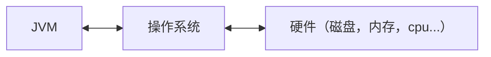
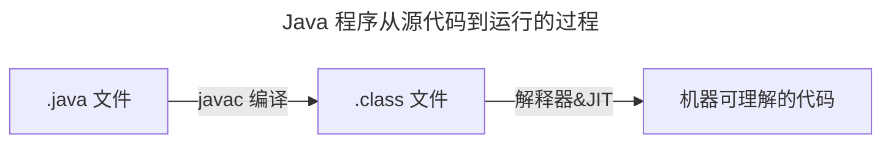
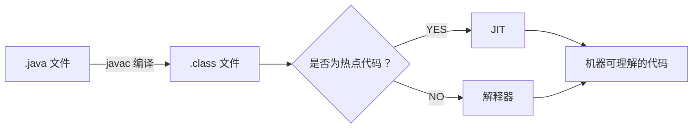
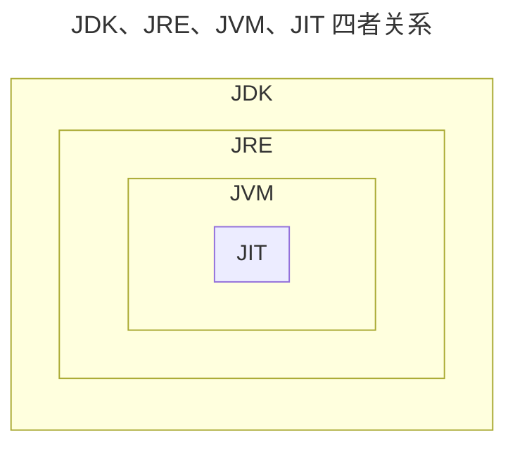
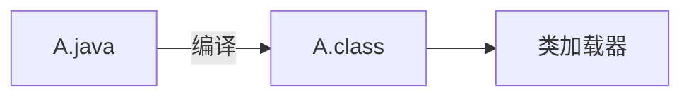
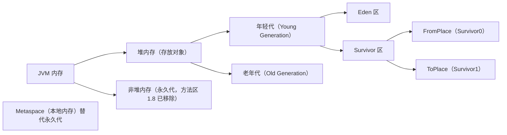
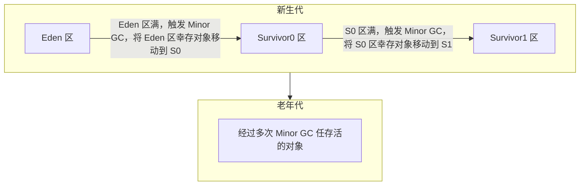

JVM(Java Virtual Machine) 其实就类似于一台小电脑运行在 windows 或者 linux 这些操作系统环境下即可。  
它直接和操作系统进行交互，与硬件不直接交互，而操作系统可以帮我们完成和硬件进行交互的工作。



## 一、基础知识

### JVM

Java 虚拟机（JVM）是运行 Java 字节码的虚拟机。  

JVM 有针对不同系统的特定实现（Windows，Linux，macOS），目的是使用相同的字节码，它们都会给出相同的结果。  

字节码和不同系统的 JVM 实现是 Java 语言“一次编译，随处可以运行”的关键所在。

**JVM 并不是只有一种！只要满足 JVM 规范，每个公司、组织或者个人都可以开发自己的专属 JVM。**   
也就是说我们平时接触到的 HotSpot VM（Sun/Oracle JDK 和 OpenJDK 中所带的虚拟机） 仅仅是是 JVM 规范的一种实现而已

> Oracle JDK 是基于 OpenJDK 源代码构建的  

### JDK 和 JRE

- JDK（Java Development Kit）= JRE + 开发工具集（javac.exe,java..exe,javadoc.exe...）  
- JRE（Java Runtime Environment Java运行环境）= JVM + Java SE 标准类库（Java Class Library）

JDK（Java Development Kit），它是功能齐全的 Java SDK（软件开发套件 Software development kit），是提供给开发者使用的，能够创建和编译 Java 程序。  

它包含了 JRE，同时还包含了编译 java 源码的编译器 javac 以及一些其他工具比如 javadoc（文档注释工具）、jdb（调试器）、jconsole（基于 JMX 的可视化监控⼯具）、javap（反编译工具）等等。

JRE（Java Runtime Environment） 是 Java 运行时环境。它是运行已编译 Java 程序所需的所有内容的集合，主要包括 Java 虚拟机（JVM）、Java 基础类库（Class Library）。

JRE 是 Java 运行时环境，仅包含 Java 应用程序的运行时环境和必要的类库。  

JDK 则包含了 JRE，同时还包括了 javac、javadoc、jdb、jconsole、javap 等工具，可以用于 Java 应用程序的开发和调试。  

如果需要进行 Java 编程工作，比如编写和编译 Java 程序、使用 Java API 文档等，就需要安装 JDK。  
而对于某些需要使用 Java 特性的应用程序，如 JSP 转换为 Java Servlet、使用反射等，也需要 JDK 来编译和运行 Java 代码。  
因此，即使不打算进行 Java 应用程序的开发工作，也有可能需要安装 JDK。

### 字节码

在 Java 中，JVM 可以理解的代码就叫做字节码（即扩展名为 `.class` 的文件），它不面向任何特定的处理器，只面向虚拟机。

Java 语言通过字节码的方式，在一定程度上解决了传统解释型语言执行效率低的问题，同时又保留了解释型语言可移植的特点。所以， Java 程序运行时相对来说还是高效的（不过，和 C++，Rust，Go 等语言还是有一定差距的），而且，由于字节码并不针对一种特定的机器，因此，Java 程序无须重新编译便可在多种不同操作系统的计算机上运行。



`.class->机器码` 这一步。在这一步 JVM 类加载器首先加载字节码文件，然后通过解释器**逐行解释执行**，这种方式的执行速度会相对比较慢。 

而且，有些方法和代码块是经常需要被调用的(也就是所谓的热点代码)，所以后面引进了 JIT（just-in-time compilation） 编译器，而 JIT 属于运行时编译。当 JIT 编译器完成第一次编译后，其会将字节码对应的机器码保存下来，下次可以直接使用。  

而我们知道，机器码的运行效率肯定是高于 Java 解释器的。这也解释了我们为什么经常会说 Java 是编译与解释共存的语言



:::info
HotSpot 采用了惰性评估(Lazy Evaluation)的做法，根据二八定律，消耗大部分系统资源的只有那一小部分的代码（**热点代码**），而这也就是 JIT 所需要编译的部分。  

JVM 会根据代码每次被执行的情况收集信息并相应地做出一些优化，因此执行的次数越多，它的速度就越快。

JDK 9 引入了一种新的编译模式 AOT(Ahead of Time Compilation)，它是直接将字节码编译成机器码，这样就避免了 JIT 预热等各方面的开销。JDK 支持分层编译和 AOT 协作使用。
:::



JVM 大致结构模型：

  

:::info
为什么不全部使用 AOT 呢?

AOT 可以提前编译节省启动时间，那为什么不全部使用这种编译方式呢？

长话短说，这和 Java 语言的动态特性有千丝万缕的联系了。举个例子，CGLIB 动态代理使用的是 ASM 技术，而这种技术大致原理是运行时直接在内存中生成并加载修改后的字节码文件也就是 .class 文件，如果全部使用 AOT 提前编译，也就不能使用 ASM 技术了。为了支持类似的动态特性，所以选择使用 JIT 即时编译器。
:::

### Java 语言“编译与解释并存”的原因

高级编程语言按照程序的执行方式分为两种：
- 编译型：编译型语言 会通过编译器将源代码 **一次性翻译** 成可被该平台执行的机器码。一般情况下，编译语言的执行速度比较快，开发效率比较低。常见的编译性语言有 C、C++、Go、Rust 等等。
- 解释型：解释型语言会通过解释器 **一句一句的将代码解释**（interpret）为机器代码后再执行。解释型语言开发效率比较快，执行速度比较慢。常见的解释性语言有 Python、JavaScript、PHP 等等。


### Oracle JDK vs OpenJDK

2006 年 SUN 公司将 Java 开源，也就有了 OpenJDK。  
2009 年 Oracle 收购了 Sun 公司，于是自己在 OpenJDK 的基础上搞了一个 Oracle JDK。  Oracle JDK 是不开源的，并且刚开始的几个版本（Java8 ~ Java11）还会相比于 OpenJDK 添加一些特有的功能和工具。

Oracle JDK 是基于 OpenJDK 7 构建的，只添加了一些小功能，由 Oracle 工程师参与维护。

Oracle JDK 和 OpenJDK 的区别：
1. 是否开源：OpenJDK 是一个参考模型并且是完全开源的，而 Oracle JDK 是基于 OpenJDK 实现的，并不是完全开源的。
   OpenJDK 开源项目：https://github.com/openjdk/jdk
2. 是否免费：Oracle JDK 会提供免费版本，但一般有时间限制。
   JDK17 之后的版本可以免费分发和商用，但是仅有 3 年时间，3 年后无法免费商用
   不过，JDK8u221 之前只要不升级可以无限期免费。OpenJDK 是完全免费的。
3. 功能性：Oracle JDK 在 OpenJDK 的基础上添加了一些特有的功能和工具，比如 Java Flight Recorder（JFR，一种监控工具）、Java Mission Control（JMC，一种监控工具）等工具。
   不过，在 Java 11 之后，OracleJDK 和 OpenJDK 的功能基本一致，之前 OracleJDK 中的私有组件大多数也已经被捐赠给开源组织。
4. 稳定性：OpenJDK 不提供 LTS 服务，而 OracleJDK 大概每三年都会推出一个 LTS 版进行长期支持。
   不过，很多公司都基于 OpenJDK 提供了对应的和 OracleJDK 周期相同的 LTS 版。因此，两者稳定性其实也是差不多的。
5. 协议：Oracle JDK 使用 `BCL/OTN` 协议获得许可，而 OpenJDK 根据 `GPL v2` 许可获得许可。

:::info
既然 Oracle JDK 这么好，那为什么还要有 OpenJDK？
- OpenJDK 是开源的，开源意味着你可以对它根据你自己的需要进行修改、优化，比如 Alibaba 基于 OpenJDK 开发了 Dragonwell8：https://github.com/alibaba/dragonwell8
- OpenJDK 是商业免费的（这也是为什么通过 yum 包管理器上默认安装的 JDK 是 OpenJDK 而不是 Oracle JDK）。虽然 Oracle JDK 也是商业免费（比如 JDK 8），但并不是所有版本都是免费的。
- OpenJDK 更新频率更快。Oracle JDK 一般是每 6 个月发布一个新版本，而 OpenJDK 一般是每 3 个月发布一个新版本。（现在你知道为啥 Oracle JDK 更稳定了吧，先在 OpenJDK 试试水，把大部分问题都解决掉了才在 Oracle JDK 上发布）基于以上这些原因，OpenJDK 还是有存在的必要的！
:::

### Java 文件是如何被运行的

假设编写了一个 `A.java` 文件，目前它只是一个文本文件且有一定的缩进  
JVM 是不认识文本文件的，所以它需要一个 **编译** ，让其成为一个它会读二进制文件的 `A.class`

#### ① 类加载器
如果 JVM 想要执行这个 .class 文件，我们需要将其装进一个 **类加载器** 中，它就像一个搬运工一样，会把所有的 .class 文件全部搬进 JVM 里面来。

#### ② 方法区
**方法区** 是用于存放类似于 **元数据** 信息方面的数据的  
比如类信息，常量，静态变量，编译后代码···等  
类加载器将 .class 文件搬过来就是先丢到这一块上
#### ③ 堆
堆 主要放了一些存储的数据，比如对象实例，数组···等，它和方法区都同属于 线程共享区域 。也就是说它们都是 **线程不安全** 的

#### ④ 栈
栈 这是我们的代码运行空间。我们编写的每一个方法都会放到 栈 里面运行。我们会听说过 本地方法栈 或者 本地方法接口 这两个名词，不过我们基本不会涉及这两块的内容，它俩底层是使用 C 来进行工作的，和 Java 没有太大的关系。

#### ⑤ 程序计数器
主要就是完成一个加载工作，类似于一个指针一样的，指向下一行我们需要执行的代码。和栈一样，都是 **线程独享** 的，就是说每一个线程都会有自己对应的一块区域而不会存在并发和多线程的问题。


:::info
- `.java` 文件经过编译后变成 `.class` 字节码文件
- 字节码文件通过 `类加载器` 被搬运到 JVM 虚拟机中
- 虚拟机主要的 5 大块：
  - `方法区`，`堆` 都为`线程共享`区域，有线程安全问题
  - `栈` 和 `本地方法栈` 和 `计数器` 都是 `独享区域`，不存在线程安全问题
  - 而 JVM 的调优主要就是围绕 `堆`，`栈` 两大块进行
  :::


### 一个简单的示例
```java
// Stu类
public class Stu(){
    public String name;
    public Student(String name){
        this.name = name;
    }
    public void say(){
        System.out.pringln("stu_name:" + name);
    }
}
```
```java
// 主函数
public class App{
    public static void main(String[] args){
        Stu stu = new Stu("T4mako");
        stu.say();
    }
}
```

1.  `App.java` 编译后得到 `App.class` ，执行 `App.class` ，系统会启动一个 `JVM 进程` ，从 `classpath` 路径中找到一个名为 `App.class` 的二进制文件，将 App 的类信息加载到运行时数据区的 `方法区` 内，这个过程叫做 App `类的加载`
2.  JVM 找到 App 的主程序入口，执行 main 方法
3.  main 中的第一条语句为 `Stu stu = new Stu("T4mako");` ，就是让 JVM 创建一个 Stu 对象，但是这个时候方法区中是没有 Stu 类的信息的，所以 JVM 马上加载 Stu 类，把 Stu 类的信息放到 `方法区` 中
4.  加载完 Stu 类后，JVM 在 `堆` 中为一个新的 stu 实例分配内存，然后调用构造函数初始化 stu 实例，这个 stu 实例持有 **指向方法区中的 Stu 类的类型信息的引用**
5.  执行 `stu.say();` 时，JVM 根据 stu 的引用找到 stu 对象，然后根据 stu 对象持有的引用定位到方法区中 Stu 类的类型信息的方法表，获得 say() 的字节码地址。
6.  执行 say()

:::info
只需要知道 `对象实例初始化` 时会去 `方法区中找类信息`  
完成后再到 `栈` 那里去 `运行方法` 。  
找方法就在方法表中找
:::

## 二、类加载器的介绍
类的加载器：
- 负责加载 .class 文件，.class 文件开头会有特定的文件标示  
- **将 class 文件字节码内容加载到内存中**，并将这些内容转换成方法区中的运行时数据结构，并且 ClassLoader 只负责 class 文件的加载，而是否能够运行则由 Execution Engine 来决定

### 2.1 类加载器的流程
类被加载到虚拟机内存中开始，到释放内存总共有 7 个步骤：  
加载，连接（验证，准备，解析），初始化，使用，卸载。  

#### 2.1.1 加载
1. 将 class 文件加载到内存
2. 将 **静态数据结构** 转化成 **方法区中运行时的数据结构**
3. 在 **堆** 中生成一个代表这个类的 `java.lang.Class 对象` 作为数据访问的入口

#### 2.1.2 链接
连接：为类的静态变量赋予正确的初始值   
1. 验证：  
   安全检查 （确保加载的类符合 JVM 规范和安全，保证被校验类的方法在运行时不会做出危害虚拟机的事件）
2. 准备：
   为 `static` 变量在方法区中分配内存空间，设置变量的初始值  
   （注意：准备阶段只设置类中的 **静态** 变量（ **方法区** 中），不包括 **实例变量**（ **堆内存** 中），实例变量是对象初始化时赋值的）
3. 解析：
   虚拟机将常量池内的符号引用替换为直接引用的过程  
   （符号引用比如我现在 `import java.util.ArrayList` 这就算符号引用
     直接引用就是指针或者对象地址，注意 **引用对象** 一定是在**内存**进行）

#### 2.1.3  初始化
初始化：执行类构造器方法的 `<clinit>()` 的过程，且要保证父类的 `<clinit>()` 方法执行完毕  
这个方法由编译器收集，顺序执行所有 **类变量（static）** 显式初始化和 **静态代码块** 中语句。  

初始化执行时机：
- new一个对象
- 访问某个类或接口的静态变量
- 调用类的静态方法，反射 `Class.forName`
- 初始化一个类的子类
- JVM启动时标明的启动类，即文件名和类名相同的那个类


注：静态代码块 和 类变量初始化 顺序执行

:::info
初始化顺序依次是：（静态变量、静态初始化块）–>（变量、初始化块）–> 构造器；如果有父类，则顺序是：父类 static 方法 –> 子类 static 方法 –> 父类构造方法- -> 子类构造方法
:::

```java
static {
    a = 10;
}
public static int a = 8; // a 最终为 8
```

:::info
字节码文件中初始化方法有两种，非静态资源初始化的 `<init>` 和静态资源初始化的 `<clinit>` ，类构造器方法 `<clinit>()` 不同于类的构造器，这些方法都是字节码文件中只能给 JVM 识别的特殊方法。
:::

#### 2.1.4 卸载
GC 将无用对象从内存中卸载

### 2.2 类加载器加载顺序
类加载器顺序：
BootStrap ClassLoader：rt.jar
Extension ClassLoader: 加载扩展的 jar 包
App ClassLoader：指定的 classpath 下面的 jar 包
Custom ClassLoader：自定义的类加载器

> 第一步： 字底向上检查类是否已加载
> 第二步： 自顶向下尝试加载类

### 2.3 双亲委派机制
当一个类收到了加载请求时，它是不会先自己去尝试加载的，而是委派给父类去完成，比如我现在要 new 一个 Person，这个 Person 是我们自定义的类，如果我们要加载它，就会先委派 App ClassLoader ，只有当父类加载器都反馈自己无法完成这个请求（也就是父类加载器都没有找到加载所需的 Class）时，子类加载器才会自行尝试加载。

这样做的好处是，加载位于 rt.jar 包中的类时不管是哪个加载器加载，最终都会委托到 BootStrap ClassLoader 进行加载，这样保证了使用不同的类加载器得到的都是同一个结果。

其实这个也是一个隔离的作用，避免了我们的代码影响了 JDK 的代码，比如我现在自己定义一个 java.lang.String：
```java
package java.lang;
public class String {
    public static void main(String[] args) {
        System.out.println();
    }
}
```
尝试运行当前类的 `main` 函数的时候，我们的代码肯定会报错。这是因为在加载的时候其实是找到了 `rt.jar` 中的 `java.lang.String`，然而发现这个里面并没有 `main` 方法。

## 三、运行时数据区
### 3.1 本地方法栈和程序计数器
- 本地方法栈：
  `native` 修饰的方法就是本地方法，这是使用 C 来实现的（比如 Thread 类的 start0 方法）  
  一般这些方法都会放到一个叫做本地方法栈的区域。

- 程序计数器其实就是一个指针，它指向了我们程序中下一句需要执行的指令  
  它是内存区域中唯一一个不会出现 OutOfMemoryError 的区域，且占用很小的内存空间  
  这个内存仅代表当前线程所执行的字节码的行号指示器，字节码解析器通过改变这个计数器的值选取下一条需要执行的字节码指令

:::info
如果执行的是 native 方法，那这个指针就不工作了。
:::

### 3.2 方法区
**方法区** 主要的作用是存放 **类的元数据** 信息，常量和静态变量···等。当它存储的信息过大时，会在无法满足内存分配时报错

### 3.3 虚拟机栈和虚拟机堆
栈管运行，堆管存储。  
则虚拟机栈负责运行代码，而虚拟机堆负责存储数据

#### 3.3.1、虚拟机栈
它是 Java 方法执行的内存模型。  
里面会对局部变量，动态链表，方法出口，栈的操作（入栈和出栈）进行存储，且线程独享。  
同时如果我们听到 **局部变量表**，那也是在说 **虚拟机栈**

#### 3.3.2、虚拟机栈的异常
线程请求的栈的深度大于虚拟机栈的最大深度，就会报 `StackOverflowError `（这种错误经常出现在递归中）  
Java 虚拟机也可以动态扩展，但随着扩展会不断地申请内存，当无法申请足够内存时就会报错 `OutOfMemoryError`

#### 3.3.3、虚拟机栈的生命周期
对于栈来说，不存在垃圾回收。  
只要程序运行结束，栈的空间自然就会释放了。  
**栈的生命周期** 和 **所处的线**程是一致的。

:::info
8 种基本类型的变量+对象的引用变量+实例方法都是在栈里面分配内存
:::

#### 3.3.4、虚拟机栈的执行
我们经常说的栈帧数据（说白了在 JVM 中叫栈帧，放到 Java 中其实就是 **方法**）它也是存放在栈中的。

栈中的数据都是以栈帧的格式存在，它是一个关于方法和运行期数据的数据集。

比如我们执行一个方法 a，就会对应产生一个栈帧 A1，然后 A1 会被压入栈中。  
同理方法 b 会有一个 B1  
方法 c 会有一个 C1  
等到这个线程执行完毕后，栈弹出 C1，B1，A1。（**先进后出**）

#### 3.3.5、局部变量的复用
局部变量表用于存放方法参数和方法内部所定义的局部变量。  
它的容量是以 Slot 为最小单位，一个 slot 可以存放 32 位以内的数据类型。

为了节省栈帧空间，这些 slot 是可以复用的，当方法执行位置超过了某个变量，那么这个变量的 slot 可以被其它变量复用。当然如果需要复用，那我们的垃圾回收自然就不会去动这些内存

#### 3.3.6、虚拟机堆的概念

JVM 内存会划分为堆内存和非堆内存，堆内存中也会划分为 **年轻代** 和 **老年代**，而非堆内存则为 **永久代**  

Eden，FromPlace 和 ToPlace 的默认占比为 8:1:1。  
可以通过一个 `-XX:+UsePSAdaptiveSurvivorSizePolicy` 参数来根据生成对象的速率动态调整


:::info
**堆内存** 中存放的是 **对象**  
垃圾收集就是收集这些对象然后交给 GC 算法进行回收

**非堆内存** 就是 **方法区**

在 1.8 中已经移除永久代，替代品是 **元空间（MetaSpace）** 
最大区别是 metaSpace 是不存在于 JVM 中的，它使用的是本地内存。并有两个参数：  
`MetaspaceSize`：初始化元空间大小，控制发生 GC
`MaxMetaspaceSize`：限制元空间大小上限，防止占用过多物理内存。

移除的大致原因：融合 HotSpot JVM 和 JRockit VM 而做出的改变，因为 JRockit 是没有永久代的，不过这也间接性地解决了永久代的 OOM 问题。
:::

#### 3.3.7、Eden 年轻代
对象放入 Eden：
- new 一个对象后，会先放到 Eden 划分出来的一块作为存储空间的内存  
- 由于堆内存是线程共享的，所以有可能会出现两个对象共用一个内存的情况  
- JVM 的处理是为每个线程都预先申请好一块连续的内存空间并规定了对象存放的位置，而如果空间不足会再申请多块内存空间。这个操作我们会称作 TLAB  

Eden 空间满了后，会触发 `Minor GC`（一个发生在年轻代的 GC）  
存活下来的对象移动到 Survivor0 区，并把 from 和 to 两个指针交换，保证了一段时间内总有一个 survivor 区为空且 to 所指向的 survivor 区为空  
经过多次的 Minor GC 后仍然存活的对象（这里的存活判断是 15 次，对应到虚拟机参数为 `-XX:MaxTenuringThreshold` 。为什么是 15？，因为 HotSpot 会在对象头中的标记字段里记录年龄，分配到的空间仅有 4 位，所以最多只能记录到 15）会移动到 **老年代**

当 Eden 区内存空间满了的时候，就会触发 Minor GC，Survivor0 区满不会触发 Minor GC  
Survivor0 区 的对象什么时候垃圾回收呢？  
假设 Survivor0 区现在是满的，此时又触发了 Minor GC ，发现 Survivor0 区依旧是满的，存不下，此时会将 S0 区与 Eden 区的对象一起进行可达性分析，找出活跃的对象，将它复制到 S1 区并且将 S0 区域和 Eden 区的对象给清空，这样那些不可达的对象进行清除，并且将 S0 区 和 S1 区交换。


老年代是存储长期存活的对象的，占满时就会触发我们最常听说的 Full GC，期间会停止所有线程等待 GC 的完成。  
所以对于响应要求高的应用应该尽量去减少发生 Full GC 从而避免响应超时的问题。

老年区执行了 full gc 之后仍然无法进行对象保存的操作，就会产生 `Out of Memory`，这时候就是虚拟机中的堆内存不足，原因可能会是堆内存设置的大小过小，这个可以通过参数 -Xms、-Xmx 来调整。也可能是代码中创建的对象大且多，而且它们一直在被引用从而长时间垃圾收集无法收集它们。



补充说明：关于 `-XX:TargetSurvivorRatio` 参数的问题。  
其实也不一定是要满足 `-XX:MaxTenuringThreshold` 才移动到老年代。  
举例：如对象年龄 5 的占 30%，年龄 6 的占 36%，年龄 7 的占 34%，加入某个年龄段后，当总占用超过 Survivor 空间  *TargetSurvivorRatio 的时候，从该年龄段开始及大于的年龄对象就要进入老年代，这时候无需等到 MaxTenuringThreshold 中要求的 15

#### 3.3.8、判断一个对象需要被干掉


:::info
程序计数器、虚拟机栈、本地方法栈，3 个区域随着线程的生存而生存的。内存分配和回收都是确定的。  
随着线程的结束内存自然就被回收了，因此不需要考虑垃圾回收的问题

Java 堆和方法区，各线程共享，内存的分配和回收都是动态的。因此垃圾收集器所关注的都是堆和方法区这部分内存
:::

判断哪些对象还存活，哪些已经死去:
1. 引用计数器计算：给对象添加一个引用计数器，每次引用这个对象时计数器加一，引用失效时减一，计数器等于 0 时就是不会再次使用的。不过这个方法有一种情况就是出现对象的循环引用时 GC 没法回收。
2. 可达性分析计算：这是一种类似于二叉树的实现，将一系列的 GC ROOTS 作为起始的存活对象集，从这个节点往下搜索，搜索所走过的路径成为引用链，把能被该集合引用到的对象加入到集合中。搜索当一个对象到 GC Roots 没有使用任何引用链时，则说明该对象是不可用的。主流的商用程序语言，例如 Java，C#等都是靠这招去判定对象是否存活的。


#### 3.3.9、宣告一个对象的真正死亡

判断一个对象的死亡至少需要两次标记

`finalize()` 方法：
`finalize()` 是 Object 类的一个方法、一个对象的 `finalize()` 方法只会被系统自动调用一次，经过 finalize()方法逃脱死亡的对象，第二次不会再调用。
注：并不提倡在程序中调用 finalize()来进行自救

1. 如果对象进行可达性分析之后没发现与 GC Roots 相连的引用链，那它将会第一次标记并且进行一次筛选。判断的条件是决定这个对象是否有必要执行 `finalize()` 方法。如果对象有必要执行 `finalize()` 方法，则被放入 F-Queue 队列中。
2. GC 对 F-Queue 队列中的对象进行二次标记。如果对象在 `finalize()` 方法中重新与引用链上的任何一个对象建立了关联，那么二次标记时则会将它移出“即将回收”集合。如果此时对象还没成功逃脱，那么只能被回收了。

对象宣告死亡后，下一步就是垃圾回收

### 3.4 垃圾回收算法

常用的有标记清除，复制，标记整理和分代收集算法

### 3.5 各种垃圾回收器与 JVM 常用参数
[各种各样的垃圾回收器](https://javaguide.cn/java/jvm/jvm-intro.html#_3-5-%E4%BA%86%E8%A7%A3-%E5%90%84%E7%A7%8D%E5%90%84%E6%A0%B7%E7%9A%84%E5%9E%83%E5%9C%BE%E5%9B%9E%E6%94%B6%E5%99%A8)  
[JVM 的常用参数](https://javaguide.cn/java/jvm/jvm-intro.html#_3-6-%E4%BA%86%E8%A7%A3-jvm-%E7%9A%84%E5%B8%B8%E7%94%A8%E5%8F%82%E6%95%B0)


## 四、JVM 调优
JVM 调优，主要就是堆内存那块

所有线程共享数据区大小 = 新生代大小 + 年老代大小 + 持久代大小。  
持久代一般固定大小为 64m。所以 java 堆中增大年轻代后，将会减小年老代大小（因为老年代的清理是使用 fullgc，所以老年代过小的话反而是会增多 fullgc 的）。此值对系统性能影响较大，Sun 官方推荐配置为 java 堆的 3/8。

### 4.1 调整最大堆内存和最小堆内存

1. `-Xmx`
   指定 java 堆最大值（默认值是物理内存的 1/4(<1GB)）  
   如 `- Xmx3550m` 设置 JVM 堆最大值为 3550M。  
2. `–Xms`：初始 java 堆最小值（默认值是物理内存的 1/64(<1GB)）  
   如 `-Xms200m`，表示分配 200M  
3. `-Xss` 
   为 jvm 启动的每个线程分配的内存大小，默认 JDK1.4 中是256K，JDK1.5+ 中是 1M  
4. `-Xmn`
   年轻代大小  
   如 `-Xmn2g`：设置年轻代大小为 2G。整个堆大小 = 年轻代大小 + 年老代大小 + 持久代大小   


默认空余堆内存小于 40% 时，JVM 就会增大堆直到 -Xmx 的最大限制 （MinHeapFreeRatio 参数可以调整）
默认空余堆内存大于 70% 时，JVM 会减少堆直到 -Xms 的最小限制（MaxHeapFreeRatio 参数可以调整）

简单来说，不停往堆内存里丢数据，等它剩余大小 <40%，JVM 就会动态申请内存空间且 <-Xmx  
如果剩余大小 >70%，又会动态缩小 且 >–Xms。

:::info
开发过程中，通常会将 -Xms 与 -Xmx 两个参数配置成相同的值，其目的是为了能够在 java 垃圾回收机制清理完堆区后不需要重新分隔计算堆区的大小而浪费资源。
:::

```java
System.out.println("Xmx=" + Runtime.getRuntime().maxMemory() / 1024.0 / 1024 + "M");    //系统的最大空间
System.out.println("free mem=" + Runtime.getRuntime().freeMemory() / 1024.0 / 1024 + "M");  //系统的空闲空间
System.out.println("total mem=" + Runtime.getRuntime().totalMemory() / 1024.0 / 1024 + "M");  //当前可用的总空间
```

> 运行结果：
> Xmx=3621.5M
> free mem=240.37600708007812M
> total mem=245.5M

可以设置 VM options 的参数：`-Xmx20m -Xms5m -XX:+PrintGCDetails`

Java 会尽可能将 total mem 的值维持在最小堆内存大小  
当最小堆内存顶不住时。total memory 就会申请内存。

当手动执行 `System.gc();`（full gc）， total memory 会把申请的内存释放掉

### 4.2、调整新生代和老年代的比值
`-XX:NewRatio` ：新生代（eden + 2*Survivor）和老年代（不包含永久区）的比值  

例如：`-XX:NewRatio=4`，表示 `新生代:老年代=1:4` ，即新生代占整个堆的 1/5。  

在 Xms = Xmx 并且设置了 Xmn 的情况下，该参数不需要进行设置。

### 4.3、调整 Survivor 区和 Eden 区的比值
`-XX:SurvivorRatio`（幸存代）：设置两个 Survivor 区和 eden 的比值

如：`-XX:SurvivorRatio=8`，表示两个 `Survivor:eden=2:8`，即一个 Survivor 占年轻代的 1/10

### 4.4、设置年轻代和老年代的大小
- `-XX:NewSize` --- 设置年轻代大小
- `-XX:MaxNewSize` --- 设置年轻代最大值

可以通过设置不同参数来测试不同的情况，反正最优解当然就是官方的 Eden 和 Survivor 的占比为 8:1:1  

最大堆内存和最小堆内存如果数值不同会导致多次的 gc，需要注意。

:::info
根据实际事情调整新生代和幸存代的大小，官方推荐新生代占 java 堆的 3/8，幸存代占新生代的 1/10 
在 OOM 时，记得 Dump 出堆，确保可以排查现场问题，通过下面命令你可以输出一个.dump 文件，这个文件可以使用 VisualVM 或者 Java 自带的 Java VisualVM 工具。

`-Xmx20m -Xms5m -XX:+HeapDumpOnOutOfMemoryError -XX:HeapDumpPath=你要输出的日志路径`

一般我们也可以通过编写脚本的方式来让 OOM 出现时给我们报个信，可以通过发送邮件或者重启程序等来解决。
:::

### 4.5、永久区的设置
`-XX:PermSize -XX:MaxPermSize`

初始空间（默认为物理内存的 1/64）和最大空间（默认为物理内存的 1/4）。  
也就是说，jvm 启动时，永久区一开始就占用了 PermSize 大小的空间，如果空间还不够，可以继续扩展，但是不能超过 MaxPermSize，否则会 OOM。  
tips：如果堆空间没有用完也抛出了 OOM，有可能是永久区导致的。堆空间实际占用非常少，但是永久区溢出 一样抛出 OOM。

### 4.6、JVM 的栈参数调优
#### 调整每个线程栈空间的大小

可以通过 `-Xss` ：调整每个线程栈空间的大小
JDK5.0 以后每个线程堆栈大小为 1M，以前每个线程堆栈大小为 256K。  
在相同物理内存下，减小这个值能生成更多的线程。  
但是操作系统对一个进程内的线程数还是有限制的，不能无限生成，经验值在 `3000~5000` 左右

#### 设置线程栈的大小
`-XXThreadStackSize`：设置线程栈的大小(0 means use default stack size)

### 4.7、其他参数介绍
- `-XXThreadStackSize`：设置内存页的大小，不可设置过大，会影响Perm的大小
- `-XX:+UseFastAccessorMethods`：设置原始类型的快速优化
- `-XX:+DisableExplicitGC`：设置关闭 `System.gc()` (这个参数需要严格的测试)
- `-XX:MaxTenuringThreshold`
    设置垃圾最大年龄。如果设置为0的话,则年轻代对象不经过 Survivor 区,直接进入年老代    
    对于年老代比较多的应用,可以提高效率。如果将此值设置为一个较大值,  
    则年轻代对象会在 Survivor 区进行多次复制,这样可以增加对象再年轻代的存活时间,    
    增加在年轻代即被回收的概率。该参数只有在串行GC时才有效  
- `-XX:+AggressiveOpts`：加快编译速度
- `-XX:+UseBiasedLocking`：改善锁机制性能
- `-Xnoclassgc`：禁用垃圾回收
- `-XX:SoftRefLRUPolicyMSPerMB`：设置每兆堆空闲空间中 SoftReference 的存活时间，默认值是 1s。
- `-XX:PretenureSizeThreshold`：设置对象超过多大时直接在老年代分配，默认值是 0。
- `-XX:TLABWasteTargetPercent`：设置 TLAB 占 eden 区的百分比，默认值是 1%
- `-XX:+CollectGen0First`：设置 FullGC 时是否先 YGC，默认值是 false