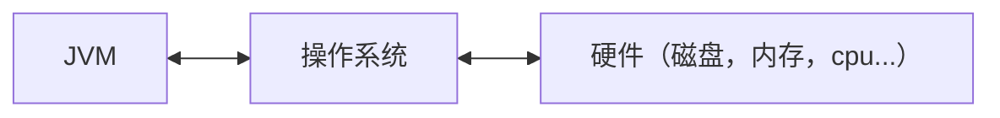
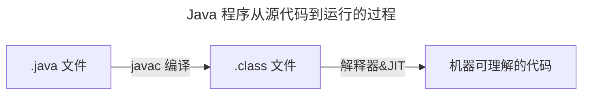
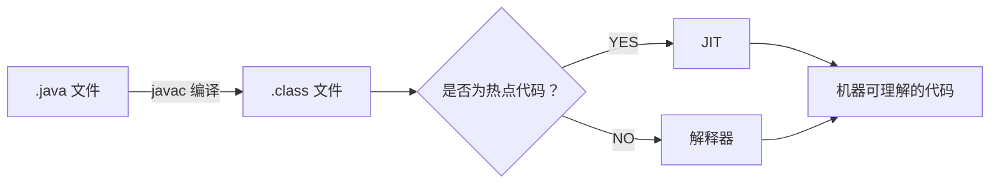
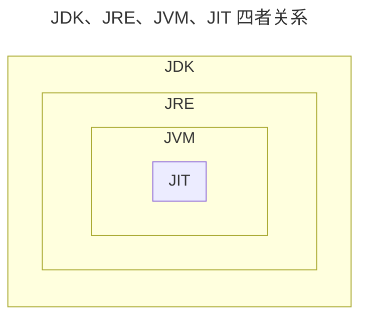
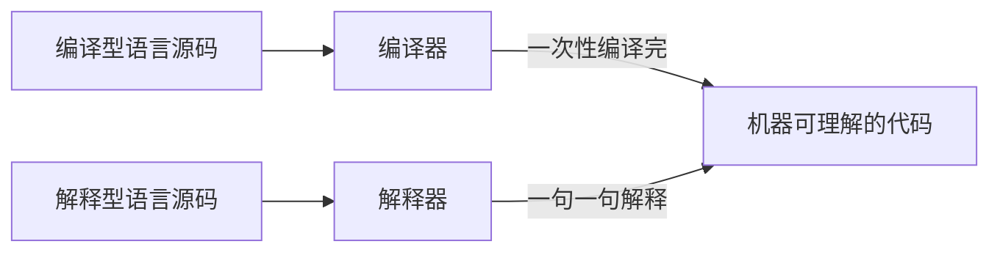
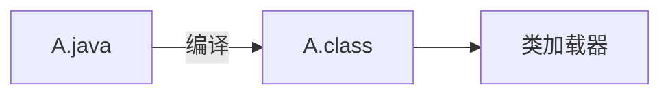

JVM(Java Virtual Machine) 其实就类似于一台小电脑运行在 windows 或者 linux 这些操作系统环境下即可。  
它直接和操作系统进行交互，与硬件不直接交互，而操作系统可以帮我们完成和硬件进行交互的工作。



## 1、基础知识

### JVM

Java 虚拟机（JVM）是运行 Java 字节码的虚拟机。  

JVM 有针对不同系统的特定实现（Windows，Linux，macOS），目的是使用相同的字节码，它们都会给出相同的结果。  

字节码和不同系统的 JVM 实现是 Java 语言“一次编译，随处可以运行”的关键所在。

**JVM 并不是只有一种！只要满足 JVM 规范，每个公司、组织或者个人都可以开发自己的专属 JVM。**   
也就是说我们平时接触到的 HotSpot VM（Sun/Oracle JDK 和 OpenJDK 中所带的虚拟机） 仅仅是是 JVM 规范的一种实现而已

> Oracle JDK 是基于 OpenJDK 源代码构建的  

### JDK 和 JRE

- JDK（Java Development Kit）= JRE + 开发工具集（javac.exe,java..exe,javadoc.exe...）  
- JRE（Java Runtime Environment Java运行环境）= JVM + Java SE 标准类库（Java Class Library）

JDK（Java Development Kit），它是功能齐全的 Java SDK（软件开发套件 Software development kit），是提供给开发者使用的，能够创建和编译 Java 程序。  

它包含了 JRE，同时还包含了编译 java 源码的编译器 javac 以及一些其他工具比如 javadoc（文档注释工具）、jdb（调试器）、jconsole（基于 JMX 的可视化监控⼯具）、javap（反编译工具）等等。

JRE（Java Runtime Environment） 是 Java 运行时环境。它是运行已编译 Java 程序所需的所有内容的集合，主要包括 Java 虚拟机（JVM）、Java 基础类库（Class Library）。

JRE 是 Java 运行时环境，仅包含 Java 应用程序的运行时环境和必要的类库。  

JDK 则包含了 JRE，同时还包括了 javac、javadoc、jdb、jconsole、javap 等工具，可以用于 Java 应用程序的开发和调试。  

如果需要进行 Java 编程工作，比如编写和编译 Java 程序、使用 Java API 文档等，就需要安装 JDK。  
而对于某些需要使用 Java 特性的应用程序，如 JSP 转换为 Java Servlet、使用反射等，也需要 JDK 来编译和运行 Java 代码。  
因此，即使不打算进行 Java 应用程序的开发工作，也有可能需要安装 JDK。

### 字节码

在 Java 中，JVM 可以理解的代码就叫做字节码（即扩展名为 `.class` 的文件），它不面向任何特定的处理器，只面向虚拟机。

Java 语言通过字节码的方式，在一定程度上解决了传统解释型语言执行效率低的问题，同时又保留了解释型语言可移植的特点。所以， Java 程序运行时相对来说还是高效的（不过，和 C++，Rust，Go 等语言还是有一定差距的），而且，由于字节码并不针对一种特定的机器，因此，Java 程序无须重新编译便可在多种不同操作系统的计算机上运行。



`.class->机器码` 这一步。在这一步 JVM 类加载器首先加载字节码文件，然后通过解释器**逐行解释执行**，这种方式的执行速度会相对比较慢。 

而且，有些方法和代码块是经常需要被调用的(也就是所谓的热点代码)，所以后面引进了 JIT（just-in-time compilation） 编译器，而 JIT 属于运行时编译。当 JIT 编译器完成第一次编译后，其会将字节码对应的机器码保存下来，下次可以直接使用。  

而我们知道，机器码的运行效率肯定是高于 Java 解释器的。这也解释了我们为什么经常会说 Java 是编译与解释共存的语言



:::info
HotSpot 采用了惰性评估(Lazy Evaluation)的做法，根据二八定律，消耗大部分系统资源的只有那一小部分的代码（**热点代码**），而这也就是 JIT 所需要编译的部分。  

JVM 会根据代码每次被执行的情况收集信息并相应地做出一些优化，因此执行的次数越多，它的速度就越快。

JDK 9 引入了一种新的编译模式 AOT(Ahead of Time Compilation)，它是直接将字节码编译成机器码，这样就避免了 JIT 预热等各方面的开销。JDK 支持分层编译和 AOT 协作使用。
:::



JVM 大致结构模型：

  

:::info
为什么不全部使用 AOT 呢?

AOT 可以提前编译节省启动时间，那为什么不全部使用这种编译方式呢？

长话短说，这和 Java 语言的动态特性有千丝万缕的联系了。举个例子，CGLIB 动态代理使用的是 ASM 技术，而这种技术大致原理是运行时直接在内存中生成并加载修改后的字节码文件也就是 .class 文件，如果全部使用 AOT 提前编译，也就不能使用 ASM 技术了。为了支持类似的动态特性，所以选择使用 JIT 即时编译器。
:::

### Java 语言“编译与解释并存”的原因

高级编程语言按照程序的执行方式分为两种：
- 编译型：编译型语言 会通过编译器将源代码 **一次性翻译** 成可被该平台执行的机器码。一般情况下，编译语言的执行速度比较快，开发效率比较低。常见的编译性语言有 C、C++、Go、Rust 等等。
- 解释型：解释型语言会通过解释器 **一句一句的将代码解释**（interpret）为机器代码后再执行。解释型语言开发效率比较快，执行速度比较慢。常见的解释性语言有 Python、JavaScript、PHP 等等。



### Oracle JDK vs OpenJDK

2006 年 SUN 公司将 Java 开源，也就有了 OpenJDK。  
2009 年 Oracle 收购了 Sun 公司，于是自己在 OpenJDK 的基础上搞了一个 Oracle JDK。  Oracle JDK 是不开源的，并且刚开始的几个版本（Java8 ~ Java11）还会相比于 OpenJDK 添加一些特有的功能和工具。

Oracle JDK 是基于 OpenJDK 7 构建的，只添加了一些小功能，由 Oracle 工程师参与维护。

Oracle JDK 和 OpenJDK 的区别：
1. 是否开源：OpenJDK 是一个参考模型并且是完全开源的，而 Oracle JDK 是基于 OpenJDK 实现的，并不是完全开源的。
   OpenJDK 开源项目：https://github.com/openjdk/jdk
2. 是否免费：Oracle JDK 会提供免费版本，但一般有时间限制。
   JDK17 之后的版本可以免费分发和商用，但是仅有 3 年时间，3 年后无法免费商用
   不过，JDK8u221 之前只要不升级可以无限期免费。OpenJDK 是完全免费的。
3. 功能性：Oracle JDK 在 OpenJDK 的基础上添加了一些特有的功能和工具，比如 Java Flight Recorder（JFR，一种监控工具）、Java Mission Control（JMC，一种监控工具）等工具。
   不过，在 Java 11 之后，OracleJDK 和 OpenJDK 的功能基本一致，之前 OracleJDK 中的私有组件大多数也已经被捐赠给开源组织。
4. 稳定性：OpenJDK 不提供 LTS 服务，而 OracleJDK 大概每三年都会推出一个 LTS 版进行长期支持。
   不过，很多公司都基于 OpenJDK 提供了对应的和 OracleJDK 周期相同的 LTS 版。因此，两者稳定性其实也是差不多的。
5. 协议：Oracle JDK 使用 `BCL/OTN` 协议获得许可，而 OpenJDK 根据 `GPL v2` 许可获得许可。

:::info
既然 Oracle JDK 这么好，那为什么还要有 OpenJDK？
- OpenJDK 是开源的，开源意味着你可以对它根据你自己的需要进行修改、优化，比如 Alibaba 基于 OpenJDK 开发了 Dragonwell8：https://github.com/alibaba/dragonwell8
- OpenJDK 是商业免费的（这也是为什么通过 yum 包管理器上默认安装的 JDK 是 OpenJDK 而不是 Oracle JDK）。虽然 Oracle JDK 也是商业免费（比如 JDK 8），但并不是所有版本都是免费的。
- OpenJDK 更新频率更快。Oracle JDK 一般是每 6 个月发布一个新版本，而 OpenJDK 一般是每 3 个月发布一个新版本。（现在你知道为啥 Oracle JDK 更稳定了吧，先在 OpenJDK 试试水，把大部分问题都解决掉了才在 Oracle JDK 上发布）基于以上这些原因，OpenJDK 还是有存在的必要的！
:::

## 2、Java 文件是如何被运行的

假设编写了一个 `A.java` 文件，目前它只是一个文本文件且有一定的缩进  
JVM 是不认识文本文件的，所以它需要一个 **编译** ，让其成为一个它会读二进制文件的 `A.class`

### ① 类加载器
如果 JVM 想要执行这个 .class 文件，我们需要将其装进一个 **类加载器** 中，它就像一个搬运工一样，会把所有的 .class 文件全部搬进 JVM 里面来。

### ② 方法区
**方法区** 是用于存放类似于元数据信息方面的数据的，比如类信息，常量，静态变量，编译后代码···等
类加载器将 .class 文件搬过来就是先丢到这一块上
### ③ 堆
堆 主要放了一些存储的数据，比如对象实例，数组···等，它和方法区都同属于 线程共享区域 。也就是说它们都是 **线程不安全** 的

### ④ 栈
栈 这是我们的代码运行空间。我们编写的每一个方法都会放到 栈 里面运行。我们会听说过 本地方法栈 或者 本地方法接口 这两个名词，不过我们基本不会涉及这两块的内容，它俩底层是使用 C 来进行工作的，和 Java 没有太大的关系。

### ⑤ 程序计数器
主要就是完成一个加载工作，类似于一个指针一样的，指向下一行我们需要执行的代码。和栈一样，都是 **线程独享** 的，就是说每一个线程都会有自己对应的一块区域而不会存在并发和多线程的问题。


:::info
- `.java` 文件经过编译后变成 `.class` 字节码文件
- 字节码文件通过 `类加载器` 被搬运到 JVM 虚拟机中
- 虚拟机主要的 5 大块：
  - `方法区`，`堆` 都为`线程共享`区域，有线程安全问题
  - `栈` 和 `本地方法栈` 和 `计数器` 都是 `独享区域`，不存在线程安全问题
  - 而 JVM 的调优主要就是围绕 `堆`，`栈` 两大块进行
:::


### 一个简单的示例
```java
// Stu类
public class Stu(){
    public String name;
    public Student(String name){
        this.name = name;
    }
    public void say(){
        System.out.pringln("stu_name:" + name);
    }
}
```
```java
// 主函数
public class App{
    public static void main(String[] args){
        Stu stu = new Stu("T4mako");
        stu.say();
    }
}
```

1.  `App.java` 编译后得到 `App.class` ，执行` App.class`，系统会启动一个 `JVM 进程`，从 `classpath` 路径中找到一个名为 `App.class` 的二进制文件，将 App 的类信息加载到运行时数据区的 `方法区` 内，这个过程叫做 App `类的加载`
2.  JVM 找到 App 的主程序入口，执行 main 方法
3.  main 中的第一条语句为 `Stu stu = new Stu("T4mako");` ，就是让 JVM 创建一个 Stu 对象，但是这个时候方法区中是没有 Stu 类的信息的，所以 JVM 马上加载 Stu 类，把 Stu 类的信息放到 `方法区` 中
4.  加载完 Stu 类后，JVM 在 `堆` 中为一个新的 stu 实例分配内存，然后调用构造函数初始化 stu 实例，这个 stu 实例持有 **指向方法区中的 Stu 类的类型信息的引用**
5.  执行 `stu.say();` 时，JVM 根据 stu 的引用找到 stu 对象，然后根据 stu 对象持有的引用定位到方法区中 Stu 类的类型信息的方法表，获得 say() 的字节码地址。
6.  执行 say()

:::info
只需要知道对象实例初始化时会去方法区中找类信息，完成后再到栈那里去运行方法。找方法就在方法表中找
:::