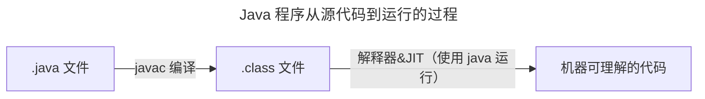

## 初识虚拟机
JVM 全称 Java Virtual Machine，即 Java 虚拟机  
Java 虚拟机的职责是运行字节码文件

JVM 三大核心功能：
- JVM 包内存管理
  - 自动为对象，方法等分配内存
  - 自动垃圾回收机制，回收不再使用的对象
- 解释执行虚拟机指令
  - 对字节码文件中的指令实时解释成机器码，让计算机执行
- 及时编译
  - 对热点代码进行优化，提升执行效率

常见的 Java 虚拟机：

JVM 的组成：
- 类加载器 ClassLoader
- 运行时数据区（JVM 管理的内存）
- 执行引擎（即使编译器、解释器、垃圾回收器）
- 本地接口（通常为 native 修饰）

## 字节码文件的组成
- 基本信息：
  - 魔数、字节码文件对应的 Java 版本号
  - 访问标识（public final 等）
  - 父类和接口
- 常量池
  - 保存字符串常量、类或接口名、字段名
- 字段
  - 当前类或接口声明的字段信息
- 方法
  - 当前类或接口声明的方法信息
- 属性
  - 类的属性、比如源码文件名、内部类的列表等

## 类的生命周期
类的生命周期：  
加载、连接、初始化、使用、卸载
### 加载阶段
1. 类加载器根据类的全限定名通过不同的渠道以二进制流的方式获取字节码信息
2. 类加载器在加载完之后，Java 虚拟机会将字节码中的信息保存到方法区中
3. 类加载器在加载完类之后，Java 虚拟机会将字节码中的信息保存到内存的方法区中  
   生成一个 InstanceKlass 对象，保存类的所有信息，里面包含实现特定功能比如多态的信息
4. 同时，Java 虚拟机还在堆中生成一份与方法区中数据类似的 Java.lang.Class 对象  
   作用在 Java 代码中去获取类的信息以及存储静态字段的数据（JDK 8 以后）

### 连接阶段
1. 验证：验证验证内容是否满足《Java 虚拟机规范》
2. 准备：给静态变量赋初值
3. 解析：将常量池中的符号引用替换成指向内存的直接引用

### 初始化阶段
- 初始化阶段会执行静态代码块中的代码，并为静态变量赋值  
- 初始化阶段会执行字节码文件中的 clinit 部分的字节码指令

## 类加载器
类加载器（ClassLoader）是 Java 虚拟机提供给应用程序去实现获取类和接口字节码数据的技术  

类加载器分为两类
- 虚拟机底层源码实现（加载程序运行时的基础类，如 java.lang.String）
- Java 代码中实现：JDK 中默认提供或自定义（如继承自抽象类 ClassLoader）

### JDK8 及以前的类加载器
虚拟机底层实现（C++）：
- 启动类加载器 BootStrap：加载 Java 中最核心的类
Java 实现：
- 扩展类加载器 Extension：允许扩展 Java 中比较通用的类
- 应用程序类加载器 Application：加载应用使用的类

### JDK9 及以后的类加载器
