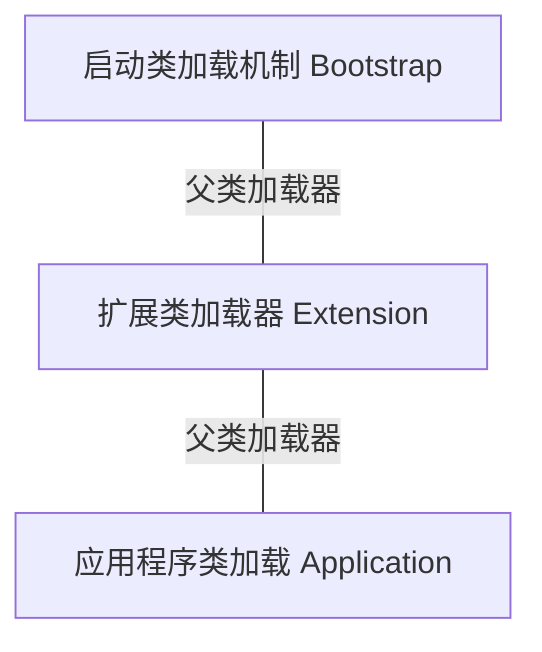

## 初识虚拟机
JVM 全称 Java Virtual Machine，即 Java 虚拟机  
Java 虚拟机的职责是运行字节码文件

JVM 三大核心功能：
- JVM 包内存管理
  - 自动为对象，方法等分配内存
  - 自动垃圾回收机制，回收不再使用的对象
- 解释执行虚拟机指令
  - 对字节码文件中的指令实时解释成机器码，让计算机执行
- 及时编译
  - 对热点代码进行优化，提升执行效率

常见的 Java 虚拟机：

JVM 的组成：
- 类加载器 ClassLoader
- 运行时数据区（JVM 管理的内存）
- 执行引擎（即使编译器、解释器、垃圾回收器）
- 本地接口（通常为 native 修饰）

## 字节码文件的组成
- 基本信息：
  - 魔数、字节码文件对应的 Java 版本号
  - 访问标识（public final 等）
  - 父类和接口
- 常量池
  - 保存字符串常量、类或接口名、字段名
- 字段
  - 当前类或接口声明的字段信息
- 方法
  - 当前类或接口声明的方法信息
- 属性
  - 类的属性、比如源码文件名、内部类的列表等

## 类的生命周期
类的生命周期：  
加载、连接、初始化、使用、卸载
### 加载阶段
1. 类加载器根据类的全限定名通过不同的渠道以二进制流的方式获取字节码信息
2. 类加载器在加载完之后，Java 虚拟机会将字节码中的信息保存到方法区中
3. 类加载器在加载完类之后，Java 虚拟机会将字节码中的信息保存到内存的方法区中  
   生成一个 InstanceKlass 对象，保存类的所有信息，里面包含实现特定功能比如多态的信息
4. 同时，Java 虚拟机还在堆中生成一份与方法区中数据类似的 Java.lang.Class 对象  
   作用在 Java 代码中去获取类的信息以及存储静态字段的数据（JDK 8 以后）

### 连接阶段
1. 验证：验证验证内容是否满足《Java 虚拟机规范》
2. 准备：给静态变量赋初值
3. 解析：将常量池中的符号引用替换成指向内存的直接引用

### 初始化阶段
- 初始化阶段会执行静态代码块中的代码，并为静态变量赋值  
- 初始化阶段会执行字节码文件中的 clinit 部分的字节码指令

## 类加载器
类加载器是什么：  
类加载器（ClassLoader）是 Java 虚拟机提供给应用程序去实现获取类和接口字节码数据的技术  
类加载器只参与加载过程中的字节码获取并加载内存这一部分

类加载器的作用：  
类加载器（ClassLoader）负责在类加载过程中的字节码获取并加载到内存这一部分。通过加载字节码数据放入内存转换为 byte[]，接下来调用虚拟机底层将 byte[] 转换成方法区和堆中的数据

类加载器分为两类：一类是 Java 代码中实现，一类是 Java 虚拟机底层源码实现
- 虚拟机底层源码实现：
  - 源代码位于 Java 虚拟机源码中，实现语言与底层语言一致（如 C++）
  - 用于加载程序运行时的基础类，如 java.lang.String
- Java 代码中实现：
  - JDK 中默认提供或自定义
  - 所有 Java 中实现的类加载器都要继承 ClassLoader 这个抽象类

### JDK8 及以前的类加载器
虚拟机底层实现（C++）：
- 启动类加载器 BootStrap：加载 Java 中最核心的类
Java 实现：
- 扩展类加载器 Extension：允许扩展 Java 中比较通用的类
- 应用程序类加载器 Application：加载应用使用的类

#### 启动类加载器 BootStrap
什么是启动类加载器：启动类加载器（Bootstrap ClassLoader）时有 Hotspot 虚拟机提供的、使用 C++ 编写的类加载器    
启动类加载器的作用：默认加载 Java 「安装目录/jre/lib」 下的文件，比如 rt.jar（包含 java.lang 中的常用类），tools.jar，resource.jar 等  

通过启动类加载器加载用户 jar 包：
- 使用参数进行扩展：
  使用 `-Xbootclasspath/xxx:jar包目录/jar包名` 进行扩展

#### Java 实现
- 扩展类加载器 Extension
什么是扩展类加载器、应用程序类加载器：扩展类加载器和应用程序类加载器都是 JDK 中提供的、使用 Java 编写的类加载器  
它们的源码位于 sun.misc.Launcher 中，是一个静态内部类，继承自 URLClassLoader     
继承 URLClassLoader 的作用：具备通过目录或指定 jar 包将字节码文件加载到内存中  

- 扩展类加载器 Extension   
  加载 Java 安装目录 /jre/lib/ext 下的文件  
  通过扩展类加载器加载用户 jar 包：使用 `-Djava.ext.dirs=jar包目录` 扩展，这种方式会覆盖掉原始目录，可使用 `;` (windows) `:` (macos/linux) 追加原始目录

- 应用程序类加载器  
  加载 classpath 下的类文件

### 双亲委派机制
由于 Java 虚拟机有多个类加载器，双亲委派机制的核心就是解决一个类到底由谁加载的问题

双亲委派机制的作用：
- 保证类加载的安全性（避免恶意代码薙魂 JDK 中的核心类库）
- 避免重复加载（避免一个类被加载多次）

类加载器的双亲委派机制：当一个类加载器接受到加载类的任务时，会自底向上查找是否加载过，再由顶向下进行加载

### 自定义类加载器
自定义类加载器的父加载器是应用程序类加载器 Application

### JDK9 及以后的类加载器
JDK 引入了 module 的概念，类加载器在设计上发生了好多变化
1. 启动类加载器使用 Java 编写，位于 jdk.internal.loader.ClassLoaders 类中   
   Java 中的 BootClassLoader 继承自 BuiltinClassLoader 实现从模块中找到要加载的字节码资源文件  
   启动类加载器依然无法获得通过 java 代码获取到，返回的仍然是 null，保持了统一  
2. 扩展类加载器被替换成了平台类加载器（Platform Class Loader）
   平台类加载器遵循模块化方法加载字节码文件，所以继承关系从 URLClassLoader 变成了 BuiltinClassLoader，BuiltinClassLoader 实现了从模块中加载字节码文件。平台类加载器的存在更过的是为了与老版本的设计方案兼容，自身没有特殊的逻辑

## 运行时数据区（Jvm 管理的内存）
Java 虚拟机在运行 java 程序过程中管理的内存其余，称为运行时数据区  

分类：
- 程序计数器（线程不共享）
- Java 虚拟机栈（线程不共享）
- 本地方法栈（线程不共享）
- 方法区（线程共享）
- 堆（线程共享）

### 程序计数器
程序计数器（Program Counter Register）也叫 PC 寄存器，每个线程会通过程序计数器记录当前要执行的字节码指令的地址    

### Java 虚拟机栈
Java 虚拟机栈采用栈的数据结构管理「方法调用」中的基本数据（方法以先进后出的形式）每一个方法的调用使用一个「栈帧」（Stack Frame）来保存  

栈帧的组成：局部变量表、操作数栈、帧数据

- 局部变量表的作用是方法执行过程中存放所有的局部变量
- 操作数栈是栈帧中虚拟机啊在执行指令过程中用来存放临时数据的一块区域
- 帧数据主要包含动态链接、方法出口、异常表的引用