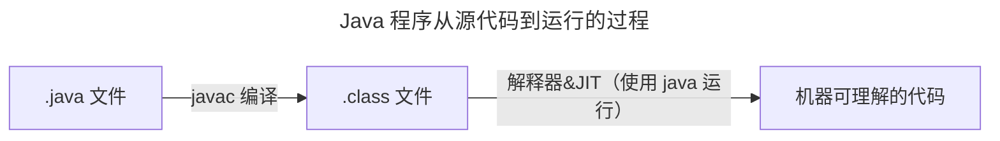

## 初始虚拟机
JVM 全称 Java Virtual Machine，即 Java 虚拟机  
Java 虚拟机的职责是运行字节码文件

JVM 三大核心功能：
- JVM 包内存管理
  - 自动为对象，方法等分配内存
  - 自动垃圾回收机制，回收不再使用的对象
- 解释执行虚拟机指令
  - 对字节码文件中的指令实时解释成机器码，让计算机执行
- 及时编译
  - 对热点代码进行优化，提升执行效率

常见的 Java 虚拟机：

JVM 的组成：
- 类加载器 ClassLoader
- 运行时数据区（JVM 管理的内存）
- 执行引擎（即使编译器、解释器、垃圾回收器）
- 本地接口（通常为 native 修饰）