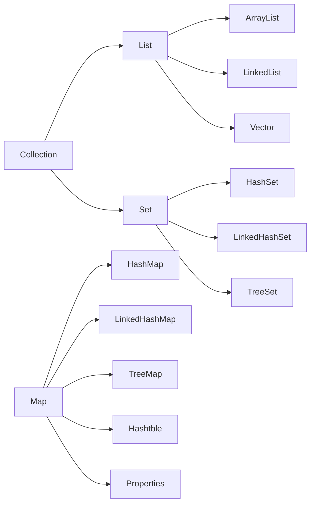

## 集合


数组的缺陷：
- 一旦初始化以后，其长度就确定了
- 数组一旦定义好，其元素的类型就确定了。只能操作指定类型的数据。
- 初始化以后，长度不可修改
- 数组中提供的方法非常有限，对于添加、删除、插入等操作非常不便，效率不高
- 获取数组中实际元素的个数的需求，数组没有现成的属性或方法可用
- 数组存储的特点：有序、可重复。对于无序、不可重复的需求，不能满足

### 1、Java 集合的分类

Java 集合可分为 `Collection` 和 `Map` 两种体系
- `Collection` 接口：单列数据， 定义了存取一组对象的方法的集合
	- `List`： 元素有序、可重复的集合	
		- `ArrayList`、`LinkedList`、`Vector`
	- `Set`： 元素无序、不可重复的集合
		- `HashSet`、`LinkedHashSet`、`TreeSet`
- `Map`接口： 双列数据，保存具有映射关系`key-value`对的集合  
	- `HashMap`、`LinkedHashMap`、`TreeMap`、`Hashtble`、`Properties`



### 2、Collection 接口中的方法的使用

| 方法 | 描述 |
|-|-|
| `add(Object obj)` | 添加 |
| `addAll(Collection coll)` | 添加 |
| `int size()` | 有效元素的个数 |
| `void clear()` | 清空集合 |
| `boolean isEmpty()` | 是否是空集合 |
| `boolean contains(Object obj)` | 是否包含某个元素，通过元素的 equals 方法来判断是否是同一个对象 |
| `boolean containsAll(Collection c)` | 也是调用元素的 equals 方法来比较 |
| `boolean remove(Object obj)` | 通过元素 equals 方法判断是否是要删除的那个元素。只会删除找到的第一个元素 |
| `boolean removeAll(Collection coll)` | 删除 |
| `boolean retainAll(Collection c)` | 取两个集合的交集，将结果存在当前集合中，不影响c |
| `boolean equals(Object obj)` | 集合是否相等 |
| `hashCode()` | 获取集合对象的哈希值 |
| `iterator()` | 返回迭代器对象，用于集合遍历 |
| `Object[] toArray()` | 将集合转化为对象数组 |

:::info
向 Collection 接口的实现类的对象中添加数据 obj 时，要求 obj 所在类要重写 equals()
:::

```java
Collection coll = new ArrayList();
coll.add("AA");
coll.add(123);// 自动装箱
coll.add(new Date());
System.out.println(coll.size()); // 3
Collection coll1 = new ArrayList();
coll1.add(456);
coll1.add("cc");
coll.addAll(coll1);
System.out.println(coll.size()); // 5
coll1.clear();
coll.remove(123);// true
System.out.println(coll.isEmpty());
```

### 3、List 接口

#### 1、List 接口框架

List 接口：存储有序的、可重复的数据
- `ArrayList`：线程不安全的，效率高。底层使用 Object[]
- `LinkedList`：对于频繁的插入，删除，使用此类效率比 ArrayList 高，底层使用双向链表
- `Vector`：作为 List 接口的古老实现类，线程安全的，效率低。底层使用 Object[]


List 接口中的常用方法

| 方法 | 描述 |
|-|-|
| `void add(int index, Object e)` | 在 index 位置插入 e 元素 |
| `boolean addAll(int index, Collection e)` | 从 index 位置开始将 e 中的所有元素添加 |
| `Object get(int index)` | 获取指定 index 位置的元素 |
| `int indexOf(Object obj)` | 返回 obj 在集合中首次出现的位置 |
| `int lastIndexOf(Object obj)` | 返回 obj 在当前集合中末次出现的位置 |
| `Object remove(int index)` | 移除指定 index 位置的元素，并返回此元素 |
| `Object set(int index, Object e)` | 设置指定 index 位置的元素为 e |
| `List subList(int fromIndex, int toIndex)` | 返回从 fromIndex 到 toIndex 位置的子集合 |

:::info
如果使用泛型，get() 方法返回泛型类对象，如果没有使用泛型，返回 Object 对象，需要强制转换
:::

#### 2、ArrayList

:::info
jdk7 下 ArrayList 的创建规则：
```java
ArrayList list = new ArrayList();//底层创建了长度是10的Object[]数组elementDate
list.add(1);//elementData[0] = new Integer(123);
...
list.add(11);//扩容，扩容为原来的 1.5 倍，将原有数组中的数据复制到新的数组中
```
jdk8 下 ArrayList 的创建规则
```java
ArrayList list = new ArrayList();//底层 Object[] elementData 初始化为{}.并没有创建长度为 10 的数组
list.add(123);//第一次调用 add() 时，底层才创建了长度为 10 的数组，并将数据 123 添加到 elementDate，后续添加与 jdk7 无异
```
jdk7 中的 ArrayList 的对象的创建类似于单例的饿汉式  
jdk8 中的 ArrayList 的兑现的创建类似于单例模式的懒汉式，延迟数组的创建，节省内存
:::


#### 3、LinkedList 
LinkedList 中 Node 的定义：
```java
private static class Node<E> {
    E item;
    Node<E> next;
    Node<E> prev;

    Node(Node<E> prev, E element, Node<E> next) {
        this.item = element;
        this.next = next;
        this.prev = prev;
    }
}
```
`LinkedList<E>` 泛型类本身新增的一些常用方法：
| 方法 | 描述 |
|-|-|
| void addFirst(E e) | 向链表的头添加新结点 e  |
| void addLast(E e) | 向链表的末尾添加新结点 e  |
| void getFirst() | 得到第一个结点的数据 |
| void getLast() | 得到最后一个结点的数据 |
| void removeFirst() | 删除第一个结点 |
| void removeLast() | 删除最后一个结点 |
| void Objcet clone() | 得到当前链表的一个克隆链表（深拷贝） |


```java
LinkedList list =  new LinkedList();//内部声明了 Node 类型的 first 和 lase 属性，默认值为 null
list.add(123);//将123封装到Node中，创建了 Node 对象
```

:::info
常用方法
增：add(Object obj)  
删：remove(int index) / remove(Object obj)   
改：Object set(int index, Object ele)  
查：Object get(int index)  
插：void add(int index, Object ele)  
长度：size()  
遍历：
- Iterator 迭代器 
- 增强 for 循环 
- 普通循环  

List 添加的数据也需要在其所在类重写 equals() 方法，因为有 remove，contains 方法
:::

:::info
集合，数组之间的转换:
- 集合 -> 数组：`toArray()`
- 数组 -> 集合：`Arrays.asList()`
:::

#### 4、Vector

jdk7 和 jdk8 中通过 Vector() 构造器创建对象时，底层都创建了长度为 10 的数组，在扩容方面，默认扩容为原来的数组长度的 2 倍
:::info
ArrayList、LinkedList、Vector 的异同:
- 相同点：
  - 三个类都实现了 List 接口，存储数据的特点相同：存储有序的、可重复的数据
- 不同点：
  - ArrayList：作为 List 接口的主要实现类：线程不安全的，效率高。底层使用 Object[] 数组
  - LinkedList：对于频繁的插入，删除，使用此类效率比ArrayList高，底层使用双向链表
  - Vector：作为 List 接口的古老实现类：线程安全的，效率低。底层使用 Object[] 数组
:::

### 4、Iterator 迭代器接口

集合元素的遍历操作，使用迭代器 Iterator 接口
1. 内部的方法：`hasNext()`、`next()`
2. 集合对象每次调用 `iterator()` 方法都得到一个全新的「迭代器对象」
3. iterator 内部定义了 `remove()`，可以在遍历的时候，删除集合中的元素。此方法不同于集合直接调用 remove
```java
Collection coll = new ArrayList();//List是有序的
coll.add(456);
coll.add(123);
coll.add(new String("Tom"));
coll.add(false);
coll.add(new Person("Jerry",20));

Iterator iterator = coll.iterator();
//next():①指针下移 ②将下移以后集合位置上的元素返回
while (iterator.hasNext()){
    System.out.println(iterator.next());
}
```  

```java
Collection coll = new ArrayList();//List是有序的
coll.add(456);
coll.add(123);
coll.add(new String("Tom"));
coll.add(false);
coll.add(new Person("Jerry",20));
//
Iterator iterator = coll.iterator();
while (iterator.hasNext()){
    Object obj = iterator.next();
    if("Tom".equals(obj)){
        iterator.remove();
    }
}
Iterator iterator1 = coll.iterator();
while (iterator1.hasNext()){
    System.out.println(iterator1.next());
}
```

### 5、堆栈
堆栈是一种后进先出的数据结构

java.util 包中的 `Stack<E>` 泛型类创构建一个堆栈对象

| 方法 | 描述 |
|-|-|
| E push(E e) | 压栈 |
| E pop() | 出栈 |
| boolean empty() | 判断栈是否还有数据 |
| E peek(E e) | 获取栈顶数据 |
| int search(Object data) | 获取数据在栈中的位置，顶端为 1，向下增加，如果不含此数据返回 -1 |


### 6、foreach

jdk5.0新增了foreach循环，用于遍历集合、数组

```java
public class forTest {
    @Test
    public void test(){
        Collection coll = new ArrayList();//List是有序的
        coll.add(456);
        coll.add(123);
        coll.add(new String("Tom"));
        coll.add(false);
        coll.add(new Person("Jerry",20));

        //for(集合中元素的类型 局部变量 : 集合对象)
        //内部仍然调用了迭代器
        for(Object obj : coll) {
            System.out.println(obj);
        }
    }
    @Test
    public void test2(){
        int[] arr = new int[]{1,2,3,4,5,6};
        //for(数组中元素的类型 局部变量 : 数组对象)
        for (int i : arr) {
            System.out.println(i);
        }
    }
}
```


### 7、Set 接口

#### 1、Set 接口的框架：

- `HashSet`：作为Set接口的主要实现类；**线程不安全的**；可以**存储null值**
- `LinkedHashSet`：作为**HashSet的子类**；遍历其内部数据时，可以**按照添加顺序遍历**
- `TreeSet`：**可以按照添加对象的指定属性，进行排序**

1. set接口中没有额外的定义新的方法，使用的都是Collection中声明的方法
2. 要求：
   - 向set中添加的数据，其所在类一定要重写`hashCode()`和`equals()`方法
   - 重写的`hashCode()`和`equals()`尽可能保持一致性：相等的对象必须具有相同的散列码
   - 对象中用作 `equals()` 方法比较的 Field，都应该用来计算 hashCode 值。 

#### 2、Set：存储无序的，不可重复的数据

以HashSet为例
- 无序性：存储的数据在底层根据数据的哈希值决定
- 不可重复性：相同的元素只能添加一个，添加的元素按照`equals()`方法判断时，不能返回`true`。

#### 3、添加元素的过程：以HashSet为例

向HashSet中添加元素a，首先调用元素a所在类的`hashCode()`方法，计算元素a的哈希值，此哈希值通过某种算法计算出HashSet底层数组中的存放位置(即为：索引位置)，判断此位置上是否已经有元素  
- 如果此位上没有其他元素，则元素a添加成功  
- 较元素a与b的哈希值，如果哈希值不相同，则元素b添加成功  
- 如果哈希值相同，需要调用元素a所在类的`equals()`方法：
  - `equals()`返回true，元素a添加失败
  - `equals()`返回fasle，则元素a添加成功-->情况三

对于添加成功的情况2、3：元素a存在指定索引位置上数据以**链表的方式存储**。
jdk 7：元素a放到数组中，指向原来的元素
jdk8：原来的元素在数组中，指向元素a
**（七上八下）**
:::info
HashSet底层：数组+链表
:::

```java
@Test
    public void test(){
        Set set = new HashSet();
        set.add(456);
        set.add(123);
        set.add("AA");
        Iterator iterator = set.iterator();
        while (iterator.hasNext()){
            System.out.println(iterator.next());
        }
    }
```


#### 4、LinkedHashSet的使用

LinkedHashSet作为HashSet的子类，在添加数据时，每个数据还维护了两个引用，**记录此数据前一个数据和后一个数据**
优点：对于频繁的遍历操作，LinkedHashSet效率高于HashSet

```java
public void test2(){
        Set set = new LinkedHashSet();
        set.add(456);
        set.add(123);
    }
```

#### 5、TreeSet

- 向TreeSet添加的数据，要求是**相同类的对象**
- 两种排序方式：  
自然排序(实现Comparable接口)和定制排序(Comparator接口)

对于 TreeSet 集合而言，它判断两个对象是否相等的唯一标准是：两个对象通过 `compareTo(Object obj)` 方法比较返回值  
- 自然排序中，比较两个对象是否相同的标准：`compareTo()返回0`，不再是equals()
- 定制排序中，比较两个对象是否相同的标准：`compare()返回0`，不再是equals()

```java
public class TreeSetTest {
    @Test
    public void test(){
        //举例一
        TreeSet set = new TreeSet();
        set.add(123);
        set.add(-123);
        set.add(66);
	    //遍历
        Iterator iterator = set.iterator();
        while (iterator.hasNext()){
            System.out.println(iterator.next());
        }
        
        //举例二
        //Person类实现了Comparable接口
        TreeSet set1 = new TreeSet();
        set1.add(new Person("AA",20));
        set1.add(new Person("BB",22));
        set1.add(new Person("CC",18));
        set1.add(new Person("ABC",66));
        set1.add(new Person("ABC",65));
        Iterator iterator1 = set1.iterator();
        while (iterator1.hasNext()){
            System.out.println(iterator1.next());
        }
    }
    
	//使用Comparator
    @Test
    public void test2() {
        Comparator com = new Comparator() {
            @Override
            public int compare(Object o1, Object o2) {
                if (o1 instanceof Person && o2 instanceof Person) {
                    Person p1 = (Person) o1;
                    Person p2 = (Person) o2;
                    return Integer.compare(p1.getAge(), p2.getAge());
                } else {
                    throw new RuntimeException("类型不合");
                }
            }
        };
        TreeSet set1 = new TreeSet(com);
        set1.add(new Person("AA", 20));
        set1.add(new Person("BB", 22));
        set1.add(new Person("CC", 18));
        set1.add(new Person("ABC", 66));
        set1.add(new Person("ABC", 65));
        Iterator iterator1 = set1.iterator();
        while (iterator1.hasNext()) {
            System.out.println(iterator1.next());
        }
    }
}
```

### 8、Map 接口

#### 1、Map的实现类的结构


- Map：双列数据，存储key-value对的数据
    - HashMap：作为Map的主要实现类：线程不安全的，效率高；可以存储null的key和value
	- LinkedHashMap：保证在遍历map元素时，可以**按照添加的顺序实现遍历**。对于频繁的遍历操作，效率高于HashMap
	- TreeMap：保证按照添加的key-value对进行排序，实现排序遍历（）。**此时考虑key的自然排序或定制排序**(底层使用红黑树)
	- Hashtable：作为古老的实现类：**线程安全**，**效率低**；**不能存储null的key和value**
	- Properties：常用来处理配置文件。key和value都是String类型

HashMap底层：
- 数组+链表（jdk7及以前）
- 数组+链表+红黑树（jdk8）

#### 2、Map结构的理解

1. Map中的key：
   - 无序的、不可重复的
   - 使用Set存储所有的key   
   - key所在类要重写`equals()`和`HashCode()`方法
2. Map中的value：无序的、可重复的
   - 使用Collection存储所有的value
   - value所在类要重写`equals()`方法
3. 一个键值对`key-value`构成了一个`Entry`对象
   - Map中的entry：无序的、不可重复的，使用set存储所有的entry

#### 3、HashMap的底层实现原理

以jdk7为例说明：  
`HashMap map = new HashMap()`:  
- 实例化后底层创建了长度是16的一维数组`Entry[] table`  
`map.put(key1,value1)`:  
 - 首先，调用key1所在类的`hashCode()`计算key1哈希值，得到在Entry数组中的存放位置。  
   - 若此位置为空，添加成功。
   - 若此位置上数据不为空，比较key1和已存在数据的哈希值：  
	  - 若哈希值不相同，添加成功。
	  - 若哈希值相同：调用key1所在类的`equals()`方法：  
		  - 若`equals()`返回`false`：添加成功
		  - 若e`quals()`返回`true`：使用value1替换value2  

补充：情况2,3数据以链表方式存储  
在不断添加过程中，涉及到扩容问题：扩容为原来的两倍，并将原有的数据复制过来。

jdk8相较于jdk7在底层实现方面的不同：  
1. `new HashMap()`：底层没有创建长度为16的Entry数组  
2. jdk8底层数组是`Node[]数组`，而非Entry[]数组  
3. 首次调用put方法时，底层创建长度为`16`的数组  
4. jdk7底层结构只有：数组+链表。jdk8底层结构：`数组+链表+红黑树`  
当数组的某一个索引位置上元素以链表形式存在的数据个数>8且当前数组的长度>64时，此索引位置上的所有数据改为使用红黑树存储。

HashMap源码中的重要常量 ：
- `DEFAULT_INITIAL_CAPACIT`Y : HashMap的默认容量， 16
- `MAXIMUM_CAPACITY` ： HashMap的最大支持容量， 2^30
- `DEFAULT_LOAD_FACTOR`： HashMap的默认加载因子：0.75
- `TREEIFY_THRESHOLD`： Bucket中链表长度大于该默认值，转化为红黑树:8
- `MIN_TREEIFY_CAPACITY`： 桶中的Node被树化时最小的hash表容量。：64
- `threshold`： 扩容的临界值， =容量*填充因子

#### 4、Map中定义的方法：

添加、 删除、修改操作：
:::info
- `Object put(Object key,Object value)`：将指定key-value添加到(或修改)当前map对象中
- `void putAll(Map m)`:将m中的所有key-value对存放到当前map中
- `Object remove(Object key)`：移除指定key的key-value对，并返回value
- `void clear()`：清空当前map中的所有数据
元素查询的操作：
- `Object get(Object key)`：获取指定key对应的value
- `boolean containsKey(Object key)`：是否包含指定的key
- `boolean containsValue(Object value)`：是否包含指定的value
- `int size()`：返回map中key-value对的个数
- `boolean isEmpty()`：判断当前map是否为空
- `boolean equals(Object obj)`：判断当前map和参数对象obj是否相等
- `Set keySet()`：返回所有key构成的Set集合
- `Collection values()`：返回所有value构成的Collection集合
- `Set entrySet()`：返回所有key-value对构成的Set集合  
:::
```java
@Test
    public void test3(){
        Map map = new HashMap();
        //添加
        map.put("AA",123);
        map.put(789,123);
        map.put("BB",123);
        //修改
        map.put("AA",80);
        System.out.println(map);

        Map map1 = new HashMap();
        map1.put("CC",456);
        map1.put("DD",123);
        //添加
        map.putAll(map1);
        System.out.println(map);
        //删除
        Object value = map.remove("CC");//remove返回value
        System.out.println(value);
        System.out.println(map);
        //清除
        map1.clear();
        System.out.println(map1.size());//0
        System.out.println(map1);
    }
    @Test
    public void test4(){
        Map map = new HashMap();
        map.put("AA",123);
        map.put(789,123);
        map.put("BB",123);
        //查询
        System.out.println(map.get("AA"));////返回value

        //boolean containsKey(Object key)：是否包含指定的key
        //boolean containsValue(Object value)：是否包含指定的value
        System.out.println(map.containsKey("AA"));//true
        System.out.println(map.containsValue(123));//true

        //boolean isEmpty()：判断当前map是否为空
        map.clear();
        System.out.println(map.isEmpty());//true
    }
```

```java
@Test
public void test5(){
    Map map = new HashMap();
    map.put("AA",123);
    map.put(789,456);
    map.put("BB",789);
    //遍历所有的ket集:keySet()
    Set set = map.keySet();
    Iterator iterator = set.iterator();
    while (iterator.hasNext()){
        System.out.println(iterator.next());
    }
    //遍历所有的values集:values()
    Collection coll = map.values();
    for(Object obj: coll){
        System.out.println(obj);
    }
    //遍历所有的key-value:entrySet()
    //方式一:
    Set entrySet = map.entrySet();
    Iterator iterator1 = entrySet.iterator();
    while (iterator1.hasNext()){
        Object obj = iterator1.next();
        Map.Entry entry = (Map.Entry) obj;
        System.out.println(entry.getKey()+"--->"+entry.getValue());
    }
    //方式二:
    Set set1 = map.keySet();
    Iterator iterator2 = set.iterator();
    while (iterator2.hasNext()){
        Object key = iterator2.next();
        Object value = map.get(key);
        System.out.println(key+"--->"+value);
    }

}
```
:::info
总结：常用方法：  
添加：Object put(Object key,Object value)  
删除：Object remove(Object key)  
修改：Object put(Object key,Object value)  
查询：Object get(Object key)  
长度：size()  
遍历：keySet() / values() / entrySet()  
:::

#### 5、TreeMap两种添加方式的使用

向TreeMap中添加key-value，要求key必须是由同一个类创建的对象
因为要按照key排序：自然排序、定制排序

```java
public class TreeMapTest {
    //自然排序（Person类实现comparable）
    @Test
    public void test(){
        TreeMap map = new TreeMap();
        map.put(new Person("DD",22),123);
        map.put(new Person("BB",20),123);
        map.put(new Person("CC",18),123);
        map.put(new Person("AA",17),123);

        Set entrySet = map.entrySet();
        Iterator iterator = entrySet.iterator();
        while (iterator.hasNext()){
            Object obj = iterator.next();
            Map.Entry entry = (Map.Entry) obj;
            System.out.println(entry.getKey()+"---"+entry.getValue());
        }
    }
    //定制排序
    @Test
    public void test2(){
        TreeMap map = new TreeMap(new Comparator() {
            @Override
            public int compare(Object o1, Object o2) {
                if(o1 instanceof Person && o2 instanceof Person){
                    Person p1 = (Person) o1;
                    Person p2 = (Person) o2;
                    return Integer.compare(p1.getAge(),p2.getAge());
                }
                throw new RuntimeException("");
            }
        });
        map.put(new Person("DD",22),123);
        map.put(new Person("BB",20),123);
        map.put(new Person("CC",18),123);
        map.put(new Person("AA",17),123);
        Set entrySet = map.entrySet();
        Iterator iterator1 = entrySet.iterator();
        while (iterator1.hasNext()){
            Object obj = iterator1.next();
            Map.Entry entry = (Map.Entry) obj;
            System.out.println(entry.getKey()+"---"+entry.getValue());
        }
    }
}
```

#### 6、Properties

Properties：用来处理配置文件。key和value都是String类型

```java
public class PropertiesTest {
    public static void main(String[] args) {
        FileInputStream fis = null;
        try {
            Properties pros = new Properties();
            fis = new FileInputStream("jdbc.properties");
            pros.load(fis);//加载流对应文件

            String name = pros.getProperty("name");
            String password = pros.getProperty("password");

            System.out.println(name+password);
        } catch (IOException e) {
            e.printStackTrace();
        } finally {
            if(fis != null){
                try {
                    fis.close();
                } catch (IOException e) {
                    e.printStackTrace();
                }
            }
        }
    }
}
```

### 9、Collections 工具类  

`Collections` 是一个操作 `Set`、 `List` 和 `Map` 等集合的工具类  
:::info
- `reverse(List)`： 反转 List 中元素的顺序
- `shuffle(List)`： 对 List 集合元素进行随机排序
- `sort(List`)： 根据元素的自然顺序对指定 List 集合元素按升序排序
- `sort(List， Comparator)`： 根据指定的 Comparator 产生的顺序对 List 集合元素进行排序
- `swap(List， int， int`)： 将指定 list 集合中的 i 处元素和 j 处元素进行交换  
- `Object max(Collection)`： 根据元素的自然顺序，返回给定集合中的最大元素
- `Object max(Collection， Comparator)`： 根据 Comparator 指定的顺序，返回给定集合中的最大元素
- `Object min(Collection)`
- `Object min(Collection， Comparator)`
- `int frequency(Collection， Object)`： 返回指定集合中指定元素的出现次数
- `void copy(List dest,List src)`：将src中的内容复制到dest中
- `boolean replaceAll(List list， Object oldVal， Object newVal)`： 使用新值替换List 对象的所有旧值  
:::
```java
public class CollectionsTest {
    @Test
    public void test(){
        List list = new ArrayList();
        list.add(123);
        list.add(456);
        list.add(789);
        list.add(22);
        list.add(33);
        list.add(33);
        list.add(33);
        System.out.println(list);
        //反转
        Collections.reverse(list);
        //随机化
        Collections.shuffle(list);
        //排序
        Collections.sort(list);
        //交换指定位置元素
        Collections.swap(list,0,1);
        //返回出现的次数
        int i = Collections.frequency(list, 33);
        System.out.println(list);
    }
    @Test
    public void test2(){
        List list = new ArrayList();
        list.add(123);
        list.add(456);
        list.add(789);
        list.add(22);
        list.add(33);
        list.add(33);
        list.add(33);

        //报异常
        /*List dest = new ArrayList();
        Collections.copy(dest,list);
        System.out.println(dest);*/
        //正确的
        List dest = Arrays.asList(new Object[list.size()]);
        //将list复制给dest
        Collections.copy(dest,list);
        System.out.println(list);

        //返回list1为线程安全的
        List list1 = Collections.synchronizedList(list);
    }
}
```

Collections 类中提供了多个 `synchronizedXxx()` 方法，该方法可使将指定集合包装成线程同步的集合，从而可以解决多线程并发访问集合时的线程安全问题
