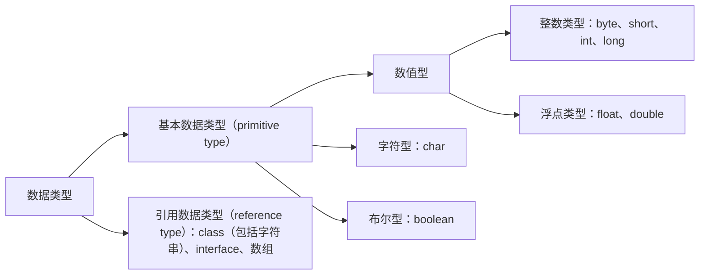

## 基本数据类型

变量必须 **先声明后使用**，在相应作用域有效  


```java
//变量的声明
int num;
//定义未赋值，是不确定值，不可用于输出
```

变量按数据类型分：


### 整数类型

|   类型    | 占用存储空间 |    表示范围    |
| :-------: | :----------: | :------------: |
| **byte**  |      1B      |    -128-127    |
| **short** |      2B      | -2^15^-2^15^-1 |
|  **int**  |      4B      | -2^31^-2^31^-1 |
| **long**  |      8B      | -2^63^-2^63^-1 |

```java
byte s1 = -128;
//byte s2 = 128; //编译不通过
short s3 = 66;
int s4 = 1234;
long s5 = 987654321L //声明 long 型变量必须以 L 或 l结尾(不带 L 默认为 int 转 long，如果数字超出 int 范围，必须带 L)
float a = 1e1f;  // 10.0
```
:::info
带 e、E 的如 `1e2`、`2.3E5`、`.2e3` 都是 double 类型的常量，e/E 前后都要带数字
:::

### 浮点型

| 类型             | 占存储空间 | 表示范围             |
| ---------------- | ---------- | -------------------- |
| **单精度float**  | 4B         | -3.403E38-3.403E38   |
| **双精度double** | 8B         | -1.798E308-1.798E308 |

```java
float f = 112; // int 自动转 float
float x = 0x123;
float f1 = 12.3F;//定义 float 类型的含小数变量时，变量要以 f或 F 结尾（必须）
double d2 = 12.3;
```

### 字符型
字符型 char ，使用 '' 两个单引号，内部必须且只能有一个字符或在 0 ~ 65535 的数字，等于两个字节  
两个 char 类型相加是 int 类型
```java
char a = 65535;
char b = 'A';
char c = '啊';
System.out.println((int)'你'); // 20320
```

### boolean 类型

boolean只有 `true` 和 `false` 两个值

## 类型转换

### 自动类型提升

 **byte、char、short → int → long → float → double**

往容量大的提升（表示数的范围的大小）
:::info
byte、char、short 三种类型的变量做运算时（无论是相同类型还是不同类型），结果为 int 型
:::

### 强制类型转换

自动类型提升的逆运算

```java
double d1 = 12.9;
int i1 = (int)d1; //12
```
:::info
整形常量，默认为 int 型，浮点型常量，默认为 double 型
:::

## String 类型

String 属于引用数据类型，声明时使用一对 「""」

```java
String s1 = "hello";
String s2 = "";
//char c1 = '';//编译不通过
```

String 可以和8种基本数据类型变量做运算，且运算只能时连接运算+，运算的结果任然是 String 类型

```java
int i1 = 12346;
String s1 = "学号";
String si = s1 + i1;

String s2 = "123";
//int num = (int)s2; // 编译不通过，语法错误！
```

## var 类型
JDK 10 版本开始，增加了「局部变量类型推断」。即可以使用 var 声明「局部变量」，不能用 var 声明 全局变量

- var 声明局部变量时，必须指定初值（不能是 null），编译器推断出 var 变量类型
- 方法的参数和返回类型不能使用 var
- var 不是动态变量（运行时确定），其在编译阶段就确定了类型
