# 深度学习
## 1、预备知识

https://zh.d2l.ai/chapter_preliminaries/index.html

### 基础概念

梯度下降、误差、k 折交叉验证、过拟合与欠拟合、损失函数、向前传播、反向传播、计算图、激活函数

权重衰退：

- 使用均方范数作为硬性限制，控制模型复杂度，减少过拟合  
  通过限制参数值 w 的选择范围来控制模型容量$||w||^2 \le  \theta$ ，通常不限制 bias，小的 theta 意味着更强的正则项

dropout 丢弃法 

动机：一个好的模型需要对输入数据的扰动鲁棒，减少过拟合

- 使用有噪音的数据等价于 Tikhonov 正则
- dropout：在层之间加入噪音，丢弃一部分前一层的输入、后一层的输出

通常将 dropout 作用在 **隐藏全连接层的输出** 上，将其中的一些值随机设为 **0** 来控制模型复杂度，丢弃概率为 **超参数**，其他数会相应变大，保证均值方差一样

注意：dropout 用在训练模型上减少复杂性，在使用模型时一般不用 dropout

数值稳定性

数值稳定性常见的两个问题：

- 梯度爆炸
  - 值超出阈值
  - 对学习率敏感
- 梯度消失
  - 梯度值变为 0
  - 训练无进展
  - 对于底部层尤为严重

因此，合理的权重初始值和激活函数的选取可以提升数值稳定性

### 数据集操作

数据集可分为

- 训练集
- 验证集
- 测试集

#### 数据增广

数据增强：则国家已有数据集，使得有更多的多样性。如在语音中加入背景噪声、改变图片的颜色和形状（翻转、切割、改颜色）

数据增广一般使用 torchvision

### 硬件、计算性能

https://zh.d2l.ai/chapter_computational-performance/index.html

### 微调

使用已训练好的模型的特征提取层与权重，调整自己崔侯的全连接层


### 困惑度 perplexity

- 衡量一个语言模型的好坏可以用平均交叉熵

  p 是语言模型的预测概率，x是真实词

  

- 历史原因NLP使用困惑度 exp(a)来衡量，是平均每次可能选项。1表示完美，无穷大是最差情况

### 梯度剪裁

- 迭代中计算这 T 个时间步上的梯度，在反向传播过程中产生长度为O(T)的矩阵乘法链，导致数值不稳定

- 梯度裁剪能有效预防梯度爆炸、

  如果梯度长度超过 0，那么拖影回长度0

## 2、线性神经网络

> FNN（Feedforward Neural Network，前馈神经网络）：FNN 是一种神经网络架构，它按照层级顺序，将数据从输入层传递到输出层，每一层的节点连接到下一层的节点
>
> MLP 是一种特定的 FNN，特点是包含至少一个隐藏层，且每一层的神经元是完全连接的

### 线性回归

```py
import torch
import torch.nn as nn
import torch.optim as optim
import numpy as np
import matplotlib.pyplot as plt

# 生成示例数据
np.random.seed(0)
X = 2 * np.random.rand(100, 1)
y = 4 + 3 * X + np.random.randn(100, 1)  # y = 4 + 3 * X + 噪声

# 将数据转换为 PyTorch 张量
X_tensor = torch.tensor(X, dtype=torch.float32)
y_tensor = torch.tensor(y, dtype=torch.float32)

# 定义线性回归模型
class LinearRegressionModel(nn.Module):
    def __init__(self):
        super(LinearRegressionModel, self).__init__()
        self.linear = nn.Linear(1, 1) #（输入维度，输出维度）输入x，输出y

    def forward(self, x):
        return self.linear(x)

# 实例化模型
model = LinearRegressionModel()

# 定义损失函数和优化器
criterion = nn.MSELoss()  # 均方误差损失
optimizer = optim.SGD(model.parameters(), lr=0.01)  # 随机梯度下降优化器

# 训练模型
num_epochs = 1000
for epoch in range(num_epochs):
    model.train()
    
    # 前向传播
    y_pred = model(X_tensor)
    
    # 计算损失
    loss = criterion(y_pred, y_tensor)
    
    # 反向传播
    optimizer.zero_grad()
    loss.backward()
    optimizer.step()
    
    if (epoch + 1) % 100 == 0:
        print(f'Epoch [{epoch + 1}/{num_epochs}], Loss: {loss.item():.4f}')

# 绘制结果
model.eval()
with torch.no_grad():
    predicted = model(X_tensor).numpy()
plt.scatter(X, y, color='blue', label='实际数据')
plt.plot(X, predicted, color='red', label='拟合直线')
plt.xlabel('X')
plt.ylabel('y')
plt.legend()
plt.title('线性回归示例')
plt.show()
```

### Softmax 分类

Softmax 是多分类任务，隐藏层为线性层，输出为多个。

为了使输出为概率，使用 **softmax**  $sigma(\mathbf{z})_i = \frac{e^{z_i}}{\sum_{j=1}^{K} e^{z_j}} \quad \text{for } i = 1, 2, \ldots, K$ 函数，通过真实值与预测值的概率经过 **交叉熵损失** 得到 0,1 值

```py
import torch
import torch.nn as nn
import torch.optim as optim
import torchvision
import torchvision.transforms as transforms
from torch.utils.data import DataLoader

# 1. 数据准备：下载MNIST数据集，并进行预处理
transform = transforms.Compose([transforms.ToTensor(), transforms.Normalize((0.5,), (0.5,))])

train_dataset = torchvision.datasets.MNIST(root='./data', train=True, download=True, transform=transform)
test_dataset = torchvision.datasets.MNIST(root='./data', train=False, download=True, transform=transform)

train_loader = DataLoader(dataset=train_dataset, batch_size=64, shuffle=True)
test_loader = DataLoader(dataset=test_dataset, batch_size=64, shuffle=False)

# 2. 定义模型：一个简单的两层神经网络
class SimpleNet(nn.Module):
    def __init__(self):
        super(SimpleNet, self).__init__()
        self.fc1 = nn.Linear(28*28, 128)  # 输入层 (28*28像素)
        self.fc2 = nn.Linear(128, 10)     # 输出层 (10类)

    def forward(self, x):
        x = x.view(-1, 28*28)            # 将输入展平
        x = torch.relu(self.fc1(x))      # 第一个全连接层和ReLU激活函数
        x = self.fc2(x)                  # 第二个全连接层
        return torch.softmax(x, dim=1)   # 使用softmax函数生成概率分布

# 3. 初始化模型、损失函数和优化器
model = SimpleNet()
criterion = nn.CrossEntropyLoss()        # 交叉熵损失函数 (softmax和损失结合)
optimizer = optim.SGD(model.parameters(), lr=0.01)

# 4. 训练模型
num_epochs = 5
for epoch in range(num_epochs):
    model.train()
    for images, labels in train_loader:
        outputs = model(images)          # 前向传播
        loss = criterion(outputs, labels) # 计算损失

        optimizer.zero_grad()            # 梯度清零
        loss.backward()                  # 反向传播
        optimizer.step()                 # 更新模型参数

    print(f'Epoch [{epoch+1}/{num_epochs}], Loss: {loss.item():.4f}')

# 5. 测试模型
model.eval()
correct = 0
total = 0
with torch.no_grad():
    for images, labels in test_loader:
        outputs = model(images)
        _, predicted = torch.max(outputs.data, 1)  # 预测最大概率的类
        total += labels.size(0)
        correct += (predicted == labels).sum().item()

print(f'Accuracy of the model on the 10000 test images: {100 * correct / total:.2f}%')
```

### 多层感知机 MLP

感知机为二分类。给定输入 x，权重 w，偏移 b，感知机输出 0 或 1（有时为 -1 或 1）。它不能拟合 XOR 函数

多层感知机（MLP）的简单例子：

```py
import torch
import torch.nn as nn
import torch.optim as optim

# 定义MLP模型
class MLP(nn.Module):
    def __init__(self, input_size, hidden_size, output_size):
        super(MLP, self).__init__()
        # 定义第一层全连接层
        self.fc1 = nn.Linear(input_size, hidden_size)
        # 激活函数ReLU
        self.relu = nn.ReLU()
        # 定义第二层全连接层
        self.fc2 = nn.Linear(hidden_size, output_size)
    
    def forward(self, x):
        # 第一层 + 激活函数
        out = self.fc1(x)
        out = self.relu(out)
        # 输出层
        out = self.fc2(out)
        return out

# 模型实例化
input_size = 10   # 输入特征数
hidden_size = 20  # 隐藏层神经元数
output_size = 3   # 输出类别数

model = MLP(input_size, hidden_size, output_size)

# 损失函数和优化器
criterion = nn.CrossEntropyLoss()
optimizer = optim.Adam(model.parameters(), lr=0.001)

# 假设我们有一个大小为10的输入张量
x = torch.randn(5, input_size)  # 批次大小为5
labels = torch.randint(0, output_size, (5,))  # 随机生成5个类别标签

# 前向传播
outputs = model(x)

# 计算损失
loss = criterion(outputs, labels)

# 反向传播和优化
optimizer.zero_grad()  # 梯度清零
loss.backward()        # 反向传播
optimizer.step()       # 更新参数

print(f'Loss: {loss.item()}')
```

## 3、卷积神经网络 CNN

### 多输入输出通道

彩色图片由 RGB 三个通道，每个输入通道通常有独立的二维卷积核

可以使用多个三维卷积核（下图核函数粘贴复制），每个核生成一个输出通道


- 计算的结果为 **特征图**
- 一次卷积可以有多个 Filter，卷积后的深度就为 Filter 的个数（上述 7\*7\*3 经过 2 个 3\*3\*3 的 filter 变为 3\*3\*2 的特征图）

1 * 1 的卷积核不识别空间模式，只是融合通道，以 **c~i~ 个输入** 值转换为 **c~o~ 个输出值** 


### 卷积层 conv（convolution）

卷积层中的 w 是卷积核，b 是偏置，w、b 是可学习参数

- 卷积层将输入和核矩阵进行交叉相关，加上偏移后得到输出
- 核矩阵和偏移是可学习的参数

**卷积层** 涉及 **超参数**：

- 滑动窗口步长
- 卷积核尺寸
- 是否边缘填充
- 卷积核个数

卷积层的权重（w + b）参数：所有卷积核的像素数 + 卷积核个数（偏置）

感受野（Receptive Field）：神经元「看到的」输入区域，在卷积神经网络中，feature map 上某个元素的计算受输入图像上某个区域的影响，这个区域即该元素的感受野


卷积结果计算公式：


可以对一次卷积后的特征图再卷积再卷积

### 池化层 pool

用于 **压缩特征图**

例如： MAX POOLING 最大池化层： 2*2 的特征为一组，筛选最大的值。平均池化层，将最大操作替换为平均

- 池化层与卷积层类似，都具有填充和步幅
- 池化层没有可学习的参数
- 在每个输入通道应用池化层以获得相应的输出通道
- 输出通道数 = 输入通道数

### 全连接层 fc

通过前面 conv 和 pool 得到最后的特征图（假设为 32\*32\*10），任务为 n 分类任务

将特征图拉成特征向量 [1,32\*32\*10] ，则全连接层参数为 [32\*32\*10,n]

## 4、经典卷积神经网络

### LeNet （1980s）

卷积、全连接

### AlexNet（2012 年）

更大卷积，全连接

### Vgg（2014 年） 

提出 vgg 块，更大更深的 AlexNet，赋值粘贴 AlexNet


### NiN

提出 NiN 块，一个卷积层后跟两个全连接层（1*1 的卷积核）


### GoogLeNet

提出  Inception 块

### Resnet（2015年）

vgg 在层数更多时，训练效果反而不好

resnet 将 **好的层保留，不好的层跳过**。做法是通过对层数堆叠的值与同等映射的值进行比较

- 若果层数堆叠的值不好，将层数堆叠权重设为 0

  

### DenseNet

## 5、批量归一化层

- 损失在最后，后面的层训练比较快，前面的层训练比较慢。
- 前面的层一变化，所有层都得跟这边，最后的那些层需要重新学习多次，导致收敛边慢

> 归一化（Normalization）：将数据缩放到一个特定范围（通常是 [0, 1] 或 [-1, 1]）$x_{\text{normalized}} = \frac{x - x_{\min}}{x_{\max} - x_{\min}}$
>
> 标准化（Standardization）：将数据转化为均值为 0，标准差为 1 的标准正态分布。$x_{\text{standardized}} = \frac{x - \mu}{\sigma}$
>
> ---
>
> **主要区别**
>
> | **特性**             | **归一化**                     | **标准化**                           |
> | -------------------- | ------------------------------ | ------------------------------------ |
> | **方法**             | 按最大值和最小值缩放           | 按均值和标准差缩放                   |
> | **输出范围**         | [0, 1] 或 [-1, 1]              | 平均值 0，标准差 1                   |
> | **适用场景**         | 特征范围有界，非正态分布的情况 | 特征服从正态分布或算法对正态分布敏感 |
> | **对异常值的敏感性** | 对异常值敏感                   | 相对较稳健                           |
>

方法：

- 固定 **小批量 batch** 里的均值和方差，然后再做额外调整

  

  

  - 批量归一化层可学习的参数为 γ 和 β
  - 作用在
    - 全连接层和卷积层输出上，激活函数前
    - 全连接层和卷积层输入上
  - 对全连接层，作用在特征维
  - 对于卷积层，作用在通道维

## 6、循环神经网络 RNN

https://www.bilibili.com/video/BV1z5411f7Bm/

在时间序列上，隐藏层与隐藏层之间包含关系 W~i~


RNN 在计算梯度时容易发生梯度爆炸‘

解决梯度爆炸的方法：

- 梯度裁剪：梯度裁剪通过设定一个阈值来限制梯度的大小。如果梯度超过这个阈值，它们将被缩放至阈值以内，从而避免了大的权重更新。这样做有助于稳定训练过程

## 7、经典循环神经网络

### RGN

### LSTM

相较于 RNN，添加控制参数 c，决定什么样的信息会被保留，什么样的会被遗忘

https://www.bilibili.com/video/BV1Z34y1k7mc

### 深度循环神经网络

### 双向循环神经网络

### 编码器-解码器架构

编码器、解码器架构：一个模型被分为两块：

- 编码器 Encoder 处理输出（类似 CNN 提取特征）
- 解码器 Decoder 生成输出（类型 fc 进行预测）

机器翻译是序列转换模型的一个核心问题， 其输入和输出都是长度可变的序列。 为了处理这种类型的输入和输出， 我们可以设计一个包含两个主要组件的架构： 

- 第一个组件是一个*编码器*（encoder）： 它接受一个长度可变的序列作为输入， 并将其转换为具有固定形状的编码状态。 
- 第二个组件是*解码器*（decoder）： 它将固定形状的编码状态映射到长度可变的序列。 这被称为*编码器-解码器*（encoder-decoder）架构


- “编码器－解码器”架构可以将长度可变的序列作为输入和输出，因此适用于机器翻译等序列转换问题。
- 编码器将长度可变的序列作为输入，并将其转换为具有固定形状的编码状态。
- 解码器将具有固定形状的编码状态映射为长度可变的序列。

### seq2seq

- 根据“编码器-解码器”架构的设计， 我们可以使用两个循环神经网络来设计一个序列到序列学习的模型。
- 在实现编码器和解码器时，我们可以使用多层循环神经网络。
- 我们可以使用遮蔽来过滤不相关的计算，例如在计算损失时。
- 在“编码器－解码器”训练中，强制教学方法将原始输出序列（而非预测结果）输入解码器。
- BLEU是一种常用的评估方法，它通过测量预测序列和标签序列之间的 n 元语法的匹配度来评估预测。

## 8、注意力机制

### 注意力机制

- 卷积、全连接、池化都只考虑「不随意线索」
- 注意力机制则显示的考虑随意线索
  - 注意力 attention 即权重

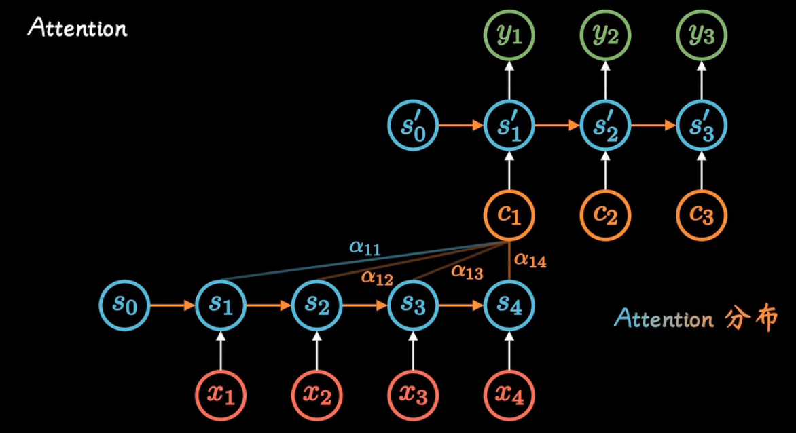

非参注意力池化层


#### 注意力分数

- 注意力分时是 query 和 key 的相似度，注意力权重是分时的 sofrmax 结果
- 两种常见的分数计算：
  - 将 query 和 key 合并起来进入一个单输出单隐藏层的 MLP
  - 直接将 query 和 key 做内积

 

### 自注意力机制 slef-attention 

- 给定序列 $x_1,x_2,...x_n$ ，$x_i$ 为 向量
- 自注意力机制池化层将 $x_i$ 当做 key，value，query 来对序列抽取特征得到 $y_1,...y_n$，这里 $y_i = f(x_i,(x_1,x_1),...,(x_n,x_n))$
- self 即 key，value，query 都是自己取的
- 完全并行、最长序列为 1、但对长序列计算复杂度高
- 位置编码在输入中加入位置信息，使得自注意能够记忆位置信息

## 9、Transformer

LSTM 的训练是迭代的、串行的，必须要等当前字处理完，才可以处理下一个字

**Transformer** 的训练时并行的，即所有字是同时训练的，这样大大增加了计算效率  
**Transformer** 使用了位置嵌入(Positional Encoding)来理解语言的顺序，使用自注意力机制（Self Attention Mechanism）和全连接层进行计算

Transformer **Encoder **负责把输入（语言序列）隐射成 **隐藏层**（下图中第2步用九宫格代表的部分），然后解码器 **Decoder** 再把隐藏层映射为自然语言序列。例如下图机器翻译的例子

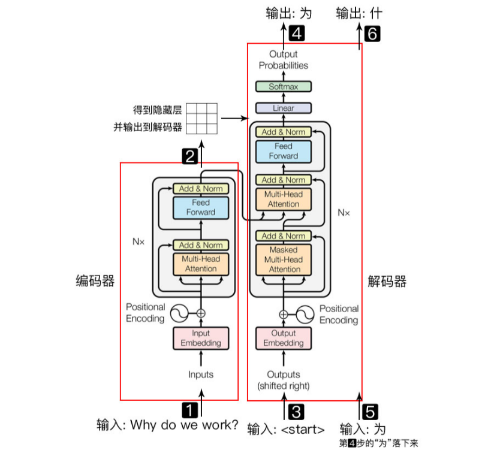

**Encoder** Block 结构图：

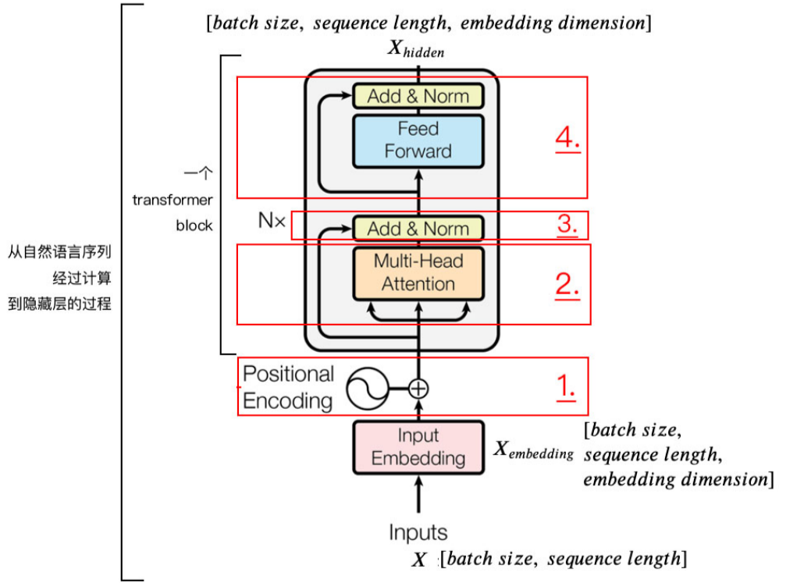

### 1. Positional Encoding

Transformer **没有** RNN 的迭代操作（在时间上递归）  
所以我们必须提供每个字的 **位置信息** 给 Transformer，这样它才能识别出语言中的顺序关系

### 2、自注意力机制 Self Attention Mechanism

对于输入的句子 **X**：

- 通过 WordEmbedding 得到字的 **字向量**
- 通过 Positional Encoding 得到字的 **位置向量**，
- 两者相加（维度相同，可以直接相加），得到该 **字真正的向量表示**。第 **t** 个字的向量记作 **x~t~**

定义三个矩阵（变量 w） **W~Q~，W~k~，W~v~**，使用这三个矩阵分别对所有的 **字向量** 进行三次线性变换，得到新的向量 **q~t~， k~t~，v~t~** 

- 将所有 q~t~ 拼接成一个大矩阵，记作 **查询矩阵 Q**
- 将所有 k~t~ 拼接成一个大矩阵，记作 **键矩阵 K**
- 将所有 v~t~ 拼接成一个大矩阵，记作 **值矩阵 V**

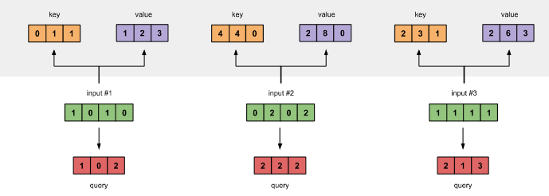

为获得第一个字的 **注意力权重**，需要用第一个字的查询向量 q~1~ 乘以 键矩阵 K

> 注意力权重：衡量输入序列中每个位置对其他位置的重要性。通过这些权重，模型可以动态地关注序列中不同部分的信息，从而更好地处理任务，如机器翻译、文本生成或图像处理

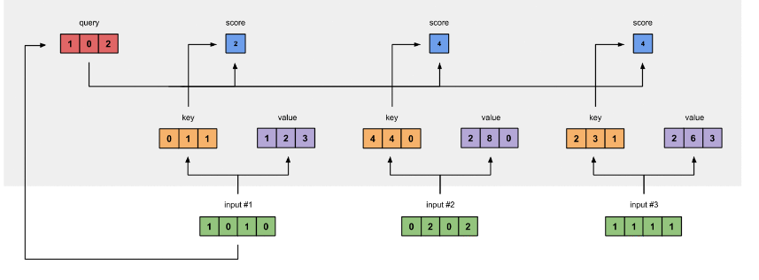

将得到的值经过 softmax，使得它们的和为1 `softmax([2, 4, 4]) = [0.0, 0.5, 0.5]`

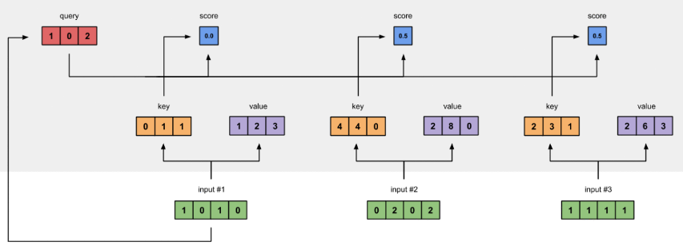

有了权重之后，将权重其分别乘以对应字的 **值向量 v~t~**

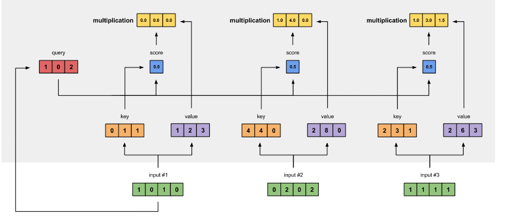

将这些 **权重化后的值向量求和**，得到第一个字的输出

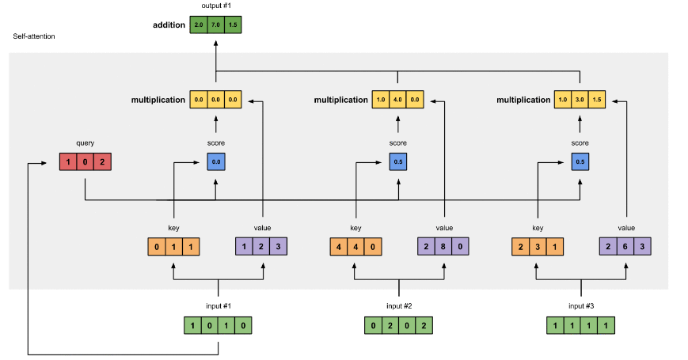

对其它的输入向量也执行相同的操作，即可得到通过 self-attention 后的所有输出

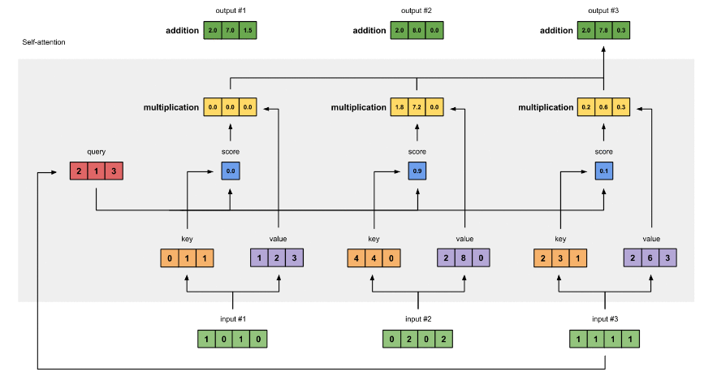

矩阵形式：

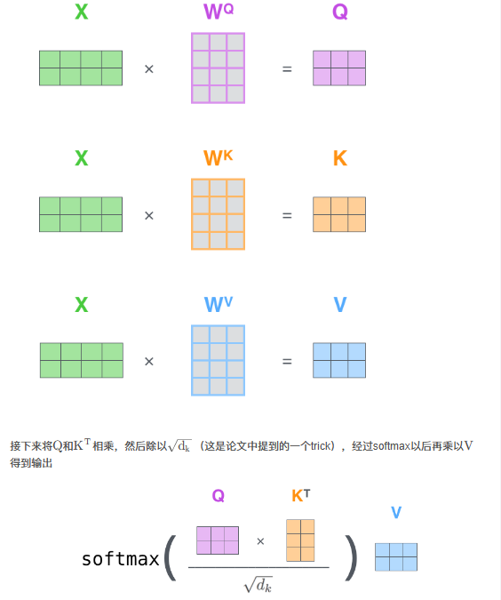

### 3、Multi-Head Attention 多头注意力

可以定义多组 Q，K，V，让它们分别关注不同的上下文。计算 Q，K，V 的过程还是一样。线性变换的矩阵从一组（W^Q^,W^k^,W^v^）变成了多组（W^Q^~0~,W^k^~0~,W^v^~0~）,（W^Q^~1~,W^k^~1~,W^v^~1~）

对于输入矩阵 X，每一组Q、K 和 V 都可以得到一个输出矩阵 Z 

### 4、残差连接和 Layer Normalization

#### 残差连接

在上一步得到经过 self-attention 加权输出（Attention(Q,K,V)）后，把他们加起来做残差连接
$$
X_{embedding} + Self Attention(Q,K,V)
$$

#### Layer Normalization

Layer Normalization 的作用是把神经网络中隐藏层归一为标准正态分布，以起到加快训练速度，加速收敛的作用

以矩阵的列(column)为单位求均值
$$
\mu _j = \frac{1}{m}\sum_{i=1}^{m}X_{ij}
$$
以矩阵的列(column)为单位求方差
$$
\sigma _j^2 = \frac{1}{m}\sum_{i=1}^{m}(X_{ij}-\mu_j)^2
$$
用每一列的每一个元素减去这列的均值，再除以这列的方差，从而得到归一化后的数值，加 $\xi $ 是为了防止分母为 0
$$
LayerNorm(x) = \frac{X_{ij}-\mu{j}}{\sqrt{\sigma_j^2+\xi}}
$$
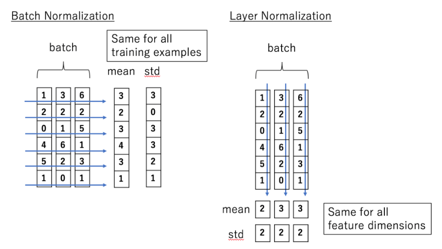

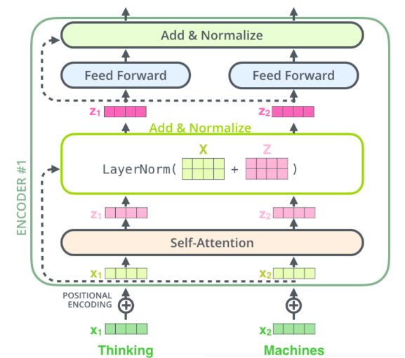

### 5、Transformer Encoder 整体结构

用公式把一个 Encoder block 的计算过程整理一下：

1. 字向量与位置编码
   $$
   X = Embedding Lookup(X) + Position Encoding
   $$

2. 自注意力机制
   $$
   Q = Linear(X) = XW_Q \\
   K = Linear(X) = XW_K \\
   V = Linear(X) = XW_V \\
   X_{attention} = SelfAttentnion(X_{attention})
   $$

3. self-attention 残差连接与 Layer Normalization
   $$
   X_{attention} = X + X_{attention} \\
   X_{attention} = LayerNorm(X_{attention})
   $$

4. FeedForward，其实就是两层线性映射并用激活函数激活，比如说 ReLU
   $$
   X_{hidden} = Linear(ReLU(Linear(X_{attention})))
   $$

5. FeedForward残差连接与Layer Normalization
   $$
   X_{hidden} = X_{attention} + X_{hidden} \\
   X_{hidden} = LayerNorm(X_{hidden})
   $$
   
