## 1、Rag 介绍

**RAG**（Retrieval-Augmented Generation 检索增强生成模型）是一种结合检索与生成的模型架构，主要用于增强生成式模型的性能，特别是在需要外部知识支持的场景中

RAG 实现流程：

- 构建知识库检索
  - 非结构化数据载入
  - 文档分割
  - 向量化
  - 向量存储到向量数据库中
- 检索和答案生成
  - 问题输入后，embedding 成向量，检索与之相似的向量
  -  将检索的 topk 向量与提示词给到 LLM，生成答案

**什么是 RAG**

大模型目前固有的局限性

- LLM的知识不是实时的
- LLM可能不知道你私有的领域/业务知识

检索增强生成

- RAG (RetrievalAugmented Generation) 顾名思义，通过检索的方法来增强生成模型的能力。（让 LLM 先翻书再解决问题）

LLM

- 预训练模型（模型 + 海量数据）

RAG 搭建流程

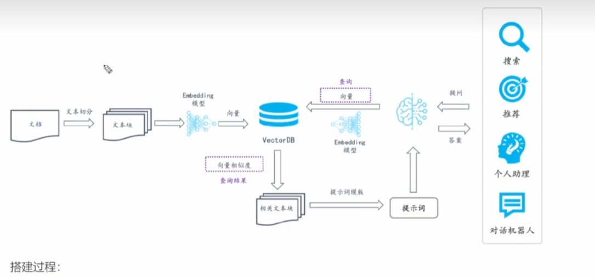

搭建过程:

1. 文档加载，并按一定条件 **切割** 成片段
2. 将切的文本片段灌入 **检索引擎**
3. 封装 **检索接口**
4. 构建 **调用流程**：Query -> 检索 -> Prompt -> LLM -> 回复

## 2、文本切分

- 文档的加载与切割（编写 py 文件，读取 pdf 文件并按换行符等进行切割）

- LLM 接口封装（封装 OpenAI 等接口，调用模型）

  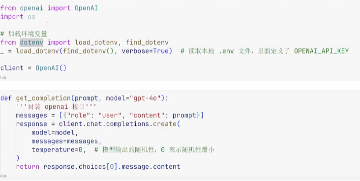

- Prompt 模板

  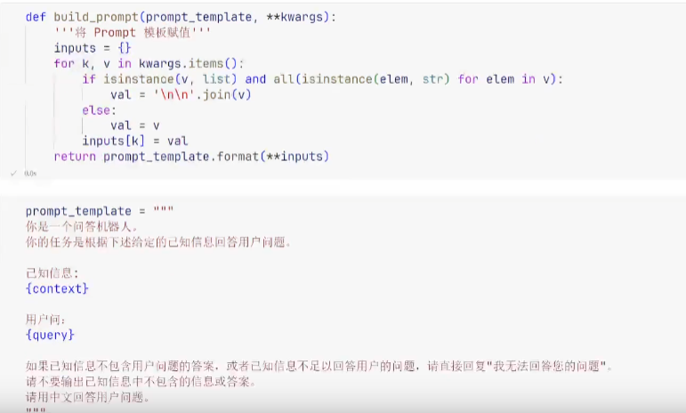

## 3、Embedding 向量检索

文本向量（N 维向量：（x~0~,x~1~,...,x~N-1~））：

- 将文本转成一组 N 维浮点数，即 **文本向量** 又叫 **Embeddings**（嵌入模型）（）
- 向量之间可以计算距离，距离远近对应 **语义相似度** 大小

文本向量是怎么得到的：

1. 构建相关(正例)与不关(负例)的对样本
2. 训练双塔式模型，让正例间的距离小，负例间的距离大

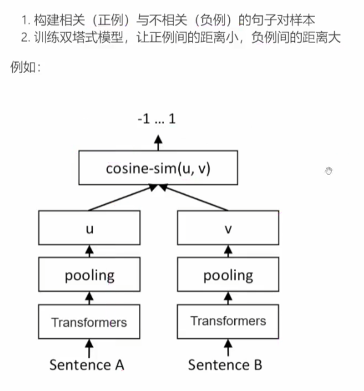

向量的相似度计算：

- 欧式距离
- 余弦距离

嵌入模型的选择：

- 标准：找需求相关的语料库来进行文本向量转换测试，进行评估
- 多语言模型推荐：text-embedding-ada-002（OpenAI）
  - 维度越大，表示特征细节提取越丰富
- 大多数场景下，开源的嵌入模型使用都很一般
  要提升检索召回率，建议对模型进行 **微调**

## 4、向量数据库

向量数据库是专门为向量检索设计的中间件

### 4.1、chroma 向量数据库

官网：https://www.trychroma.com/

几个关键概念:

- 向量数据库的意义是 **快速检索**
- 向量数据库本身不生成向量，向量是由 Embedding 模型产生的
- 向量数据库与传统的关系型数据库是与补的，不是替代关系，在实际应用中根据实际需求经常同时使用

### 4.2、Chroma 向量数据库服务

Server 端：

```cmd
chroma run --path /db_path
```

Client 端：

```py
import chromadb
chroma_client = chromadb.Httpclient(host='localhost'，port=8000)
```

### 4.3、主流向量数据库功能对比

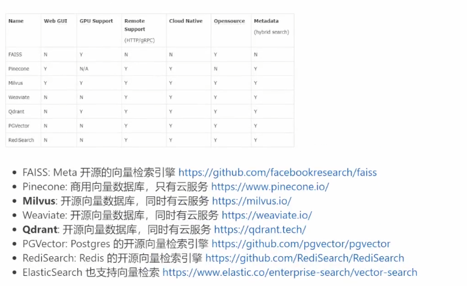

### 4.4、基于向量检索的 RAG

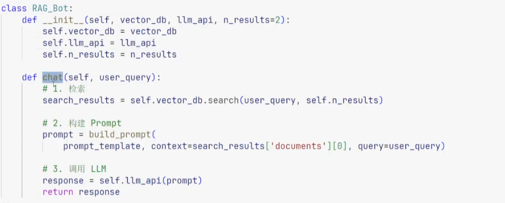

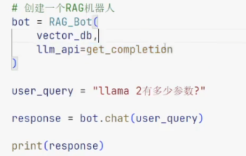

新模型与评估：

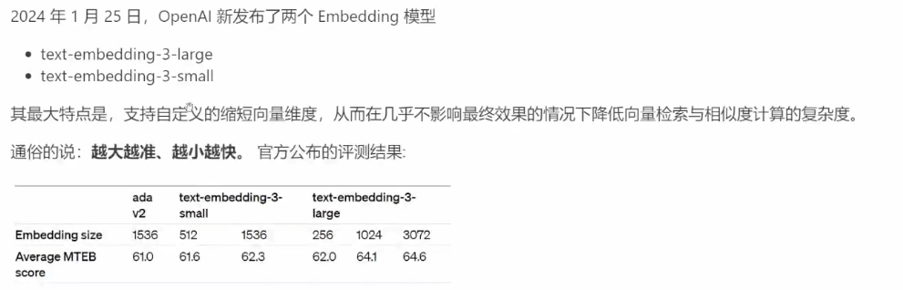

MTEB：大规模多任务的 Embedding 模型公开评测集

## 5、RAG 进阶（文本分割与检索）

### 5.1、文本分割的粒度

目前手工的文本分割缺陷：

**缺陷**：

1.粒度太大可能导致检索不精准，粒度太小可能导致信息不全面
2.问题的答案可能跨越两个片段

**改进**：按一定粒度，部分重叠式的切割文本，使上下文更完整

- chunk_size（片段区域）：一般根据文档内容或大小来设置‘
- overlap_size（重复部分）：一般设置 chunk_size 的 10% 到 20% 

对于复杂文本：

- NSP 任务来进行微调训练（拿自己业务数据喂投，非手工切割）

  判断句子（段落） A 和 B 是否有关系，若有关系则进行合并

### 5.2、检索后排序

有时，最合适的答案不一定排在检索的最前面

方案

- 检索时过招回一部分文本
- 通过一个排序模型对 query 和 document 重新打分排序

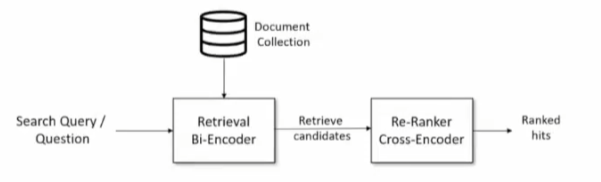

### 5.3、混合检索（Hybrid Search）

在实际生产中，传统的关键字检索（稀疏表示）与向量检索（稠密表示）各有优劣

举个具体例子，比如文档中包含很长的专有名词，**关键字检索** 往往 **更精准** 而 **向量检索** 容易 **引入概念混淆**。

所以，有时候我们需要结合不同的检索算法，来达到比单一检索算法更优的效果。这就是 **混合检索**  

混合检索的核心是，综合文档 d 在不同检索算法下的排序名次 (rank)，为其生成最终排序  

一个最常用的算法叫 **Reciprocal Rank Fusion (RRF)**

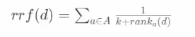

其中 A 表示所有使用的检索算法的集合，ranka(d) 表示使用算法 a 检索时，文档 d 的排序，k 是个常数

很多向量数据库都支持混合检索，比如 Weaviate、 Pinecone 等。也可以根据上述原理自己实现

RAG 的流程

- 离线步骤
  1. 文档加载
  2. 文档切分
  3. 向量化
  4. 灌入向量数据库
- 在线步骤
  1. 获得用户问题
  2. 用户问题向量化
  3. 检索向量数据库
  4. 将检索结果和用户问题填入 Prompt 模版
  5. 用最终获得的 Prompt 调用 LLM
  6. 由 LLM 生成回复

## 6、PDF 的表格处理

流程：

1. 将每页 PDF 转成图片
2. 识别图片中的表格
3. 基于 GPT-4 Vision API 做表格回答
4. 用 GPT-4 Vision 生成表格（图像）描述，并向量化用于检索

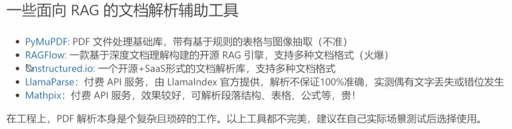

## 7、GraphRAG

1. 什么是 **GraphRAG**：核心思想是将知识预先处理成 **知识图谱**
2. 优点：适合复杂问题，尤其是以查询为中心的总结，例如:“XXX团队去年有哪些贡献
3. 缺点:知识图谱的构建、清洗、维护更新等都有可观的成本
4. 建议:
   - GraphRAG不是万能良药
   - 领会其核心思想
   - 遇到传统 RAG 无论如何优化都不好解决的问题时，酌情使用


