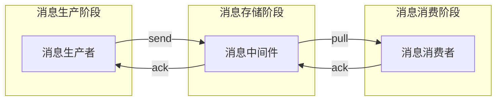
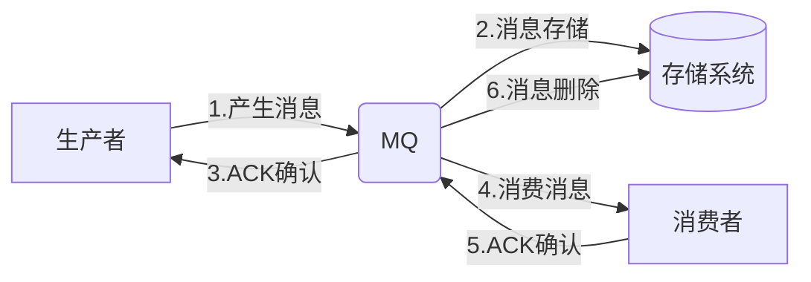
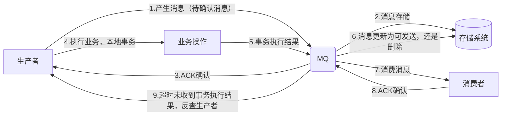

# MQ 八股

## 什么是消息队列，优缺点，怎么选型

消息队列主要功能：
- 接收消息
- 存消息
- 消费消息
- 发消息

优点：
- 解耦
- 异步
- 削峰填谷

缺点：
- 可用性变低
- 开发复杂性上升
- 数据一致性问题

| 特性 | ActiveMQ | RabbitMQ | RocketMQ | Kafka |
|------|----------|----------|----------|-------|
| 单机吞吐量 | 万级 | 万级 | 10 万级 | 10 万级 |
| 时效性 | 毫秒级 | 微秒级 | 毫秒级 | 毫秒级 |
| 可用性 | 高（主从） | 高（主从） | 非常高（分布式） | 非常高（分布式） |
| 消息语义 | 至少一次 | 至少一次 | 至少一次 / 最多一次 | 至少一次 / 最多一次 / 精确一次（0.11+，需配置开启） |
| 消息顺序性 | 有序 | 有序 | 顺序消息（同一队列内有序） | 分区有序 |
| 支持主题数 | 千级 | 万级（队列数可更多，但元数据开销较大） | 万级（CommitLog 结构对海量 Topic 友好） | Topic 上千时单 Broker 因分区文件过多，性能会显著下降 |
| 消息回溯 | 不支持 | 不支持 | 支持（按时间回溯） | 支持（按 offset 回溯） |
| 管理界面 | 普通 | 普通 | 完善 | 普通 |

## 消息重复消费怎么解决

- 生产端如果重复发消息，MQ 框架会自己解决避免存储重复消息（如何保证 **幂等性**）
- 消费端需要对已消费成功的消息通过数据库或 Redis 缓存业务标识（id，流水号等），在处理消息前校验是否已经处理过或正在处理，保证幂等

## 消息丢失怎么解决

- 生产端：发送给 MQ 成功后收到 ack 确认响应，表示成功。如果失败，再发送一次
- 消息存储阶段：使用集群，如果一个节点挂了 ，还有其他节点
- 消费端：消息接收并处理后返回 ack，不会求实消息

## 如何保证 MQ 的可靠性和顺序性

可靠性：
- 消息持久化
  - MQ 将消息持久化，保证服务器重启后依然可以读取与处理
- 消息确认机制
  - 消费者接收消息并成功处理后才返回 ack，此时 MQ 才移除消息
- 消息重试策略
  - 消费者处理消息失败，可以间隔重试，如果重试过多发送到 **死信队列**，人工排查

顺序性
- 识别需要有序的场景
- MQ 的支持
- 使用 **单线程** 或 **线程池**

## 如何保证幂等

**幂等性** 指 **同一操作** 多次执行对系统影响与结果 **一致**（多次调用支付接口，只会付一次）

实现幂等性方式

- 唯一标识（消息去重），通过 **业务 id** 保证消息只被消费一次
- 数据库事务 + 乐观锁：通过 **版本号/状态子段** 控制并发更新
- 数据库唯一约束：通过 **数据库唯一索引** 防止重复写入
- 分布式锁：保证同一时刻只有一个请求执行关键操作

## 如何处理消息积压问题

消息积压表明消息 **生产** 速度 **大于** **消费** 速度

- 是否有 bug
  - 修复 consumer
  - 新建 topic，容量为原来 10 倍
  - 分发消息，征用更加多的消费机器
  - 快速处理，然后恢复原来的架构
- 优化为批处理消息
- 水平扩容，添加 Topic 队列数和消费组机器数

## 如何保证消息数据一致性

一个普通的 MQ 消息的生产与消费

当需要 **本地修改数据 + 需要其他系统做事** 的场景时，就要 要么都做要么都不做，此时需要 **事务消息**

- 生产者发送一条 **半事务** 消息给 MQ
- MQ 接收消息并持久化，标记状态为 **待发送**
- MQ 发送 ACK 到生产者，MQ 此时不会发消息给消费者
- 生产者执行 **本地事务**
- 生产者本地事务成功，将执行结果发给 MQ，否则发送 rollback，如果长时间没发送，MQ 通过接口反查生产者
- MQ 接收消费者本地事务成功，标记消息为 **可发送**，如果是 rollback，删除消息
- 消息若为可发送，MQ push 消息给消费者，消费者完成返回 ack

