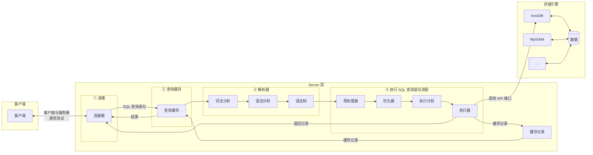

# MySQL 八股

## SQL 的执行顺序

从 `From` 开始，每个步骤都生成 **虚拟表** 到后一个阶段

- (9) `SELECT`
- (10) `DISTINCT <column>`,
- (6) `AGG_FUNC <column> or <expression>`,
- (1) `FROM <left_table>`
  - (3) `<join_type>JOIN<right_table>`
  - (2) `ON <join_condition>`
- (4) `WHERE <where_condition>`
- (5) `GROUP BY <group_by_list>`
- (7) `WITH {CUBE|ROLLUP}`
- (8) `HAVING <having_condtion>`
- (11) `ORDER BY <order_by_list>`
- (12) `LIMIT <limit_number>`;


## 存储引擎

### 一条 SQL 执行的过程



**MySQL** 默认存储引擎为 **InnoDB** 

为什么：
- 事务支持
- 并发性能
- 崩溃恢复

## 索引

### 索引的好处与分类

索引类似 **目录**，可以提高 **查询效率**

- 按 **数据结构** 分类：
  - B+ 树索引
  - Hash 索引（适用 **等值查询** 而非 **范围查询**）
  - Full-text 索引
  > 表在创建时，InnoDB 就会创建索引：
  > - 表有主键：主键作为聚簇索引
  > - 表无主键：选第一个不含 Null 值的唯一列作为聚簇索引
  > - 兜底：创建隐式自增 id 列作为聚簇索引
- 按 **物理存储** 分类：
  - 聚簇索引（主键索引）
  - 二级索引
  > 主键索引和二级索引默认使用的是 **B+树** 索引
  > - 聚簇索引（主键索引） B+Tree 叶子节点存放 **行数据**
  > - 二级索引 B+Tree 叶子节点存放 **索引列的值 + 主键值**
  > 若需要查询的数据（二级索引列 / id）能通过二级索引查到，就不用回表直接返回，若查不到，则要通过 **主键** **回表**，如果聚簇索引的索引数据更新，结构会变化，反之不变
- 按 **字段特性** 分类
  - 主键索引
  - 唯一索引
  - 普通索引
  - 前缀索引
- 按 **字段个数** 分类：
  - 单列索引
  - 联合索引
  > 联合索引用多个列作为 key 值，创建索引时，排在前面的列会先进行排序，使用索引时按 **最左匹配原则** 匹配，因此创建联合索引要注意 **字段顺序**，把 **区分度** 大的放前面，区分度 = distinct(column) / count(*)
  > 若创建 (a,b,c) 为联合索引：
  > `where a=1 and b=2`、`where b=1 and a=2 and c=3` 索引有效
  > `where b=1` **索引失效**，因为 b，c **全局无需，局部有序**

### 主键 id 为什么用自增 id 好而非 UUID

UUID 无需，新增行不一定必前一个 id 大，因此要插入中间，导致很多额外操作：

- 要找到写入目标页，磁盘 IO 增加
- 页分裂操作增加
- 频繁页分裂导致数据有碎片

### B+ Tree 特性


- MySQL InnoDB 引擎默认用 B+ Tree 作为索引的数据结构
- B+ Tree 叶子节点 **存放数据**，非叶子节点只存放索引，每个叶子节点之间有双向链表
- B+ 树是 **自平衡的**，插入删除前自动平衡
- B+ Tree 叶子节点是一个数据页，数据页中有页目录，数据页中的数据以单链表存储
  - 页将所有记录划分为几组
  - 页目录（槽）记录每组的最大 id
  - 每组的最大 id 的数据头会写这组有多少数据
  - 组中可以用二分查找
- B+ Tree 存储千万级数据只需要 3-4 层高度，减少 IO（3-4 次）
- B+ Tree 相比 B Tree 查询效率更高

与 B 树的区别：


- B 树的非叶子节点即存储索引页存储部分数据
- B 树的叶子节点没有链表相连

与跳表区别：同样数据量，跳表层数更高，磁盘 IO 更高


### 索引失效的情况有哪些

-  like %xx 或者 like %xx% 导致索引失效
-  对索引列使用函数/表达式计算
-  联合索引没按照最左匹配
-  or 连接的条件没有一个成立
-  

### 什么是回表查询

查询时使用了二级索引，查询的数据能在二级索引中找到的就不用回表，否则要根据 id 重新用主键索引查一遍


### 什么是索引覆盖

创建的索引覆盖所有需要查询的数据，这样不用回表

### 如果一个列即使单列索引又是联合索引，查询先走哪个

mysql 优化器会分析索引查询成本，如果是 （a），（a,b）会走（a,b）

### 索引字段是不是建越多越好

不是，建越多占用空间越多，在写入频繁的场景下对 B+ 树的维护消耗越大

### 怎么决定建立哪些索引

- 什么时候需要
  - 字段有唯一性
  - 经常用于 `WHERE` 查询的 字段
  - 经常用于 `GROUP BY` 和 `ORDER BY` 的字段
- 什么时候不需要
  - `WHERE`，`GROUP BY`，`ORDER BY` 用不到的字段
  - 字段中存在大量重复，不需要创建索引
  - 数据量少的时候
  - 经常 **更新** 的字段不用创建索引

### 怎么做索引优化

- 前缀索引优化
- 覆盖索引优化
- 主键索引最好是自增
- 防止索引失效

## 事务

### MySQL 并发问题有哪些

- 脏读
  - 读到了别的事务 **未提交** 的修改（对方可能回滚，读到的是脏数据）
- 不可重复读
  - 同一事务内两次读 **同一行**，值不同（别的事务 `UPDATE` 了这行并提交）
- 幻读
  - 同一事务内两次 **范围查询**，结果集 **行数** 不同（别的事务 `INSERT`/`DELETE` 了行并提交）

### MySQL 怎么解决并发问题

- 行锁
- 表所

### 事务隔离级别有哪些

- 读未提交
  - B 可见 A 未提交事务
  - 脏读、不可重复读、幻读
- 读提交
  - A 的事务提交后，A 的变更才被 B 可见
  - 不可重复读、幻读
- 可重复读
  - A 的事务提交前，A 的数据与提交前一致（InnoDB 默认）
  - 幻读
- 串行化
  - 读写锁

| 事务 A | 事务 B |
|:------:|:------:|
| 启动事务 A | 启动事务 B |
| 查得余额 100万 | |
| | 查得余额 100万 |
| | 将余额 100万 改成 200万 |
| 查得余额 V1 | |
| | 提交事务 B |
| 查得余额 V2 | |
| 提交事务 A | |
| 查得余额 V3 | |

在不同隔离级别下，事务 A 执行过程中查询到的余额可能会不同：

- 在 **读未提交** 隔离级别下，事务 B 修改余额后，虽然没有提交事务，但是此时的余额已经可以被事务 A 看见了，于是事务 A 中余额 V1 查询的值是 200 万，余额 V2、V3 自然也是 200 万了；
- 在 **读提交** 隔离级别下，事务 B 修改余额后，因为没有提交事务，所以事务 A 中余额 V1 的值还是 100 万，等事务 B 提交完后，最新的余额数据才能被事务 A 看见，因此额 V2、V3 都是 200 万；
- 在 **可重复读** 隔离级别下，事务 A 只能看见启动事务时的数据，所以余额 V1、余额 V2 的值都是 100 万，当事务 A 提交事务后，就能看见最新的余额数据了，所以余额 V3 的值是 200 万；
- 在 **串行化** 隔离级别下，事务 B 在执行将余额 100 万修改为 200 万时，由于此前事务 A 执行了读操作，这样就发生了读写冲突，于是就会被锁住，直到事务 A 提交后，事务 B 才可以继续执行，所以从 A 的角度看，余额 V1、V2 的值是 100 万，余额 V3 的值是 200 万。


### MySQL 设置可重复读隔离级别，怎么保证不发生幻读？

开启事务之后，马上执行 `select ... for update` 这类锁定读的语句

> `select....` 快照读，不加锁，MVCC
> `SELECT ... LOCK IN SHARE MODE` 加 S 锁/共享锁/读锁
> `select ... for update` 加 X 锁/排他锁/写锁

### 一个事务有太多 SQL 的弊端

- 死锁和锁超时
- 回滚时间长
- 主从延迟

## 锁

### 锁有那些，表锁行锁有什么作用

- 全局锁
  - 整个数据库只读
  - 应用于 **全库逻辑备份**
- 表级锁
  - 表锁
    - 整体控制、粒度大、适用于大批量操作
  - 元数据锁：对表 CRUD，加的是 **MDL 读锁**，对表结构变更，加的是 **MDL 写锁**
  - 意向锁：快速判断表里是否有记录被加锁
- 行级锁
  - 提高并发
  - 减少锁冲突
  - 适用于频繁单杠操作
- 记录锁
- 间隙锁
- 临键锁


### 两条 update 语句同时处理一张表，一个 <10 一个 >15 会阻塞吗

- 如果是 主键/索引，不会阻塞
- 如果不是 主键/索引，会阻塞，触发全表扫表


## 日志

### MySQL 日志有哪些，分别什么作用

- redo log
  - **重做** 日志 Innodb 存储引擎层日志
  - 实现事务 **持久性**，用于 **掉电故障恢复**
  - 如何实现：
    - 记录需要更新 -> 先更新内存（Buffer Pool）并标记 **脏页** -> **事务完成后** 记录 redo log（顺序写）
    - 后台线程将 Buffer Pool 的脏页 刷新到磁盘中（WAL Write-Ahead Logging 技术，先写日志再写磁盘）
    - redo log 记录事务 **完成后** 的数据状态，记录的 **更新后** 的值；
- undo log
  - **回滚** 日志 Innodb 存储引擎层日志
  - 实现事务 **原子性**，用于 **事务回滚** 和 **MVCC**
  - 如何实现：事务没提交前，MySQL 记录 **更新前** 的数据到 undo log 日志文件，要回滚时，利用 undo log 就行回滚
  - undo log 记录事务 **开始前** 的数据状态，记录 **更新前** 的值；
  ```mermaid
    flowchart TD
      A[事务开始] --> B[执行事务]
      B --> C[记录 Redo Log]
      B --> D[记录 Undo Log]
      B --> E{发生崩溃}
      E -- 是 --> F[回滚事务]
      E -- 否 --> G{Commit}
      G -- 否 --> F
      G -- 是 --> H{发生崩溃}
      H -- 是 --> I[恢复事务]
      C --> I
      D --> F
  ```
- bin log
  - 二进制日志，Server 层生成的日志
  - 用于 **数据备份** 和 **主从复制**
  - **增量更新**，只记录 **变更与修改操作**
  - 三种格式类型
    - STATEMENT，记录 SQL，问题是像 uuid 或 now 动态函数在主从上不一致
    - ROW，记录数据行，问题是太大
    - MIXED：混合 STATEMENT 和 ROW
- relay log
  - 中继日志，用于主从复制下，Slave 通过 io 拷贝 master 的 bin log 后本地生成的日志
- 慢查询日志
  - 记录执行时间过长的 SQL，需要设置阈值手动开启


## SQL 优化

### Explain 及其作用

Explain 用于查看 sql 执行计划，例如 `EXPLAIN SELECT * FROM...`：
- `possible_keys`: 可能用到的索引
- `key`: 实际用的索引
- `key_len`: 索引长度
- `rows`: 扫描行数
- `types`: 数据扫描类型
  - ALL：全表扫描
  - index：全索引扫描
  - range： 索引范围扫描
  - ref：非唯一索引扫描
  - eq_ref：唯一索引扫描
  - const：键或者唯一索引与常量值进行比较
- extra

### 查询速度慢如何优化

- 分析查询语句，**EXPLAIN**
- 创建或优化索引
- 查询优化，避免用 SELECT *，只查真正需要的列，走覆盖索引
- 联表查询 **小表** 驱动 **大表**
- 冗余字段设计减少联表查询
- 单表超千万级，大表拆小表
- 使用 Redis 缓存

## 主从复制，分库分表

### 主从复制

- 主库写 binlog，提交事务，本地更新
- binlog 复制到从库，从库把 binlog 写到暂存日志中
- 回放 binlog，更新存储引擎中的数据

### 分库分表

- 垂直分库
  - 将不同业务和功能的数据放不同数据库中
- 垂直分表
  - 针对字段多的表，将不常用的字段拆到单独表中
- 水平分库
  - 同一个表按一定规则拆分到不同的数据库中，但数据的访问需要额外的路由工作，因此系统的复杂度也被提升
- 水平分表
  - **同一个数据库** 内，把一张大数据量的表按一定规则，切分成多个结构完全相同表