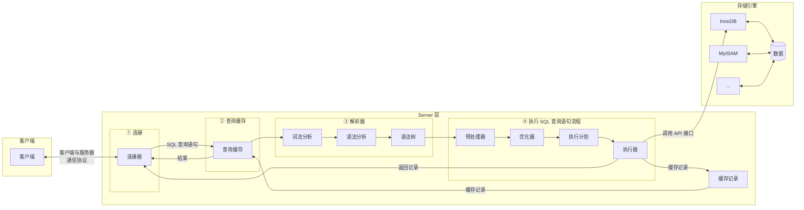
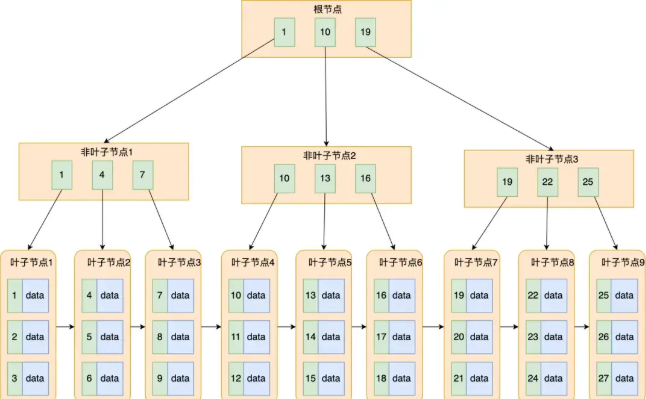
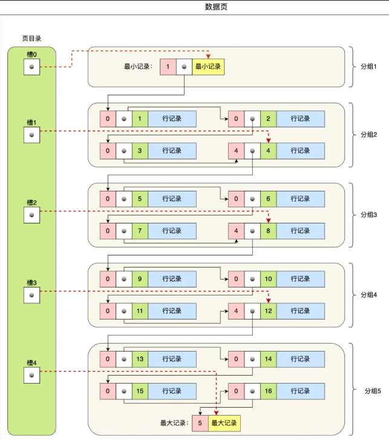

# MySQL 八股

## SQL 的执行顺序

从 `From` 开始，每个步骤都生成 **虚拟表** 到后一个阶段

- (9) `SELECT`
- (10) `DISTINCT <column>`,
- (6) `AGG_FUNC <column> or <expression>`,
- (1) `FROM <left_table>`
  - (3) `<join_type>JOIN<right_table>`
  - (2) `ON <join_condition>`
- (4) `WHERE <where_condition>`
- (5) `GROUP BY <group_by_list>`
- (7) `WITH {CUBE|ROLLUP}`
- (8) `HAVING <having_condtion>`
- (11) `ORDER BY <order_by_list>`
- (12) `LIMIT <limit_number>`;

## 存储引擎

### 一条 SQL 执行的过程

**MySQL** 默认存储引擎为 **InnoDB** 

为什么：
- 事务支持
- 并发性能
- 崩溃恢复

## 索引

### 索引的好处与分类

索引类似 **目录**，可以提高 **查询效率**

- 按 **数据结构** 分类：
  - B+ 树索引
  - Hash 索引（适用 **等值查询** 而非 **范围查询**）
  - Full-text 索引
  > 表在创建时，InnoDB 就会创建索引：
  > - 表有主键：主键作为聚簇索引
  > - 表无主键：选第一个不含 Null 值的唯一列作为聚簇索引
  > - 兜底：创建隐式自增 id 列作为聚簇索引
- 按 **物理存储** 分类：
  - 聚簇索引（主键索引）
  - 二级索引
  > 主键索引和二级索引默认使用的是 **B+树** 索引
  > - 聚簇索引（主键索引） B+Tree 叶子节点存放 **行数据**
  > - 二级索引 B+Tree 叶子节点存放 **索引列的值 + 主键值**
  > 若需要查询的数据（二级索引列 / id）能通过二级索引查到，就不用回表直接返回，若查不到，则要通过 **主键** **回表**，如果聚簇索引的索引数据更新，结构会变化，反之不变
- 按 **字段特性** 分类
  - 主键索引
  - 唯一索引
  - 普通索引
  - 前缀索引
- 按 **字段个数** 分类：
  - 单列索引
  - 联合索引
  > 联合索引用多个列作为 key 值，创建索引时，排在前面的列会先进行排序，使用索引时按 **最左匹配原则** 匹配，因此创建联合索引要注意 **字段顺序**，把 **区分度** 大的放前面，区分度 = distinct(column) / count(*)
  > 若创建 (a,b,c) 为联合索引：
  > `where a=1 and b=2`、`where b=1 and a=2 and c=3` 索引有效
  > `where b=1` **索引失效**，因为 b，c **全局无需，局部有序**

### 主键 id 为什么用自增 id 好而非 UUID

UUID 无需，新增行不一定必前一个 id 大，因此要插入中间，导致很多额外操作：

- 要找到写入目标页，磁盘 IO 增加
- 页分裂操作增加
- 频繁页分裂导致数据有碎片

### B+ Tree 特性

- MySQL InnoDB 引擎默认用 B+ Tree 作为索引的数据结构
- B+ Tree 叶子节点 **存放数据**，非叶子节点只存放索引，每个叶子节点之间有双向链表
- B+ 树是 **自平衡的**，插入删除前自动平衡
- B+ Tree 叶子节点是一个数据页，数据页中有页目录，数据页中的数据以单链表存储
  - 页将所有记录划分为几组
  - 页目录（槽）记录每组的最大 id
  - 每组的最大 id 的数据头会写这组有多少数据
  - 组中可以用二分查找
- B+ Tree 存储千万级数据只需要 3-4 层高度，减少 IO（3-4 次）
- B+ Tree 相比 B Tree 查询效率更高

与 B 树的区别：

- B 树的非叶子节点即存储索引页存储部分数据
- B 树的叶子节点没有链表相连

与跳表区别：同样数据量，跳表层数更高，磁盘 IO 更高

### 索引失效的情况有哪些

-  like %xx 或者 like %xx% 导致索引失效
-  对索引列使用函数/表达式计算
-  联合索引没按照最左匹配
-  or 连接的条件没有一个成立
-  

### 什么是回表查询

查询时使用了二级索引，查询的数据能在二级索引中找到的就不用回表，否则要根据 id 重新用主键索引查一遍

### 什么是索引覆盖

创建的索引覆盖所有需要查询的数据，这样不用回表

### 如果一个列即使单列索引又是联合索引，查询先走哪个

mysql 优化器会分析索引查询成本，如果是 （a），（a,b）会走（a,b）

## 索引字段是不是建越多越好

不是，建越多占用空间越多，在写入频繁的场景下对 B+ 树的维护消耗越大

### 怎么决定建立哪些索引

- 什么时候需要
  - 字段有唯一性
  - 经常用于 `WHERE` 查询的 字段
  - 经常用于 `GROUP BY` 和 `ORDER BY` 的字段
- 什么时候不需要
  - `WHERE`，`GROUP BY`，`ORDER BY` 用不到的字段
  - 字段中存在大量重复，不需要创建索引
  - 数据量少的时候
  - 经常 **更新** 的字段不用创建索引

### 怎么做索引优化

- 前缀索引优化
- 覆盖索引优化
- 主键索引最好是自增
- 防止索引失效

## 事务

