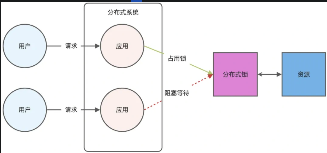

# Redis 八股

## Redis 数据结构

- string: 字符或数字
- list
- hash：set/zset 底层
- set：去重无序
- zset：有序（需要给元素排序、取排名、按分数范围筛选的场景）

## zset 底层实现

跳表

> 为什么不用 B+ 树？
> B+ 树的设计核心是降低树的高度，从而减少磁盘 I/O 次数。Redis 是纯内存操作，指针跳转的开销非常小

## 如何实现 Redis 原子性

### lua 脚本
由于 Redis 单线程，redis 执行一条命令的时候是原子性的，如果要多条命令可以使用 lua 脚本。
redis 在处理 lua 脚本内的命令，不会处理其他客户端的命令

### redis 事务
Redis事务的执行流程分三步：

1. MULTI：开启事务队列。
2. 输入命令：所有命令进入队列，但不执行。
3. EXEC：一次性按顺序执行队列中的所有命令。

它能保证的：在EXEC执行期间，Redis不会插入其他客户端的命令（单线程隔离性）。

它不能保证的（重点）：如果某条命令执行时报错，其他命令照常执行，不会回滚。

## Redis 日志持久化机制有哪些

- AOF 日志：每 **执行** 一条 **写操作** 命令，就把该命令追加到一个文件里
- RDB 快照：将某一时刻的 **内存数据** 以 **二进制** 的方式写入磁盘
- 混合持久化：在 AOF 重写时，先打 RDB 快照，然后在重写期间将新的命令写入 AOF

AOF 具体实现：Redis 命令 -> 用户缓冲区 -> 内核 page cache -> fsync() 真正落盘
- fsync 不同时机（立即、1s、30s）代表不同性能和可靠性

RDB 具体实现：save/bgsave（主线程和子线程）

## Redis 缓存淘汰与过期策略

缓存淘汰：
- 不进行数据淘汰（新的写入禁止写入，默认策略）noeviction
- 进行数据淘汰
  - volatile-random：随机淘汰设置了过期时间的任意键值
  - volatile-ttl：优先淘汰更早过期的键值
  - volatile-lru: 淘汰所有设置了过期时间的键值中，最久未使用的键值
  - volatile-lfu: 淘汰所有设置了过期时间的键值中，最少使用的键值
  - allkeys-random：随机淘汰任意键值
  - allkeys-lru：淘汰整个键值中最久未使用的键值
  - allkeys-lfu: 淘汰整个键值中最少使用的键值。

过期删除策略：**惰性删除 + 定期删除**

- 查询的 key 过期，删除
- 定期删除：每隔一段时间「随机」从数据库中取出一定数量的 key 进行检查，并删除其中的过期 key。如果过期 key 大于 25%，继续抽样

## Redis 集群的主从同步怎么实现

完全同步：
- slave 初次连接 master -> 完全同步
  - 建立链接，协商同步（Slave send SYNC to Master）
  - master 同步数据给 slave 服务器（Master send RDB to Slave）
  - master 服务器同步 **写** 命令给从服务器
- slave 数据丢失/长时间未与主服务器同步（如断电），请求完全同步

增量同步：
- Slave send PSYNC to Master
- Master 服务器决定采用增量还是全量
- 更新

Master 如何决定 **全量** 还是 **增量**，增量要怎么知道发送哪些数据？
- repl_backlog_buffer，Master 的 **环形** 缓冲区，master_repl_offset 记录 master **写** 的位置（偏移量）
- slave_repl_offset 记录 slave 节点读到的位置
- 环形缓冲区一般 1M（可通过调整来减少全量同步），slave 通过读 offset 的差值来增量更新，如果 缓冲区已被覆盖，使用 全量更新

## Redis 主从可以保证数据的一致性吗？

不能

**默认模式** 是异步复制，Master 节点不会等 Slave 节点同步后再返回

## 哨兵 Sentinel 原理

redis 主从模式通常是 **读写分离** 的，**哨兵** 也是一个 **节点**，哨兵也有 **集群** 其作用为：
- 监控 Master 节点是否存活
- 选举一个 Slave 节点切换为 Master 节点
- 通知其余节点

## 哨兵选主节点的算法

1. 故障节点主观下线
   - 哨兵会定时对一个集群内的所有节点发心跳包，如果该节点在一定时间内没回复，则被哨兵 **主观下线**
2. 故障节点客观下线
   - 当节点被一个哨兵节点客观下线时，需要哨兵集群中的其他节点共同判断主观下线才行（超过quorum数量），此时该节点为客观下线
3. Sentinel 集群选举 Leader
   - 首先哨兵节点要选一个节点作为哨兵 leader 节点（通常由 runid 小的先发起选举要票，票过哨兵节点半数就变 leader）
4. Sentinel Leader 决定新主节点，按如下顺序：
   - 过滤故障节点
   - 选择 slave-priority 最小的从节点作为主节点
   - 选择复制 **偏移量最大** 的节点作为主节点
   - 选择 runid 最小的作为主节点

## Redis 集群模式及优缺点

当一台服务器无法存下所有数据，就需要 **多台服务器存储**，使用 **Redis 切片集群（Redis Cluster）**，将数据放在不同服务器上

Redis Cluster 使用 **哈希槽（Hash Slot）** 处理 **数据** 与 **节点** 的 **映射** 关系。一个 **切片集群** 有 16384 个 哈希槽。

哈希槽 的分配方式：
- 平均分配
- 手动分配

数据入槽：key -> CRC16(key) % 16383

优点：
- 高可用
- 高性能
- 扩展性好
缺点：
- 不熟维护复杂
- 集群同步问题
- 数据分片限制

## 高并发场景，Redis 单节点 + MySQL 单节点能有多大并发量

- 缓存命中，4 核 8 G，redis 支撑 10W QPS
- 缓存未命中，4 核 8 G，MySQL 支持 5000 左右 qps

## Redis 分布式锁

> 什么是分布式锁，为什么需要分布式锁：
> 单机（Redis）情况下：
> - 多个 Client 访问一个或多个资源：Redis 命令天然原子性/Lua 脚本 保证原子性
> 多机（Redis）情况下：
> - 多个 Client 访问一个或多个资源：单机只能保证自己的原子性，不能保证其他 Redis 的原子性，使用 分布式锁

**set nx** 方式：
- `SET resource_name lock_value NX PX milliseconds` 设置锁
- 解锁
为了保证两个操作的原子性，可以使用 lua 脚本

**RedLock** 算法：有多个 Redis 实例，客户端尝试在 **大于半数** Redis 实例上同时加锁且成功时才认为获取锁成功

### Redis 分布式锁实现原理

- 如果 key 不存在，则显示插入成功，可以用来表示加锁成功
- 如果 key 存在，则会显示插入失败，可以用来表示加锁失败

加锁的三个条件：
- 原子性，加锁包含：读取锁变量、检查锁变量值和设置锁变量值，这些操作要是原子的
- 锁变量需要设置过期时间
- 锁变量的值需要能区分来自不同客户端的加锁操作，每个客户端设置的值是一个唯一值用于标识客户端

## Redis 大 key 问题

- 什么是大 key
  - 某个 k-v 占用空间大（10kb-1M）导致 redis 性能下降，内存不足，主从同步延迟，阻塞其他操作
- 如何解决：
  - 对大 key 拆分
  - 清理不必要的大 key
  - 监控 redis 内存水位，如果 redis 存储使用率过高/增长率过快，触发预警
  - 过期数据定期清理

## Reis 热 key 问题

- 什么是热 key
  - QPS 集中在特定的 Key
  - 带宽使用率集中在特定的 Key
  - CPU 使用时间占比集中在特定的 Key
- 如何解决：
  - 对热 Key 进行复制
  - 使用读写分离架构（热 key 以读为主）

## 如何保证 redis 和 mysql 数据一致性

- 对于读数据，选择旁路缓存策略，如果 cache 不命中，会从 db 加载数据到 cache
- 对于写数据，我会选择更新 db 后，再删除缓存。

## 什么是缓存穿透、击穿、雪崩，怎么解决

- 缓存穿透
  - 数据既不在缓存中也不在数据库中，大量请求达到数据库，数据库压力骤增
  - 解决方案：
    - 限制非法请求
    - 在缓存中设置空值或默认值，不让请求达到数据库
    - 布隆过滤器，可以判断数据是否存在（不存在就真不存在）
- 缓存击穿
  - 某个热点数据过期，大量请求打到数据库，数据库压力骤增
  - 解决方案：
    - 不给热点数据设置过期时间，或要在快要过期前重新设置过期时间
    - 互斥锁，保证只有一个业务线程读取并更新缓存，后续请求排队
- 缓存雪崩
  - 大量缓存数据同一时间过期或 redis 宕机故障
  - 解决方案
    - 避免将大量数据设置同一过期时间，可以添加随机数
    - 互斥锁，保证只有一个线程构建缓存
    - 让缓存永久有效，后台更新缓存

## 如何设计秒杀场景处理高并发和超卖现象

- 数据库层面
  - 加排他锁，写的时候阻塞
  - 更新数据库减库存的时候，限制必须大于 0，缺点：性能不是很好
- 分布式锁
  - 同一时间只有一个客户端拿到锁，但是变成串行化处理，缺点：没法处理大量请求
- 分布式锁 + 分段缓存
  - 把数据分成很多个段，每个段是一个单独的锁，多个线程过来并发修改数据的时候，可以并发的修改不同段的数据
  - 缺点：当某段锁的库存不足，一定要实现自动释放锁然后换下一个分段库存再次尝试加锁处理，此种方案复杂比较高。
- 利用 redis 的 incr、decr 的原子性 + 异步队列
  - 初始化时，将商品的库存数量加载到 redis 缓存中
  - 接收到秒杀请求时，在 redis 中进行预减库存，当 redis 中的库存不足时，直接返回秒杀失败，否则继续进行第 3 步
  - 将请求放入异步队列中，返回正在排队中
  - 服务端异步队列将请求出队，可以判断用户是否已经秒杀过商品防止重复秒杀，出队成功就减少数据库库存
  - 用户在客户端申请秒杀请求后，进行轮询，查看是否秒杀成功，秒杀成功则进入秒杀订单详情，否则秒杀失败
  - 缺点：由于是通过异步队列写入数据库中，可能存在数据不一致，其次引用多个组件复杂度比较高

