## 1.Spring Security 快速入门

官网：https://docs.spring.io/spring-security/reference/index.html

创建 SpringBoot + SpringSecurity 项目

**Spring Security 默认做了什么**

- 保护应用程序 URL，要求对应用程序的任何交互进行身份验证。
- 程序启动时生成一个默认用户 “user”。
- 生成一个默认的随机密码，并将此密码记录在控制台上。
- 生成默认的登录表单和注销页面。
- 提供基于表单的登录和注销流程。
- 对于Web请求，重定向到登录页面；
- 对于服务请求，返回401未经授权。
- 处理跨站请求伪造（CSRF）攻击。
- 处理会话劫持攻击。
- 写入Strict-Transport-Security 以确保 HTTPS。
- 写入 X-Content-Type-Options 以处理嗅探攻击。
- 写入 Cache Control 头来保护经过身份验证的资源。
- 写入 X-Frame-Options 以处理点击劫持攻击。

### 1.1、Spring Security 的底层原理

**官方文档：**[Spring Security 的底层原理](https://docs.spring.io/spring-security/reference/servlet/architecture.html)

Spring Security 之所以默认帮助我们做了那么多事情，它的底层原理是传统的`Servlet 过滤器`

下图展示了处理一个 Http 请求时，过滤器和 Servlet 的工作流程：可以在过滤器中对请求进行修改或增强

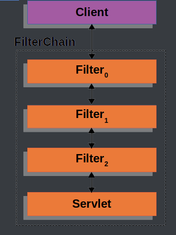

DelegatingFilterProxy 是 Spring Security 提供的一个 Filter 实现，可以在 Servlet 容器和 Spring 容器之间建立桥梁。通过使用 DelegatingFilterProxy，这样就可以将Servlet容器中的 Filter 实例放在 Spring 容器中管理。

FilterChainProxy 是Spring Security提供的一个特殊的Filter，它允许通过SecurityFilterChain将过滤器的工作委托给多个Bean Filter实例。

SecurityFilterChain 被 FilterChainProxy 使用，负责查找当前的请求需要执行的Security Filter列表。

可以有多个SecurityFilterChain的配置，FilterChainProxy决定使用哪个SecurityFilterChain

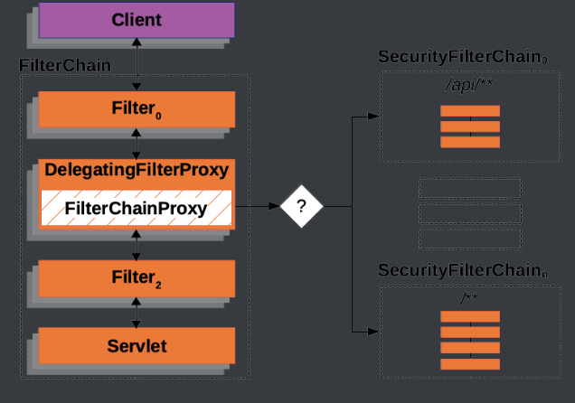

### 1.2、启动与运行时

SecurityFilterChain 接口的实现，加载了默认的16个 Filter

默认情况下 Spring Security 将初始的用户名和密码存在了 SecurityProperties类中。这个类中有一个静态内部类 User，配置了默认的用户名（name = "user"）和密码（password = uuid）

也可以将用户名、密码配置在 SpringBoot 的配置文件中

## 2、Spring Security 自定义配置

### 2.1、基于内存的用户认证

可以在 SpringSecurity 中创建自定义配置文件

**UserDetailsService** 用来管理用户信息

**InMemoryUserDetailsManager** 是 UserDetailsService 的一个实现，用来管理基于内存的用户信息

创建一个 **WebSecurityConfig** 文件：

```java
@Configuration
@EnableWebSecurity//Spring项目总需要添加此注解，SpringBoot项目中不需要
public class WebSecurityConfig {

    @Bean
    public UserDetailsService userDetailsService() {
        InMemoryUserDetailsManager manager = new InMemoryUserDetailsManager();
        manager.createUser( //此行设置断点可以查看创建的user对象
            User
            .withDefaultPasswordEncoder()
            .username("t4masko") //自定义用户名
            .password("password") //自定义密码
            .roles("USER") //自定义角色
            .build()
        );
        return manager;
    }
}
```

基于内存的用户认证流程：

- 程序启动时：
  - 创建`InMemoryUserDetailsManager`对象
  - 创建`User`对象，封装用户名密码
  - 使用`InMemoryUserDetailsManager`将User存入 **内存**
- 校验用户时：
  - SpringSecurity自动使用`InMemoryUserDetailsManager`的`loadUserByUsername`方法从`内存中`获取User对象
  - 在`UsernamePasswordAuthenticationFilter`过滤器中的`attemptAuthentication`方法中将用户输入的用户名密码和从内存中获取到的用户信息进行比较，进行用户认证

### 2.2、基于数据库的数据源

Spring Security 默认基于内存，基于数据库的用户认证流程：

- 序启动时：
  - 创建 `DBUserDetailsManager` 类，实现接口 UserDetailsManager, UserDetailsPasswordService
  - 在应用程序中初始化这个类的对象
- 校验用户时：
  - SpringSecurity自动使用`DBUserDetailsManager`的`loadUserByUsername`方法从`数据库中`获取User对象
  - 在`UsernamePasswordAuthenticationFilter`过滤器中的`attemptAuthentication`方法中将用户输入的用户名密码和从数据库中获取到的用户信息进行比较，进行用户认证

定义 DBUserDetailsManager

```java
public class DBUserDetailsManager implements UserDetailsManager, UserDetailsPasswordService {
    
    @Resource
    private UserMapper userMapper;

    @Override
    public UserDetails loadUserByUsername(String username) throws UsernameNotFoundException {

        QueryWrapper<User> queryWrapper = new QueryWrapper<>();
        queryWrapper.eq("username", username);
        User user = userMapper.selectOne(queryWrapper);
        if (user == null) {
            throw new UsernameNotFoundException(username);
        } else {
            Collection<GrantedAuthority> authorities = new ArrayList<>();
            return new org.springframework.security.core.userdetails.User(
                    user.getUsername(),
                    user.getPassword(),
                    user.getEnabled(),
                    true, //用户账号是否过期
                    true, //用户凭证是否过期
                    true, //用户是否未被锁定
                    authorities); //权限列表
        }
    }

    @Override
    public UserDetails updatePassword(UserDetails user, String newPassword) {
        return null;
    }

    @Override
    public void createUser(UserDetails user) {

    }

    @Override
    public void updateUser(UserDetails user) {

    }

    @Override
    public void deleteUser(String username) {

    }

    @Override
    public void changePassword(String oldPassword, String newPassword) {

    }

    @Override
    public boolean userExists(String username) {
        return false;
    }
}

```

初始化 UserDetailsService，修改WebSecurityConfig中的userDetailsService方法如下，或者直接在 DBUserDetailsManager 类上添加 @Component 注解：

```java
@Bean
public UserDetailsService userDetailsService() {
    DBUserDetailsManager manager = new DBUserDetailsManager();
    return manager;
}
```

### 2.3、SpringSecurity 的默认配置

在 WebSecurityConfig 中添加如下配置

```java
@Bean
public SecurityFilterChain filterChain(HttpSecurity http) throws Exception {
    //authorizeRequests()：开启授权保护
    //anyRequest()：对所有请求开启授权保护
    //authenticated()：已认证请求会自动被授权
    http
        .authorizeRequests(authorize -> authorize.anyRequest().authenticated())
        .formLogin(withDefaults())//表单授权方式
        .httpBasic(withDefaults());//基本授权方式

    return http.build();
}
```

### 2.4、添加用户功能

#### Controller

UserController中添加方法

```java
@PostMapping("/add")
public void add(@RequestBody User user){
    userService.saveUserDetails(user);
}
```

#### Service

UserService接口中添加方法

```java
void saveUserDetails(User user);
```

UserServiceImpl实现中添加方法

```java
@Resource
private DBUserDetailsManager dbUserDetailsManager;

@Override
public void saveUserDetails(User user) {

    UserDetails userDetails = org.springframework.security.core.userdetails.User
            .withDefaultPasswordEncoder()
            .username(user.getUsername()) //自定义用户名
            .password(user.getPassword()) //自定义密码
            .build();
    dbUserDetailsManager.createUser(userDetails);

}
```

#### 修改配置

DBUserDetailsManager中添加方法

```java
@Override
public void createUser(UserDetails userDetails) {

    User user = new User();
    user.setUsername(userDetails.getUsername());
    user.setPassword(userDetails.getPassword());
    user.setEnabled(true);
    userMapper.insert(user);
}
```

#### 关闭 csrf 攻击防御

默认情况下 SpringSecurity 开启了csrf攻击防御的功能，这要求请求参数中必须有一个隐藏的 **_csrf** 字段

在filterChain方法中添加如下代码，关闭csrf攻击防御

```java
//关闭csrf攻击防御
http.csrf((csrf) -> {
    csrf.disable();
});
```

### 2.5、自定义登录页面

#### 创建登录Controller

```java
package com.atguigu.securitydemo.controller;

@Controller
public class LoginController {

    @GetMapping("/login")
    public String login() {
        return "login";
    }
}
```

#### 创建登录页面

resources/templates/login.html

```html
<!DOCTYPE html>
<html xmlns:th="https://www.thymeleaf.org">
<head>
    <title>登录</title>
</head>
<body>
<h1>登录</h1>
<div th:if="${param.error}">
    错误的用户名和密码.</div>

<!--method必须为"post"-->
<!--th:action="@{/login}" ，
使用动态参数，表单中会自动生成_csrf隐藏字段，用于防止csrf攻击
login: 和登录页面保持一致即可，SpringSecurity自动进行登录认证-->
<form th:action="@{/login}" method="post">
    <div>
        <!--name必须为"username"-->
        <input type="text" name="username" placeholder="用户名"/>
    </div>
    <div>
        <!--name必须为"password"-->
        <input type="password" name="password" placeholder="密码"/>
    </div>
    <input type="submit" value="登录" />
</form>
</body>
</html>
```

#### 配置SecurityFilterChain

SecurityConfiguration：

```java
.formLogin( form -> {
    form
        .loginPage("/login").permitAll() //登录页面无需授权即可访问
        .usernameParameter("username") //自定义表单用户名参数，默认是username
        .passwordParameter("password") //自定义表单密码参数，默认是password
        .failureUrl("/login?error") //登录失败的返回地址
        ;
}); //使用表单授权方式
```

## 3、前后端分离编码

用户认证流程：

- 登录成功后调用：AuthenticationSuccessHandler
- 登录失败后调用：AuthenticationFailureHandler

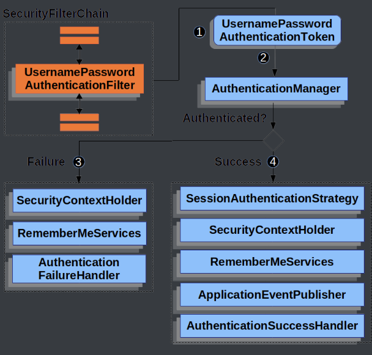

### 3.1、认证成功的响应

成功结果处理

```java
public class MyAuthenticationSuccessHandler implements AuthenticationSuccessHandler {
    @Override
    public void onAuthenticationSuccess(HttpServletRequest request, HttpServletResponse response, Authentication authentication) throws IOException, ServletException {

        //获取用户身份信息
        Object principal = authentication.getPrincipal();

        //创建结果对象
        HashMap result = new HashMap();
        result.put("code", 0);
        result.put("message", "登录成功");
        result.put("data", principal);

        //转换成json字符串
        String json = JSON.toJSONString(result);

        //返回响应
        response.setContentType("application/json;charset=UTF-8");
        response.getWriter().println(json);
    }
}
```

SecurityFilterChain 配置

```java
form.successHandler(new MyAuthenticationSuccessHandler()) //认证成功时的处理
```


### 3.2、认证失败响应

失败结果处理

```java
package com.atguigu.securitydemo.config;

public class MyAuthenticationFailureHandler implements AuthenticationFailureHandler {

    @Override
    public void onAuthenticationFailure(HttpServletRequest request, HttpServletResponse response, AuthenticationException exception) throws IOException, ServletException {

        //获取错误信息
        String localizedMessage = exception.getLocalizedMessage();

        //创建结果对象
        HashMap result = new HashMap();
        result.put("code", -1);
        result.put("message", localizedMessage);

        //转换成json字符串
        String json = JSON.toJSONString(result);

        //返回响应
        response.setContentType("application/json;charset=UTF-8");
        response.getWriter().println(json);
    }
}
```

SecurityFilterChain 配置

```java
form.failureHandler(new MyAuthenticationFailureHandler()) //认证失败时的处理
```


### 3.3、注销响应

注销结果处理

```java
public class MyLogoutSuccessHandler implements LogoutSuccessHandler {

    @Override
    public void onLogoutSuccess(HttpServletRequest request, HttpServletResponse response, Authentication authentication) throws IOException, ServletException {

        //创建结果对象
        HashMap result = new HashMap();
        result.put("code", 0);
        result.put("message", "注销成功");

        //转换成json字符串
        String json = JSON.toJSONString(result);

        //返回响应
        response.setContentType("application/json;charset=UTF-8");
        response.getWriter().println(json);
    }
}
```

SecurityFilterChain

```java
http.logout(logout -> {
    logout.logoutSuccessHandler(new MyLogoutSuccessHandler()); //注销成功时的处理
});
```

### 3.4、请求未认证的接口

实现 AuthenticationEntryPoint 接口

[Servlet Authentication Architecture :: Spring Security](https://docs.spring.io/spring-security/reference/servlet/authentication/architecture.html)

当访问一个需要认证之后才能访问的接口的时候，Spring Security 会使用`AuthenticationEntryPoint`将用户请求跳转到登录页面，要求用户提供登录凭证。

这里我们也希望系统 `返回json结果`，因此我们定义类`实现AuthenticationEntryPoint接口`

```java
package com.atguigu.securitydemo.config;

public class MyAuthenticationEntryPoint implements AuthenticationEntryPoint {
    @Override
    public void commence(HttpServletRequest request, HttpServletResponse response, AuthenticationException authException) throws IOException, ServletException {

        //获取错误信息
        //String localizedMessage = authException.getLocalizedMessage();

        //创建结果对象
        HashMap result = new HashMap();
        result.put("code", -1);
        result.put("message", "需要登录");

        //转换成json字符串
        String json = JSON.toJSONString(result);

        //返回响应
        response.setContentType("application/json;charset=UTF-8");
        response.getWriter().println(json);
    }
}
```

SecurityFilterChain 配置

```java
//错误处理
http.exceptionHandling(exception  -> {
    exception.authenticationEntryPoint(new MyAuthenticationEntryPoint());//请求未认证的接口
});
```

### 3.5、跨域


在 SpringSecurity 中解决跨域很简单，在配置文件中添加如下配置即可

```java
//跨域
http.cors(withDefaults());
```

## 4、身份认证

### 4.1、基础概念

在 Spring Security 框架中，SecurityContextHolder、SecurityContext、Authentication、Principal 和 Credential 是一些与身份验证和授权相关的重要概念。它们的关系如下：

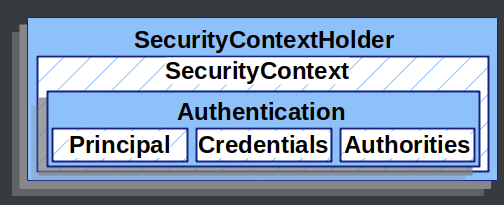

1. SecurityContextHolder：SecurityContextHolder 是 Spring Security 存储已认证用户详细信息的地方。
2. SecurityContext：SecurityContext 是从 SecurityContextHolder 获取的内容，包含当前已认证用户的 Authentication 信息。
3. Authentication：Authentication 表示用户的身份认证信息。它包含了用户的Principal、Credential和Authority信息。
4. Principal：表示用户的身份标识。它通常是一个表示用户的实体对象，例如用户名。Principal可以通过Authentication对象的getPrincipal()方法获取。
5. Credentials：表示用户的凭证信息，例如密码、证书或其他认证凭据。Credential可以通过Authentication对象的getCredentials()方法获取。
6. GrantedAuthority：表示用户被授予的权限

SecurityContextHolder用于管理当前线程的安全上下文，存储已认证用户的详细信息，其中包含了SecurityContext对象，该对象包含了Authentication对象，后者表示用户的身份验证信息，包括Principal（用户的身份标识）和Credential（用户的凭证信息）

### 4.2、在 Controller 中获取用户信息

IndexController：

```java
@RestController
public class IndexController {

    @GetMapping("/")
    public Map index(){

        System.out.println("index controller");

        SecurityContext context = SecurityContextHolder.getContext();// 存储认证对象的上下文
        Authentication authentication = context.getAuthentication();//认证对象
        String username = authentication.getName();//用户名
        Object principal =authentication.getPrincipal();//身份
        Object credentials = authentication.getCredentials();//凭证(脱敏)
        Collection<? extends GrantedAuthority> authorities = authentication.getAuthorities();//权限

        System.out.println(username);
        System.out.println(principal);
        System.out.println(credentials);
        System.out.println(authorities);

        //创建结果对象
        HashMap result = new HashMap();
        result.put("code", 0);
        result.put("data", username);

        return result;
    }
}
```

### 4.3、会话并发处理

后登录的账号会使先登录的账号失效

实现接口 SessionInformationExpiredStrategy

```java
public class MySessionInformationExpiredStrategy implements SessionInformationExpiredStrategy {
    @Override
    public void onExpiredSessionDetected(SessionInformationExpiredEvent event) throws IOException, ServletException {

        //创建结果对象
        HashMap result = new HashMap();
        result.put("code", -1);
        result.put("message", "该账号已从其他设备登录");

        //转换成json字符串
        String json = JSON.toJSONString(result);

        HttpServletResponse response = event.getResponse();
        //返回响应
        response.setContentType("application/json;charset=UTF-8");
        response.getWriter().println(json);
    }
}
```

SecurityFilterChain配置

```java
//会话管理
http.sessionManagement(session -> {
    session
        .maximumSessions(1)
        .expiredSessionStrategy(new MySessionInformationExpiredStrategy());
});
```

## 5、授权

授权管理的实现在 SpringSecurity 中非常灵活，可以帮助应用程序实现以下两种常见的授权需求：

- 用户-权限-资源：例如张三的权限是添加用户、查看用户列表，李四的权限是查看用户列表

- 用户-角色-权限-资源：例如 张三是角色是管理员、李四的角色是普通用户，管理员能做所有操作，普通用户只能查看信息

  

### 5.1、基于 request 的授权

#### 5.1.1、用户-权限-资源

需求：

- 具有 USER_LIST 权限的用户可以访问 /user/list 接口
- 具有 USER_ADD 权限的用户可以访问 /user/add 接口

##### 配置权限

SecurityFilterChain

```java
//开启授权保护
http.authorizeRequests(
        authorize -> authorize
    			//具有USER_LIST权限的用户可以访问/user/list
                .requestMatchers("/user/list").hasAuthority("USER_LIST")
    			//具有USER_ADD权限的用户可以访问/user/add
    			.requestMatchers("/user/add").hasAuthority("USER_ADD")
                //对所有请求开启授权保护
                .anyRequest()
                //已认证的请求会被自动授权
                .authenticated()
        );
```

##### 授予权限

DBUserDetailsManager中的loadUserByUsername方法：

```java
Collection<GrantedAuthority> authorities = new ArrayList<>();
authorities.add(()->"USER_LIST");
authorities.add(()->"USER_ADD");

/*authorities.add(new GrantedAuthority() {
    @Override
    public String getAuthority() {
        return "USER_LIST";
    }
});
authorities.add(new GrantedAuthority() {
    @Override
    public String getAuthority() {
        return "USER_ADD";
    }
});*/
```

##### 请求未授权的接口

SecurityFilterChain

```java
//错误处理
http.exceptionHandling(exception  -> {
    exception.authenticationEntryPoint(new MyAuthenticationEntryPoint());//请求未认证的接口
    exception.accessDeniedHandler((request, response, e)->{ //请求未授权的接口

        //创建结果对象
        HashMap result = new HashMap();
        result.put("code", -1);
        result.put("message", "没有权限");

        //转换成json字符串
        String json = JSON.toJSONString(result);

        //返回响应
        response.setContentType("application/json;charset=UTF-8");
        response.getWriter().println(json);
    });
});
```


#### 5.1.2、用户-角色-资源

**需求：**角色为 ADMIN 的用户才可以访问 /user/** 路径下的资源

##### 配置角色

SecurityFilterChain

```java
//开启授权保护
http.authorizeRequests(
        authorize -> authorize
                //具有管理员角色的用户可以访问/user/**
                .requestMatchers("/user/**").hasRole("ADMIN")
                //对所有请求开启授权保护
                .anyRequest()
                //已认证的请求会被自动授权
                .authenticated()
);
```

##### 授予角色

DBUserDetailsManager 中的 loadUserByUsername 方法：

```java
return org.springframework.security.core.userdetails.User
        .withUsername(user.getUsername())
        .password(user.getPassword())
        .roles("ADMIN")
        .build();
```


##### 用户-角色-权限-资源

RBAC（Role-Based Access Control，基于角色的访问控制）是一种常用的数据库设计方案，它将用户的权限分配和管理与角色相关联。以下是一个基本的RBAC数据库设计方案的示例：

1. 用户表（User table）：包含用户的基本信息，例如用户名、密码和其他身份验证信息。

| 列名     | 数据类型 | 描述         |
| -------- | -------- | ------------ |
| user_id  | int      | 用户ID       |
| username | varchar  | 用户名       |
| password | varchar  | 密码         |
| email    | varchar  | 电子邮件地址 |
| ...      | ...      | ...          |

2. 角色表（Role table）：存储所有可能的角色及其描述。

| 列名        | 数据类型 | 描述     |
| ----------- | -------- | -------- |
| role_id     | int      | 角色ID   |
| role_name   | varchar  | 角色名称 |
| description | varchar  | 角色描述 |
| ...         | ...      | ...      |

3. 权限表（Permission table）：定义系统中所有可能的权限。

| 列名            | 数据类型 | 描述     |
| --------------- | -------- | -------- |
| permission_id   | int      | 权限ID   |
| permission_name | varchar  | 权限名称 |
| description     | varchar  | 权限描述 |
| ...             | ...      | ...      |

4. 用户角色关联表（User-Role table）：将用户与角色关联起来。

| 列名         | 数据类型 | 描述           |
| ------------ | -------- | -------------- |
| user_role_id | int      | 用户角色关联ID |
| user_id      | int      | 用户ID         |
| role_id      | int      | 角色ID         |
| ...          | ...      | ...            |

5. 角色权限关联表（Role-Permission table）：将角色与权限关联起来。

| 列名               | 数据类型 | 描述           |
| ------------------ | -------- | -------------- |
| role_permission_id | int      | 角色权限关联ID |
| role_id            | int      | 角色ID         |
| permission_id      | int      | 权限ID         |
| ...                | ...      | ...            |

在这个设计方案中，用户可以被分配一个或多个角色，而每个角色又可以具有一个或多个权限。通过对用户角色关联和角色权限关联表进行操作，可以实现灵活的权限管理和访问控制。

当用户尝试访问系统资源时，系统可以根据用户的角色和权限决定是否允许访问。这样的设计方案使得权限管理更加简单和可维护，因为只需调整角色和权限的分配即可，而不需要针对每个用户进行单独的设置。


### 5.2、基于方法的授权

#### 5.2.1、开启方法授权

在配置文件中添加如下注解

```java
@EnableMethodSecurity
```


#### 5.2.2、给用户授予角色和权限

DBUserDetailsManager中的loadUserByUsername方法：

```java
return org.springframework.security.core.userdetails.User
        .withUsername(user.getUsername())
        .password(user.getPassword())
        .roles("ADMIN")
        .authorities("USER_ADD", "USER_UPDATE")
        .build();
```


#### 5.2.3、常用授权注解

```java
//用户必须有 ADMIN 角色 并且 用户名是 admin 才能访问此方法
@PreAuthorize("hasRole('ADMIN') and authentication.name == 'admim'")
@GetMapping("/list")
public List<User> getList(){
    return userService.list();
}

//用户必须有 USER_ADD 权限 才能访问此方法
@PreAuthorize("hasAuthority('USER_ADD')")
@PostMapping("/add")
public void add(@RequestBody User user){
    userService.saveUserDetails(user);
}
```

## 6、OAuth2

### 6.1、OAuth2 简介

“Auth” 表示 “授权” Authorization、 “O” 是 Open 的简称，表示 “开放”、连在一起就表示 **“开放授权”**，OAuth2是一种开放授权协议。

OAuth 2协议包含以下角色：

1. 资源所有者（Resource Owner）：即用户，资源的拥有人，想要通过客户应用访问资源服务器上的资源。
2. 客户应用（Client）：通常是一个Web或者无线应用，它需要访问用户的受保护资源。
3. 资源服务器（Resource Server）：存储受保护资源的服务器或定义了可以访问到资源的API，接收并验证客户端的访问令牌，以决定是否授权访问资源。
4. 授权服务器（Authorization Server）：负责验证资源所有者的身份并向客户端颁发访问令牌。

**OAuth2的使用场景**：

- 开放系统间授权

  - 社交登录
  - 开放API

- 现代微服务安全

  - 单块应用安全

  - 微服务安全

- 企业内部应用认证授权

  - SSO：Single Sign On 单点登录
  - IAM：Identity and Access Management 身份识别与访问管理  

### 6.2、OAuth2 的四种授权模式

RFC6749：[RFC 6749 - The OAuth 2.0 Authorization Framework (ietf.org)](https://datatracker.ietf.org/doc/html/rfc6749)

阮一峰：[OAuth 2.0 的四种方式 - 阮一峰的网络日志 (ruanyifeng.com)](https://www.ruanyifeng.com/blog/2019/04/oauth-grant-types.html)

四种模式：

- 授权码（authorization-code）
- 隐藏式（implicit）
- 密码式（password）
- 客户端凭证（client credentials）

#### 第一种方式：授权码

**授权码（authorization code），指的是第三方应用先申请一个授权码，然后再用该码获取令牌。**

这种方式是最常用，最复杂，也是最安全的，它适用于那些有后端的 Web 应用。授权码通过前端传送，令牌则是储存在后端，而且所有与资源服务器的通信都在后端完成。这样的前后端分离，可以避免令牌泄漏。

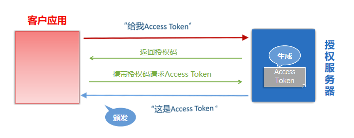

注册客户应用：客户应用如果想要访问资源服务器需要有凭证，需要在授权服务器上注册客户应用。注册后会**获取到一个ClientID和ClientSecrets**

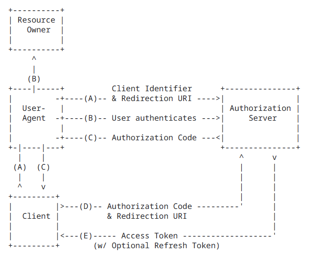

#### 第二种方式：隐藏式

**隐藏式（implicit），也叫简化模式，有些 Web 应用是纯前端应用，没有后端。这时就不能用上面的方式了，必须将令牌储存在前端。**

RFC 6749 规定了这种方式，允许直接向前端颁发令牌。这种方式没有授权码这个中间步骤，所以称为隐藏式。这种方式把令牌直接传给前端，是很不安全的。因此，只能用于一些安全要求不高的场景，并且令牌的有效期必须非常短，通常就是会话期间（session）有效，浏览器关掉，令牌就失效了。

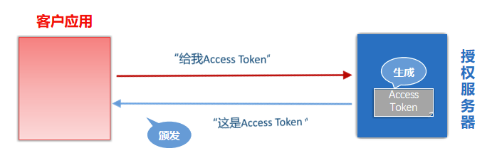

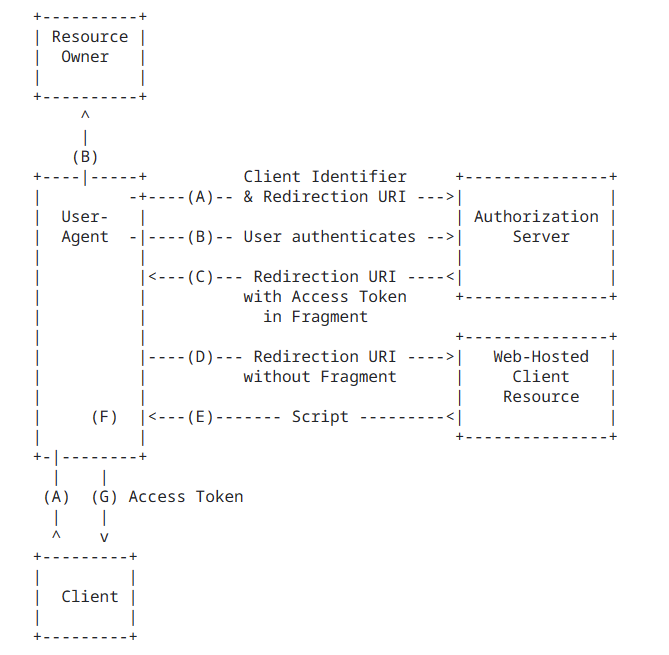

```
https://a.com/callback#token=ACCESS_TOKEN
将访问令牌包含在URL锚点中的好处：锚点在HTTP请求中不会发送到服务器，减少了泄漏令牌的风险。
```

#### 第三种方式：密码式

**密码式（Resource Owner Password Credentials）：如果你高度信任某个应用，RFC 6749 也允许用户把用户名和密码，直接告诉该应用。该应用就使用你的密码，申请令牌。**

这种方式需要用户给出自己的用户名/密码，显然风险很大，因此只适用于其他授权方式都无法采用的情况，而且必须是用户高度信任的应用。

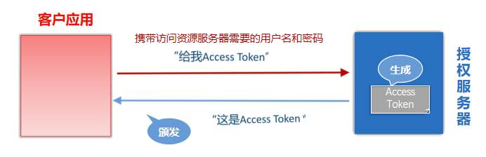

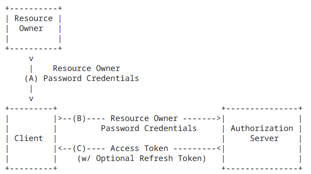

#### 第四种方式：凭证式

**凭证式（client credentials）：也叫客户端模式，适用于没有前端的命令行应用，即在命令行下请求令牌。**

这种方式给出的令牌，是针对第三方应用的，而不是针对用户的，即有可能多个用户共享同一个令牌。

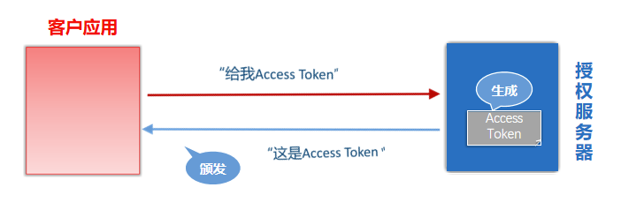

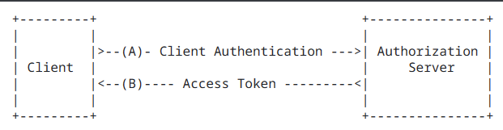

### 6.3、授权类型的选择

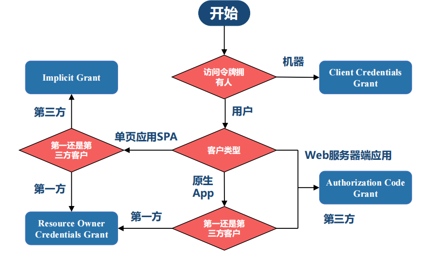

### 6.4、Spring 中的 OAuth2

相关角色：

1. 资源所有者（Resource Owner）
2. 客户应用（Client）
3. 资源服务器（Resource Server）
4. 授权服务器（Authorization Server）

**Spring 中的实现** [OAuth2 :: Spring Security](https://docs.spring.io/spring-security/reference/servlet/oauth2/index.html)

**Spring Security**

- 客户应用（OAuth2 Client）：OAuth2客户端功能中包含OAuth2 Login
- 资源服务器（OAuth2 Resource Server）

**Spring**

- 授权服务器（Spring Authorization Server）：它是在Spring Security之上的一个单独的项目。

**相关依赖**

```xml
<!-- 资源服务器 -->
<dependency>
	<groupId>org.springframework.boot</groupId>
	<artifactId>spring-boot-starter-oauth2-resource-server</artifactId>
</dependency>

<!-- 客户应用 -->
<dependency>
	<groupId>org.springframework.boot</groupId>
	<artifactId>spring-boot-starter-oauth2-client</artifactId>
</dependency>

<!-- 授权服务器 -->
<dependency>
    <groupId>org.springframework.boot</groupId>
    <artifactId>spring-boot-starter-oauth2-authorization-server</artifactId>
</dependency>
```

**授权登录的实现思路**

使用OAuth2 Login

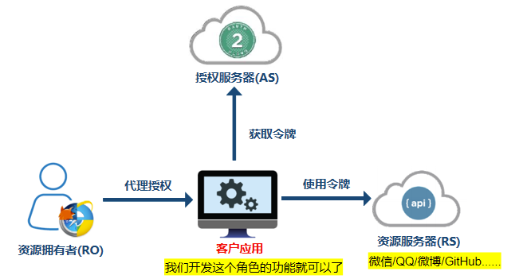
