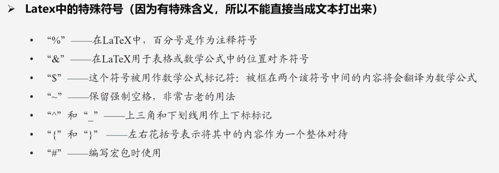
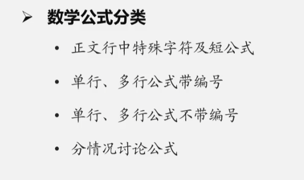
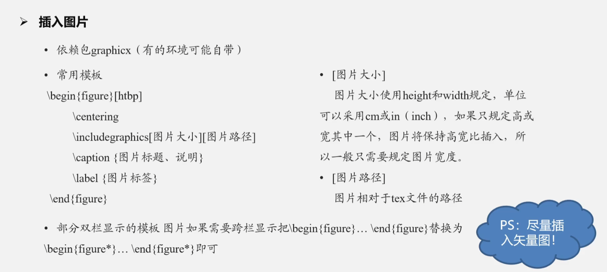
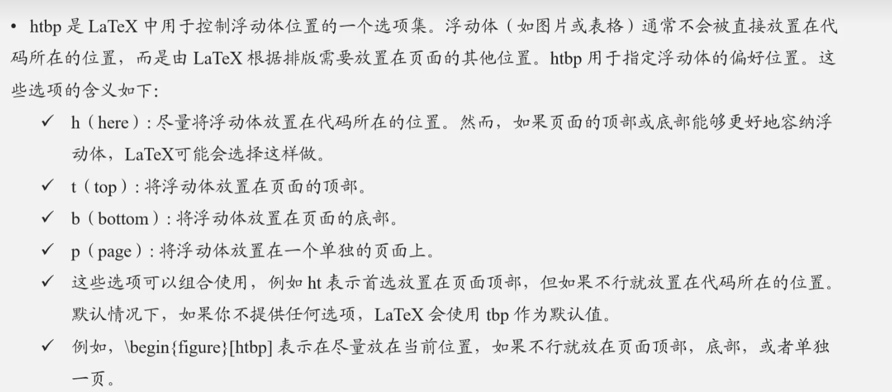
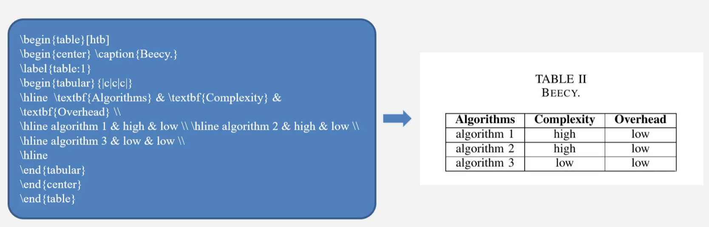
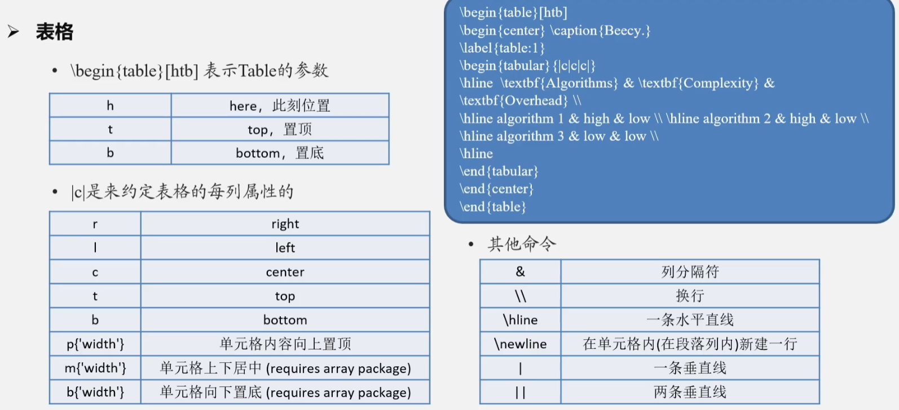
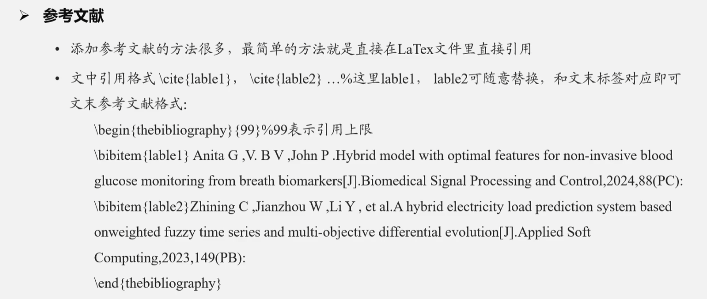
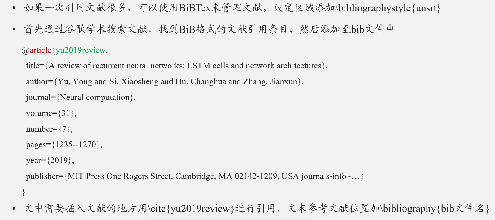
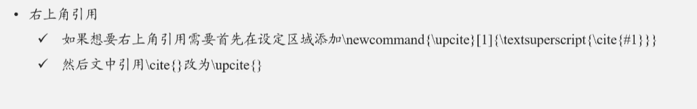

## 1、Latex 模板

是什么：Latex 模板规定了一篇文章的所有格式

怎么改：先改标题、作者，然后撰写正文，插入图表、格式公式、添加引用等

Latex 排版的好处：

- 省事美观
- 格式好

模板里有什么（三种类型）：

- %：**注释**
- \：表示这是一个 **命令** 或 **特殊符号** 
- 普通文本



## 2、正文

### 设定区域和正文区域

设定区域：

- 一下代码为设定区域，规定论文格式，导入相关依赖包等

  ```latex
  \documentclass{...}
  \usepackage{...}
  ```

- 一般不会对生产的 PDF 产生影响

- 设定区域会随着不断添加新的元素而丰富

正文区域：

- 下面命令中间是正文区域，

  ```latex
  \begin{...}
  ...
  \end{...}
  ```

正文各级标题（一级、二级...）：

- chapter
- section
- subsection
- subsubsection

换行、段、页、首行缩进：

- `\\`：换行
- `\par`：分段
- `\newpage`：分页命令
- `\setlength{\parindent}{长度}`：首行缩进

## 3、数学公式



- 正文行中公式： 

  ```latex
  $公式$
  ```

- 单行公式带编号，其中 `\label{公式标签}` 用作引用

  ```latex
  \begin{equation} \label{公式标签}
  ...
  \end{equation}
  ```

  自动引用 `\autoref{公式标签}`（需要导入依赖包 `\usepackage{hyperref}`）

- 无编号行间公式

  ```latex
  $$公式$$
  ```

- 多行公式

  使用 `\begin{split}...\end{split}`（需要导入依赖包 `\usepackage{amsmath}`）

  ```latex
  \begin{equation} \label{eq0}
  	\begin{split}
  		&A+B\\
  		&=\\
  		&C
  	\end{split}
  \end{equation}
  ```

- 分情况讨论公式

  属于多行公式的一种，使用 `\begin{cases}...\end{cases}` （需要导入依赖包 `\usepackage{amsmath}`）

  需要用正文样式输出的地方用 `\text{}`

  ```latex
  \begin{equation} \label{eq0}
  	F(x)=
  	\begin{cases}
  		0,\text{if $x<0$}\\
  		1,\text{otherwise.}
  	\end{cases}
  \end{equation}
  ```

  

## 4、图片





```latex
\begin{figure}[htbp]
 	\center
 	\includegraphics[width=12cm]{figures/a.eps}
 	\caption{this is a picture}
 	\label{fig:aa}
 \end{figure}
```

## 5、表格

Latex 表格生成器：

- [LaTeX 表格编辑器](https://latex-tables.com/) (支持excel导入)
- [在线创建 LaTeX 表格](https://TablesGenerator.com)





## 6、应用文献





