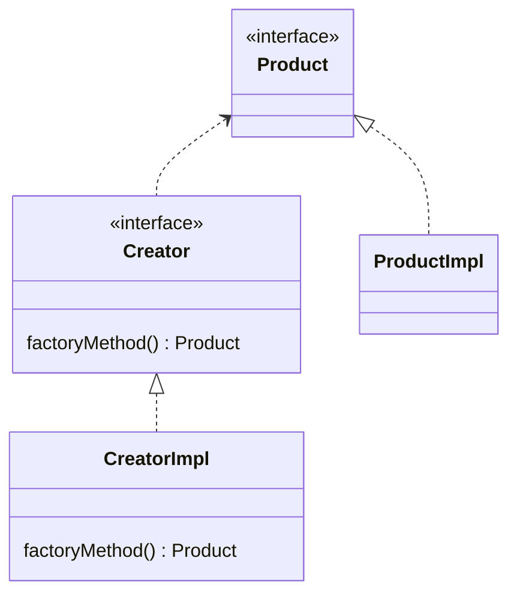

设计模式（pattern）是针对某一类问题的最佳解决方案，且已被成功应用与许多系统的设计中  

设计模式的分类：
- 「行为型模式」：涉及怎样合理设计对象之间的交互通信，怎样合理地为对象分配职责，使设计有弹性、易维护、易复用
  - 策略模式
  - 状态模式
  - 命令模式
  - 中介者模式
  - 责任链模式
  - 模板方法模式
  - 观察者模式
  - 访问者模式
- 「结构型模式」：涉及如何组合类的对象，以形成更大的对象与结构
  - 装饰模式
  - 组合模式
  - 适配器模式
  - 外观模式
  - 代理模式
  - 享元模式
  - 桥接模式
- 「创建型模式」：涉及对象的实例化，避免用户直接使用 new 创建对象
  - 工厂方法模式
  - 抽象工厂模式
  - 生成器模式
  - 原型模式
  - 单件模式


## 单例模式（Singleton Pattern）
单例模式是最常用的设计模式之一。它可以确保在整个应用程序中，某个类只有一个实例存在，并提供一种访问这个实例的全局访问点。  
单例模式在需要限制某些类的实例数量时非常有用。它通常用于需要全局访问的资源，如配置文件、日志记录器、数据库连接等。

应用场景：日志记录器、数据库连接、系统配置

| 实现方式 | 是否线程安全 | 是否延迟加载（只有需要时才创建单例对象） |
|-|-|-|
| 懒汉式 | 否 | 是 |
| 饿汉式 | 是 | 否 |
| 静态内部类 | 是 | 是 |
| 双重检查锁 | 是 | 否 |
| 枚举方式（最简便） | 是 | 否 |

预防反序列化破坏单例模式的方式：类实现 public Object readReslove() 方法  
### 懒汉式单例模式

懒汉式不是线程安全的，需要通过加锁等方式来保证线程安全

```java
public class Singleton {
    private static Singleton instance; // 单一实例
    
    private Singleton() {
        // 私有构造函数，防止外部实例化
    }
    
    public static Singleton getInstance() { // 获取该实例
        if (instance == null) {
            instance = new Singleton(); // 第一次调用该方法时，创建实例（延迟加载）
        }
        return instance;
    }
}
```

### 饿汉式单例模式

饿汉式在类加载时就创建了单例对象，所以不存在线程安全问题。  
不过，这种方式可能会导致不必要的资源浪费，因为单例对象的创建可能在应用程序启动时就完成了，而有些应用场景中可能并不需要使用单例对象。

```java
public class Singleton {
    // 在类加载时就创建单例对象
    private static Singleton instance = new Singleton();
    
    // 将构造函数设为私有，禁止外部创建实例
    private Singleton() {}
    
    // 提供获取单例对象的方法
    public static Singleton getInstance() {
        return instance;
    }
}
```

### 静态内部类方式
SingletonHolder 是一个静态内部类，它包含一个静态的 INSTANCE 成员变量，用于存储单例对象。  
在第一次调用 getInstance 方法时，静态内部类会被加载，从而创建单例对象。这种方式既兼顾了线程安全又兼顾了延迟加载的需求。

```java
public class Singleton {
    private Singleton() {
        // 私有构造函数，防止外部实例化
    }
    
    public static Singleton getInstance() { // 获取单例（延迟加载）
        return SingletonHolder.INSTANCE;
    }
    
    private static class SingletonHolder { // 静态内部类
        private static final Singleton INSTANCE = new Singleton(); 
    }
}
```


### 双重检查锁（线程安全的懒汉式）

它可以在保证线程安全的同时实现延迟加载

```java
public class Singleton {
    // volatile 修饰变量，保证了不同线程对该变量操作的内存可见性
    private static volatile Singleton instance; 

    private Singleton() {}

    public static Singleton getInstance() {
        if (instance == null) {
            synchronized (Singleton.class) {
                if (instance == null) {
                    instance = new Singleton();
                }
            }
        }
        return instance;
    }
}
```

### 枚举方式
 使用枚举实现单例模式的好处是，可以避免反射和序列化攻击。因为枚举类型的构造函数是私有的，所以无法使用反射来创建实例；而且枚举类型的实例在序列化和反序列化时会自动处理好，所以也无法通过序列化和反序列化来破坏单例。
```java
public enum Singleton {
    INSTANCE;

    public void doSomething() {
        // TODO: 实现单例对象的功能
    }
}
```


## 简单工厂
简单工厂不是一种设计模式，反而像一种编程习惯

我们使用工厂来创建对象，只和工厂打交道就可以了

简单工厂包含如下角色:
- 抽象产品：定义了产品的规范，描述了产品的主要特性和功能。
- 具体产品：实现或者继承抽象产品的子类
- 具体工厂：提供了创建产品的方法，调用者通过该方法来创建产品。

通过创建简单工厂类，在业务代码中调用简单工厂创建具体产品，解除了和抽象产品实现类的耦合（具体产品），但又产生了具体工厂与业务代码的耦合

简单工厂模式的优缺点：  

优点:  
封装了创建对象的过程，可以通过参数直接获取对象。把对象的创建和业务逻辑层分开，这样以后就避免了修改客户代码，如果要实现新产品直接修改工厂类，而不需要在原代码中修改，这样就降低了客户代码修改的可能性，更加容易扩展。
缺点:  
增加新产品时还是需要修改工厂类的代码，违背了「开闭原则」。

案例如下：
```java
public abstract class Coffee { // 抽象产品

    public abstract String getName();

    public void sell(){
        System.out.println("sell");
    }
}

public class LatteCoffee extends Coffee{ // 具体产品
    @Override
    public String getName() {
        return "Latee";
    }
} 
public class KabuCoffee extends Coffee{ // 具体产品
    @Override
    public String getName() {
        return "Kabu";
    }
}


public class SimpleCoffeeFactory{ // 简单工厂
    public Coffee createCoffee(String type){
        if (type.equals("latte")) return new LatteCoffee(); // 返回具体产品
        else if(type.equals("Kabu")) return new KabuCoffee(); // 返回具体产品
        return null;
    }
}

public class OrderCoffee {
    public static void main(String[] args) {
        SimpleCoffeeFactory factory = new SimpleCoffeeFactory(); // 获得简单工厂对象
        Coffee latte = factory.createCoffee("latte"); // 通过简单工厂创建对象实例
        System.out.println(latte.getName());
        latte.sell();
    }
}
```


## 工厂方法模式

工厂方法模式（Factory Method、虚拟构造）：定义一个用于创建对象的接口，让子类决定实例化哪一个类   
工厂方法模式使一个类的实例化延迟到子类工厂去实现  

在 Java 中，工厂模式广泛应用于各种框架和类库中，例如 JDBC 中的 DataSource 工厂、Spring 框架中的 Bean 工厂、MyBatis 框架中的 SqlSessionFactory 等等。

工厂方法模式的四个角色：
- 抽象产品（Product）：定义了产品的规范，描述了产品的主要特性和功能。
- 具体产品（ProductImpl）：实现了抽象产品角色所定义的接口，由具体工厂来创建，它同具体工厂之间一一对应.
- 抽象工厂（Factory/Creator）：提供了创建产品的接口，调用者通过它访问具体工厂的工厂方法来创建产品。
- 具体工厂（FactoryImpl/CreatorImpl）：主要是实现抽象工厂中的抽象方法，完成具体产品的创建
  
工厂模式的优缺点：
优点:
- 用户只需要知道具体工厂的名称就可得到所要的产品，无须知道产品的具体创建过程在系统增加新的产品时只需要添加具体产品类和对应的具体工厂类，无须对原工厂进行任何修改，满足开闭原则
缺点:
- 每增加一个产品就要增加一个具体产品类和一个对应的具体工厂类，这增加了系统的复杂度

UML 图如下：

:::warning
注意：接口名、抽象类名为斜体
:::

案例：使用各种颜色笔芯的圆珠笔

抽象产品（Product）:
```java
public abstract class PenCore{
    String color;
    public abstract void writeWord(String s);
}
```
具体产品（ProductImpl）:
```java
public class RedPenCore extends PenCore{
    RedPenCore(){
        color = "Red";
    }
    @Override
    public void writeWord(String s) {
        System.out.println("write " + color + " article:" + s);
    }
}

public class BluePenCore extends PenCore{
    BluePenCore(){
        color = "Blue";
    }
    @Override
    public void writeWord(String s) {
        System.out.println("write " + color + " article:" + s);
    }
}

```

工厂（Factory）
```java
abstract class PenCoreFactory{
    public abstract PenCore getPenCode(); // 工厂方法，返回具体产品类实例
}
```

实现工厂（FactoryImpl）
```java
class RedCoreFactory extends PenCoreFactory{
    @Override
    public PenCore getPenCode() { // 重写工厂方法
        return new RedPenCore();
    }
}

class BlueCoreFactory extends PenCoreFactory{
    @Override
    public PenCore getPenCode() { // 重写工厂方法
        return new BluePenCore();
    }
}
```


在使用工厂模式时，只和 Product、Creator 和 ConcreteCreator 打交道，用户只需要了解抽象产品有哪些方法即可，不需要知道有哪些具体产品
- 创建 Product 引用
- 创建 Factory 引用
- 将 FactoryImpl 对象赋给 Factory 的引用
- 调用 FactoryImpl 对象重写的工厂方法返回 ProductImpl 对象赋值给 Product 的引用
```java
PenCore penCore; // 创建 Product 引用
PenCoreFactory factory; // 创建 Factory 引用
factory = new RedCoreFactory(); // 将 FactoryImpl 对象赋给 Factory 的引用
penCore = factory.getPenCode(); // 调用 FactoryImpl 对象重写的工厂方法返回 ProductImpl 对象赋值给 Product 的引用
penCore.writeWord("<3");
```

其他参考：https://www.runoob.com/design-pattern/factory-pattern.html

## 抽象工厂模式

抽象工厂模式是一种为访问类提供一个创建一组相关或相互依赖对象的接口，且访问类无须指定所要产品的具体类就能得到同族的不同等级的产品的模
式结构。  
抽象工厂模式是工厂方法模式的升级版本，工厂方法模式只生产一个等级的产品，而抽象工厂模式可生产多个等级的产品。

抽象工厂模式包含以下几个核心角色：

- 抽象产品（Abstract Product）：定义了产品的规范，描述了产品的主要特性和功能，抽象工厂模式有多个抽象产品。
- 具体产品（Concrete Product）：实现了抽象产品角色所定义的接口，由具体工厂来创建，它同具体工厂之间是多对一的关系.
- 抽象工厂（Abstract Factory）：提供了创建产品的接口，它包含多个创建产品的方法，可以创建多个不同等级的产品
- 具体工厂（Concrete Factory）：主要是实现抽象工厂中的多个抽象方法，完成具体产品的创建。

抽象工厂模式通常涉及一族相关的产品，每个具体工厂类负责创建该族中的具体产品。客户端通过使用抽象工厂接口来创建产品对象，而不需要直接使用具体产品的实现类。

如果要加同一个产品族的话，只需要再加工个对应的工厂类即可，不需要修改其他的类

抽象工厂模式优缺点：
优点：
- 当一个产品族中的多个对象被设计成一起工作时，它能保证客户端始终只使用同一个产品族中的对象。
缺点:
- 当产品族中需要增加一个新的产品时，所有的工厂类都需要进行修改

案例：创建生产带有颜色与形状的工厂

1. 抽象产品 Shape 和 Color 接口：
```java
public interface Shape {
   void draw();
}

public interface Color {
   void fill();
}
```
2. Shape 与 Color 的具体产品：
```java
// Shape 接口的具体产品
public class Rectangle implements Shape {
   @Override
   public void draw() {
      System.out.println("Inside Rectangle::draw() method.");
   }
}

public class Square implements Shape {
   @Override
   public void draw() {
      System.out.println("Inside Square::draw() method.");
   }
}

public class Circle implements Shape {
   @Override
   public void draw() {
      System.out.println("Inside Circle::draw() method.");
   }
}

// Color 接口的具体产品
public class Red implements Color {
   @Override
   public void fill() {
      System.out.println("Inside Red::fill() method.");
   }
}

public class Green implements Color {
   @Override
   public void fill() {
      System.out.println("Inside Green::fill() method.");
   }
}

public class Blue implements Color {
   @Override
   public void fill() {
      System.out.println("Inside Blue::fill() method.");
   }
}
```
3. 为 Color 和 Shape 对象创建抽象类 AbstractFactory 来获取工厂
AbstractFactory 抽象工厂声明了多个创建产品对象的方法，每个方法对应一种产品类型
```java
public abstract class AbstractFactory {
   public abstract Color getColor(String color); // 对应 Color 产品
   public abstract Shape getShape(String shape); // 对应 Shape 产品
}
```
4. 创建扩展了 AbstractFactory 的具体工厂 ShapeFactory、ColorFactory，基于给定的信息生成实体类的对象
```java
// 具体工厂 ShapeFactory、ColorFactory
public class ShapeFactory extends AbstractFactory {
   @Override
   public Shape getShape(String shapeType){
      if(shapeType == null){
         return null;
      }        
      if(shapeType.equalsIgnoreCase("CIRCLE")){
         return new Circle();
      } else if(shapeType.equalsIgnoreCase("RECTANGLE")){
         return new Rectangle();
      } else if(shapeType.equalsIgnoreCase("SQUARE")){
         return new Square();
      }
      return null;
   }
   @Override
   public Color getColor(String color) {
      return null;
   }
}

public class ColorFactory extends AbstractFactory {
   @Override
   public Shape getShape(String shapeType){
      return null;
   }
   @Override
   public Color getColor(String color) {
      if(color == null){
         return null;
      }        
      if(color.equalsIgnoreCase("RED")){
         return new Red();
      } else if(color.equalsIgnoreCase("GREEN")){
         return new Green();
      } else if(color.equalsIgnoreCase("BLUE")){
         return new Blue();
      }
      return null;
   }
}
```

5. 创建一个工厂创造器/生成器类，通过传递形状或颜色信息来获取工厂。
```java
public class FactoryProducer {
   public static AbstractFactory getFactory(String choice){ // 返回具体工厂对象
      if(choice.equalsIgnoreCase("SHAPE")){
         return new ShapeFactory();
      } else if(choice.equalsIgnoreCase("COLOR")){
         return new ColorFactory();
      }
      return null;
   }
}
```
6. 使用 FactoryProducer 来获取 AbstractFactory，通过传递类型信息来获取实体类的对象。
```java
public class AbstractFactoryPatternDemo {
   public static void main(String[] args) {
      //获取形状工厂
      AbstractFactory shapeFactory = FactoryProducer.getFactory("SHAPE");

      //获取形状为 Circle 的对象
      Shape shape1 = shapeFactory.getShape("CIRCLE");
 
      //调用 Circle 的 draw 方法
      shape1.draw();
 
      //获取形状为 Rectangle 的对象
      Shape shape2 = shapeFactory.getShape("RECTANGLE");
 
      //调用 Rectangle 的 draw 方法
      shape2.draw();
      
      //获取形状为 Square 的对象
      Shape shape3 = shapeFactory.getShape("SQUARE");
 
      //调用 Square 的 draw 方法
      shape3.draw();
 
      //获取颜色工厂
      AbstractFactory colorFactory = FactoryProducer.getFactory("COLOR");
 
      //获取颜色为 Red 的对象
      Color color1 = colorFactory.getColor("RED");
 
      //调用 Red 的 fill 方法
      color1.fill();
 
      //获取颜色为 Green 的对象
      Color color2 = colorFactory.getColor("GREEN");
 
      //调用 Green 的 fill 方法
      color2.fill();
 
      //获取颜色为 Blue 的对象
      Color color3 = colorFactory.getColor("BLUE");
 
      //调用 Blue 的 fill 方法
      color3.fill();
   }
}
```

参考：https://www.runoob.com/design-pattern/abstract-factory-pattern.html

## 原型模式

原型模式，即 Prototype，用于创建重复的对象，同时又能保证性能。

- 浅拷贝实现 Cloneable，重写 clone() 方法 或 手动添加 copy() 方法
- 深拷贝是通过实现 Serializable 读取二进制流或第三方 JSON 相关包实现

通过实现 Cloneable 接口实现浅拷贝 
```java
class Shape implements Cloneable{
    private String describe;
    private double radius;

    @Override
    protected Object clone() throws CloneNotSupportedException { // 返回类型是 Object 的，需要强转
        return super.clone();
    }
}
```

通过编写 copy() 方法实现浅拷贝
```java
class Shape implements Cloneable{
    private String describe;
    private double radius;

    public Shape copy() {
        Shape shape = new Shape();
        shape.describe = this.describe;
        shape.radius = this.radius;
        return shape;
    }
}
```

通过 Serializable 实现深拷贝
```java
class Shape implements Serializable {
    
    public Shape copy() throws IOException, ClassNotFoundException {
        ByteArrayOutputStream bos = new ByteArrayOutputStream();
        ObjectOutputStream oos = new ObjectOutputStream(bos);
        oos.writeObject(this);
        ByteArrayInputStream bis = new ByteArrayInputStream(bos.toByteArray());
        ObjectInputStream ois = new ObjectInputStream(bis);
        return (Shape) ois.readObject();
    }
}
```