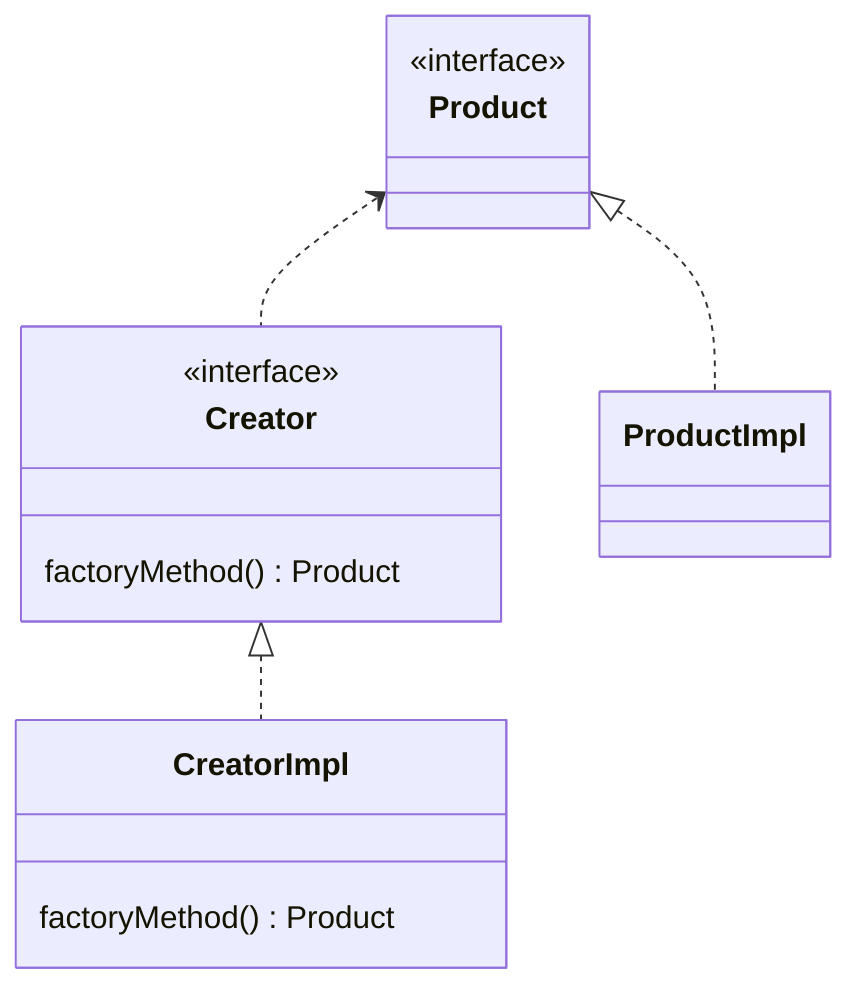

设计模式（pattern）是针对某一类问题的最佳解决方案，且已被成功应用与许多系统的设计中  

设计模式的分类：
- 「行为型模式」：涉及怎样合理设计对象之间的交互通信，怎样合理地为对象分配职责，使设计有弹性、易维护、易复用
  - 策略模式
  - 状态模式
  - 命令模式
  - 中介者模式
  - 责任链模式
  - 模板方法模式
  - 观察者模式
  - 访问者模式
- 「结构型模式」：涉及如何组合类的对象，以形成更大的对象与结构
  - 装饰模式
  - 组合模式
  - 适配器模式
  - 外观模式
  - 代理模式
  - 享元模式
  - 桥接模式
- 「创建型模式」：涉及对象的实例化，避免用户直接使用 new 创建对象
  - 工厂方法模式
  - 抽象工厂模式
  - 生成器模式
  - 原型模式
  - 单件模式


## 单例模式（Singleton Pattern）
单例模式是最常用的设计模式之一。它可以确保在整个应用程序中，某个类只有一个实例存在，并提供一种访问这个实例的全局访问点。  
单例模式在需要限制某些类的实例数量时非常有用。它通常用于需要全局访问的资源，如配置文件、日志记录器、数据库连接等。

应用场景：日志记录器、数据库连接、系统配置

| 实现方式 | 是否线程安全 | 是否延迟加载（只有需要时才创建单例对象） |
|-|-|-|
| 懒汉式 | 否 | 是 |
| 饿汉式 | 是 | 否 |
| 静态内部类 | 是 | 是 |
| 双重检查锁 | 是 | 否 |
| 枚举方式（最简便） | 是 | 否 |
### 懒汉式单例模式

懒汉式不是线程安全的，需要通过加锁等方式来保证线程安全

```java
public class Singleton {
    private static Singleton instance; // 单一实例
    
    private Singleton() {
        // 私有构造函数，防止外部实例化
    }
    
    public static Singleton getInstance() { // 获取该实例
        if (instance == null) {
            instance = new Singleton(); // 第一次调用该方法时，创建实例（延迟加载）
        }
        return instance;
    }
}
```

### 饿汉式单例模式

饿汉式在类加载时就创建了单例对象，所以不存在线程安全问题。  
不过，这种方式可能会导致不必要的资源浪费，因为单例对象的创建可能在应用程序启动时就完成了，而有些应用场景中可能并不需要使用单例对象。

```java
public class Singleton {
    // 在类加载时就创建单例对象
    private static Singleton instance = new Singleton();
    
    // 将构造函数设为私有，禁止外部创建实例
    private Singleton() {}
    
    // 提供获取单例对象的方法
    public static Singleton getInstance() {
        return instance;
    }
}
```

### 静态内部类方式
SingletonHolder 是一个静态内部类，它包含一个静态的 INSTANCE 成员变量，用于存储单例对象。  
在第一次调用 getInstance 方法时，静态内部类会被加载，从而创建单例对象。这种方式既兼顾了线程安全又兼顾了延迟加载的需求。

```java
public class Singleton {
    private Singleton() {
        // 私有构造函数，防止外部实例化
    }
    
    public static Singleton getInstance() { // 获取单例（延迟加载）
        return SingletonHolder.INSTANCE;
    }
    
    private static class SingletonHolder { // 静态内部类
        private static final Singleton INSTANCE = new Singleton(); 
    }
}
```


### 双重检查锁（线程安全的懒汉式）

它可以在保证线程安全的同时实现延迟加载

```java
public class Singleton {
    // volatile 修饰变量，保证了不同线程对该变量操作的内存可见性
    private static volatile Singleton instance; 

    private Singleton() {}

    public static Singleton getInstance() {
        if (instance == null) {
            synchronized (Singleton.class) {
                if (instance == null) {
                    instance = new Singleton();
                }
            }
        }
        return instance;
    }
}
```

### 枚举方式
 使用枚举实现单例模式的好处是，可以避免反射和序列化攻击。因为枚举类型的构造函数是私有的，所以无法使用反射来创建实例；而且枚举类型的实例在序列化和反序列化时会自动处理好，所以也无法通过序列化和反序列化来破坏单例。
```java
public enum Singleton {
    INSTANCE;

    public void doSomething() {
        // TODO: 实现单例对象的功能
    }
}
```


## 工厂方法模式

工厂方法模式（Factory Method、虚拟构造）：定义一个用于创建对象的接口，让子类决定实例化哪一个类  
工厂方法模式使一个类的实例化延迟到子类  

在 Java 中，工厂模式广泛应用于各种框架和类库中，例如 JDBC 中的 DataSource 工厂、Spring 框架中的 Bean 工厂、MyBatis 框架中的 SqlSessionFactory 等等。

工厂方法模式的四个角色：
- 抽象产品（Product）：抽象类或接口，定义具体产品必须实现的方法
- 具体产品（ProductImpl）：实现 Product 的类
- 工厂/构造者（Factory/Creator）：抽象类或接口，构造者负责定义一个被称为工厂方法的抽象方法，返回 ConcreteProduct 类的实例
- 实现工厂/具体构造者（FactoryImpl/CreatorImpl）：实现 Factory 的类
  
UML 图如下：

:::warning
注意：接口名、抽象类名为斜体
:::

案例：使用各种颜色笔芯的圆珠笔

抽象产品（Product）:
```java
public abstract class PenCore{
    String color;
    public abstract void writeWord(String s);
}
```
具体产品（ProductImpl）:
```java
public class RedPenCore extends PenCore{
    RedPenCore(){
        color = "Red";
    }
    @Override
    public void writeWord(String s) {
        System.out.println("write " + color + " article:" + s);
    }
}

public class BluePenCore extends PenCore{
    BluePenCore(){
        color = "Blue";
    }
    @Override
    public void writeWord(String s) {
        System.out.println("write " + color + " article:" + s);
    }
}

```

工厂（Factory）
```java
abstract class PenCoreFactory{
    public abstract PenCore getPenCode(); // 工厂方法，返回具体产品类实例
}
```

实现工厂（FactoryImpl）
```java
class RedCoreFactory extends PenCoreFactory{
    @Override
    public PenCore getPenCode() { // 重写工厂方法
        return new RedPenCore();
    }
}

class BlueCoreFactory extends PenCoreFactory{
    @Override
    public PenCore getPenCode() { // 重写工厂方法
        return new BluePenCore();
    }
}
```

在使用工厂模式时，只和 Product、Creator 和 ConcreteCreator 打交道，用户只需要了解抽象产品有哪些方法即可，不需要知道有哪些具体产品
- 创建 Product 引用
- 创建 Factory 引用
- 将 FactoryImpl 对象赋给 Factory 的引用
- 调用 FactoryImpl 对象重写的工厂方法返回 ProductImpl 对象赋值给 Product 的引用
```java
PenCore penCore; // 创建 Product 引用
PenCoreFactory factory; // 创建 Factory 引用
factory = new RedCoreFactory(); // 将 FactoryImpl 对象赋给 Factory 的引用
penCore = factory.getPenCode(); // 调用 FactoryImpl 对象重写的工厂方法返回 ProductImpl 对象赋值给 Product 的引用
penCore.writeWord("<3");
```
## 抽象工厂模式

抽象工厂模式和工厂方法不太一样，它要解决的问题比较复杂，不但工厂是抽象的，产品是抽象的，而且有多个产品需要创建，因此，这个抽象工厂会对应到多个实际工厂，每个实际工厂负责创建多个实际产品

## 原型模式

原型模式，即 Prototype，用于创建重复的对象，同时又能保证性能。

- 浅拷贝实现 Cloneable，重写 clone() 方法 或 手动添加 copy() 方法
- 深拷贝是通过实现 Serializable 读取二进制流。

通过实现 Cloneable 接口实现浅拷贝 
```java
class Shape implements Cloneable{
    private String describe;
    private double radius;

    @Override
    protected Object clone() { // 返回类型是 Object 的，需要强转
        Shape shape = new Shape();
        shape.describe = this.describe;
        shape.radius = this.radius;
        return shape;
    }
}
```

通过编写 copy() 方法实现浅拷贝
```java
class Shape implements Cloneable{
    private String describe;
    private double radius;

    public Shape copy() {
        Shape shape = new Shape();
        shape.describe = this.describe;
        shape.radius = this.radius;
        return shape;
    }
}
```

通过 Serializable 实现深拷贝
```java
```