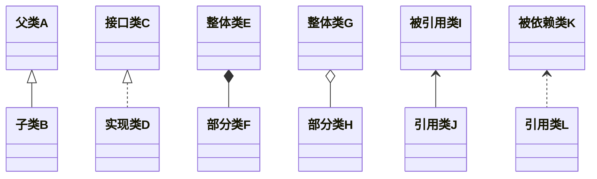
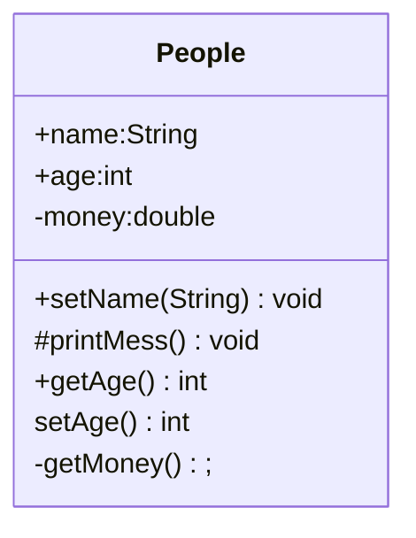
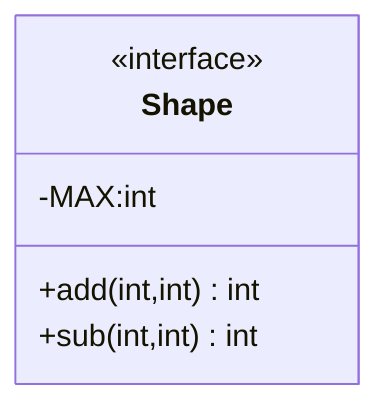

## UML 类图简介

UML（Unified Modeling Language） 类图（Class Diagram）属于结构图（静态图），常用于被描述一个系统的静态结构。

UML 类图包含 类、接口、泛化（继承）、实现、组合、聚合、关联、依赖关系

### 1. 类的 UML 图
类图分为三层结构：
- 第一层：名字层，如果类的名字是斜体，则这个类是抽象类
- 第二层：变量层（属性层），格式： `变量名:类型`
- 第三层：方法层，格式：`方法名(参数列表)`

四种权限修饰符：public、protected、缺省（友好）、private    
对应：+、#、、-

### 2. 接口的 UML 图
接口的 UML 图分为三层结构：  
- 第一层：名字层，接口名字必须使用斜体，且上方使用 `<<interface>>` 修饰（分为两行）
- 第二层：常量层，列出接口的常量以及类型，`常量名:类型`，常量都是 public，所以使用 + 
- 第三层：方法层（操作层），列出接口中的方法及返回类型，`方法名(参数列表):类型`，方法都是 public ，所以使用 +

### 3. 泛化（继承）关系（Generalization/extends）

UML 中的泛化关系（Generalization）就是值指类或接口的继承关系  
继承用「实线空心箭头」表示，由子类指向父类。

### 4、实现关系（implements）
指的是一个 class 类实现 interface 接口（可以是多个）的功能
实现使用「虚线空心箭头」表示，由实现类指向接口

### 5、组合关系（Composition）
- 组合是关联关系的一种特例，它体现的是一种 contains-a 的关系，这种关系比聚合更强，也称为强聚合
- 它同样体现整体与部分间的关系，但此时整体与部分是不可分的，整体的生命周期结束也就意味着部分的生命周期结束

组合使用的是「实线实心菱形」表示，菱形端为整体类，另一端为部分类

### 6、聚合关系（Aggregation）
- 聚合也是关联关系的一种特例，它体现的是整体与部分、拥有的关系，即 has-a 的关系
- 此时整体与部分之间是可分离的，他们可以具有各自的生命周期，部分可以属于多个整体对象，也可以为多个整体对象共享

聚合使用的是「实线空心菱形」表示，菱形端为整体类，另一端为部分类

### 7、关联关系（Association）

如果 A 类中的成员变量有用 B 类（接口）来声明变量，则 A 与 B 为关联关系，称 A 关联于 B  
如果 A 关联 B，那么 UML 通过一个「实线」连接 A 和 B 的 UML 图  

关联使用的是「实线普通箭头」，引用类（A）指向被引用类（B）

### 8. 依赖关系（Dependency）
如果 A 类中某个方法的参数用 B 类（接口）来声明的变量或某个方法返回的数据类型是 B 类型的，那么 A 和 B 的关系是依赖关系，称 A 依赖于 B

关联使用的是「虚线普通箭头」，引用类（A）指向被依赖类（B）
### 9. 注释
UML 使用注释（Annotation）为类图提供附加的说明，UML 在一个带卷角的长方形中显式给出注释，并使用虚线将这个长方形和它注释的实体连接起来

### 10. 设计类的原则

#### 「开-闭」原则

#### 「多用组合、少用继承」原则

#### 「高内聚-低耦合」原则
- 高内聚：类中的方法是一组相关行为
- 低耦合：尽量不让一个类含有太多其他类的实例的引用

