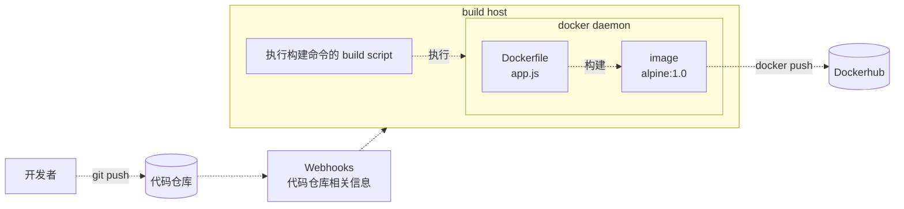
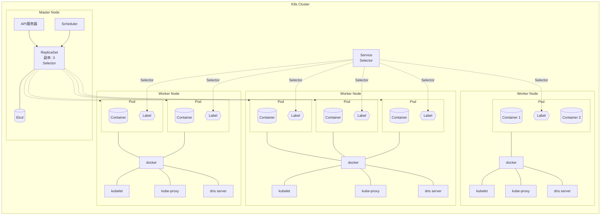
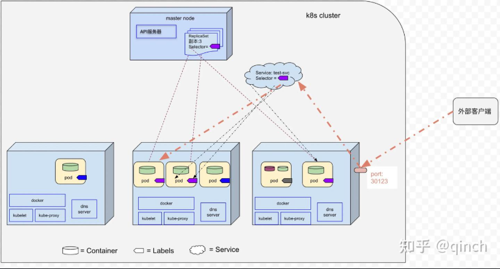
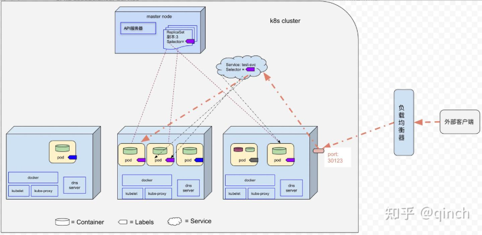
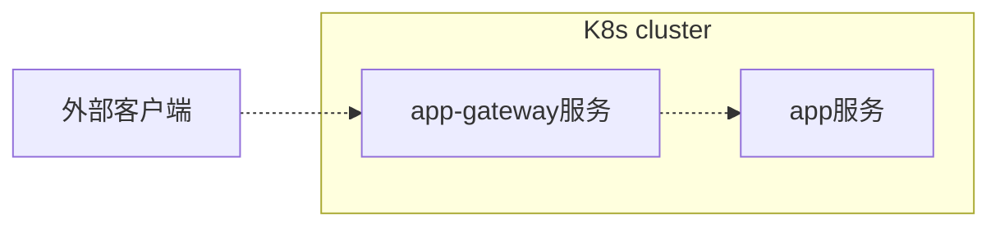
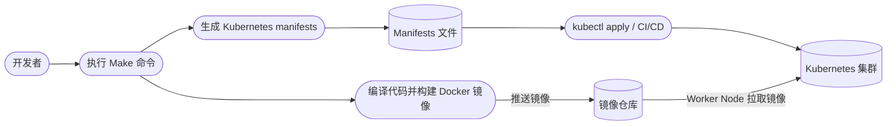
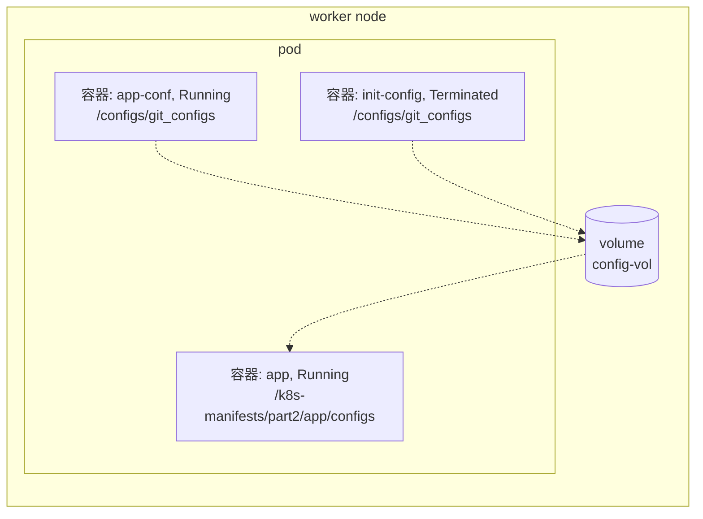
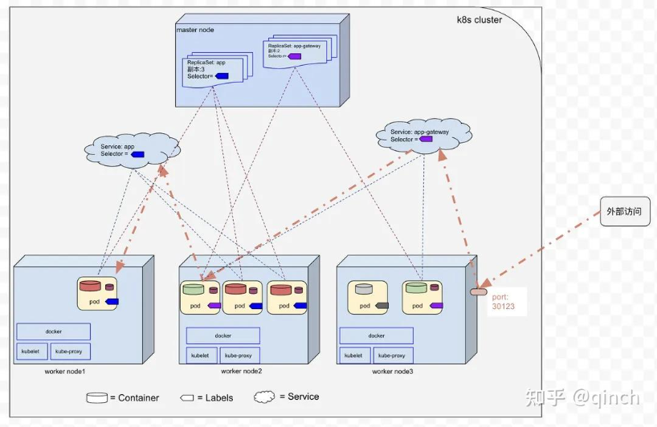

# Kubernetes 笔记

参考：https://zhuanlan.zhihu.com/p/1995144704958935811?theme=dark

## 简介

容器 **单一职责** 原则：容器应尽量只运行一个主进程，避免把多个无关进程放在同一容器中，简化进程管理，发生故障时只需重启对应容器，实现故障隔离，升系统的可维护性、稳定性和可扩展性。

什么是 **K8s**：管理云平台中多个主机上的容器化的应用

K8s 组成：
- master node，管理和控制整个集群
  - 接收 kubectl 请求
  - 接收开发者提交的 YAML 或 API 请求
  - 保存集群状态和配置
  - 调度 Pod
  - 根据资源情况选择 Pod 应该运行在哪个 Worker Node
  - 监控节点和 Pod 的状态
  - 发现异常后进行调度、扩容或重建
- worker node，真正运行应用的节点
  - 运行 Pod 和容器
  - 为应用提供 CPU、内存、网络等资源
  - 接收控制平面的指令
  - 监控容器是否正常运行

K8s 与 Docker 关系：
- Docker 用于将应用容器化
- KBs 是容器编排系统，不仅支持 Docker 容器类型，也支持 Containerd 以及其他容器类型（比如：CRI-O）

Docker 镜像制作流程：



一个简单的 K8s 集群架构图如下所示：



- kubelet：Node 上的 Pod 管理员 
  - 向 Kubernetes 汇报 Node 状态
  - 监听分配给当前 Node 的 Pod
  - 确保 Pod 中的容器正常运行
  - 容器异常退出时重新启动
  - 执行健康检查
  - 挂载存储卷
  - 通过容器运行时启动容器，例如 containerd、CRI-O
- kube-proxy：处理 Service 流量
  - 实现 ClusterIP
  - 实现 NodePort
  - 将 Service 流量转发到后端 Pod
  - 在多个 Pod 之间进行负载分发

## Pod

### 什么是 Pod？

**Pod** 在 **Worker Node** 之间调度，它是 K8s 中创建和管理的、**最小** 的可部署的计算单元

一个 worker node 可以包含多个 Pod，一个 pod 包含一个或多个 Container（容器），这些容器共享存储、网络、以及怎样运行这些容器的规约
> 我们可以把 pod 看作一个独立的逻辑机器，该机器包含一个或者多个容器，将这些容器绑定在一起共享某些资源（比如 IP/端口）

Pod 生命周期是短暂的，其生命周期可能因调度、故障或升级而随时终止，每个 Pod 都有自己的 IP，当旧的 Pod 被销毁后，新创建的 Pod 会动态分配 **新的 IP 地址**

### 为什么需要 Pod？

容器遵循单一职责原则，一个容器通常只运行一个主要进程。

但不同容器之间默认相互隔离，无法直接共享网络、存储以及 IPC 等资源

Pod 提供了一个更高层次的管理单位，可以将多个需要紧密协作的容器组织在一起，使它们能够按需共享网络、存储和 IPC 等资源，并作为一个整体进行创建、调度和管理。

一个 Pod 创建的 `pod-test.yaml` 例子：

```yaml
apiVersion: v1           # Kubernetes API 版本,普通 Pod 使用 v1 
kind: Pod                # k8s 资源类型,这里表示创建一个 Pod
metadata:                # pod 元数据
 name: test-pod       # pod 的名称
spec:                    # Pod 的具体规格，希望 Kubernetes 创建什么样的 Pod
 containers:
 - image: tutum/dnsutils # 创建容器所用的镜像
   name: dnsutil         # 容器的名称
   command: ["sleep", "infinity"] # 覆盖镜像默认的启动命令
```

`kubectl create -f test.yaml` 之后，Kubernetes 会：
- 创建 Pod 对象
- Scheduler 选择节点
- 节点 kubelet 读取 Pod 配置
- containerd 拉取镜像
- 启动容器
- 执行 command：sleep infinity

可以使用 `kubectl get pod test-pod` 查看状态


### Pod 命令

```sh
# 根据 YAML 文件创建或更新 Pod
kubectl apply -f pod-test.yaml

# 查看当前命名空间中的所有 Pod
kubectl get pods

# 查看指定 Pod 的状态
kubectl get pod test-pod

# 查看 Pod 所在节点、IP 等详细信息
kubectl get pod test-pod -o wide

# 查看 Pod 的详细信息、事件和容器状态
kubectl describe pod test-pod

# 查看 Pod 的日志
kubectl logs test-pod

# 持续查看 Pod 的实时日志
kubectl logs -f test-pod

# 进入 Pod 中的容器
kubectl exec -it test-pod -- sh

# 在 Pod 中执行一条命令
kubectl exec test-pod -- ls

# 删除指定的 Pod
kubectl delete pod test-pod

# 根据 YAML 文件删除 Pod
kubectl delete -f pod-test.yaml
```


## Label

### 什么是 Label

Label 是一个 KV 对，它可以附加到 K8s对象（如 Pod，Worker Node等），然后通过 Selector（标签选择器）来选择具有相应 Label 的 K8s 对象

### 为什么需要 Label

Label 用来分类，Selector 用来查找和管理这些分类后的对象。

### Label 命令

```sh
# 给 Pod 创建 Label
kubectl label pod <Pod名称> key=value

# 例如：给 pod1 添加 app=app1
kubectl label pod pod1 app=app1

# 给多个 Pod 添加相同的 Label
kubectl label pod pod1 pod2 pod3 app=app1

# Label 已存在时，使用 --overwrite 覆盖原值
kubectl label pod pod1 app=app2 --overwrite

# 查看所有 Pod 的 Label
kubectl get pods --show-labels

# 根据 Label 筛选 Pod
kubectl get pods -l app=app1
```


## ReplicaSet

### 什么是 ReplicaSet

ReplicaSet（副本控制器）是一种 K8s 资源，它可以维护一组在任何时候都处于运行状态的 Pod 副本的** 稳定集合**（如果其中某个 Pod 因为 Worker Node 断电/断网（或者其他任何原因）导致该 Pod 消失，则 ReplicaSet 会注意到这个缺少了的 Pod，并且创建新的Pod来替代消失的 Pod）

ReplicaSet 是一种 **期望式** 的声明方式，只需要告诉它我期望的副本数量

可以把 ReplicaSet 理解成一个 **哨兵 + 补位员**

不过 ReplicaSet 通常由 Deployment 管理，很少直接单独使用。

> 它会持续监控 Pod 的实际数量：
> - 期望有 3 个 Pod，实际少于 3 个，就自动创建新的 Pod；
> - 实际多于 3 个，就删除多余的 Pod；
> - Pod 异常消失时，也会自动补回。
> 所以它的核心作用是：让实际运行的 Pod 数量始终接近期望数量。


### 为什么需要 ReplicaSet

- 监控 Pod 数量
- Pod 消失自动补充
- 根据设定批量创建


### ReplicaSet 命令

rs-test.yaml

```yaml
apiVersion: apps/v1
kind: ReplicaSet
metadata:
  name: rs-test     # replica set 名字
spec:
  replicas: 2       # 期望pod的数量
  selector:
    matchLabels:
      app: dnsutil  # 操作label app=dnsutil的pod
  template:         # 创建新 pod 所用的 pod 模板 
    metadata:
      labels:
        app: dnsutil
    spec:
      containers:
        - name: dnsutil
          image: tutum/dnsutils
          command: ["sleep", "infinity"]
```

```sh
# 根据 YAML 文件创建或更新 ReplicaSet
kubectl apply -f rs-test.yaml

# 查看 ReplicaSet
kubectl get replicaset

# 查看 ReplicaSet 创建的 Pod
kubectl get pods -l app=dnsutil

# 查看 ReplicaSet 的详细信息和事件
kubectl describe replicaset rs-test

# 修改期望的 Pod 副本数为 3
kubectl scale replicaset rs-test --replicas=3

# 删除 ReplicaSet 及其管理的 Pod
kubectl delete replicaset rs-test
```

## Service

### 什么是 Service

Service 是 Kubernetes 为一组 Pod 提供的 **固定访问入口**

它拥有 **稳定** 的 IP 和端口，客户端通过 Service 访问应用，Service 再将请求转发到后端某个 Pod。即使 Pod 被重建或 IP 发生变化，客户端也不需要改变访问地址

### 为什么需要 Service

Pod 是临时资源，可能随时被销毁和重建，而且每次重建都会获得新的 IP 地址。Service 为多个相同功能的 Pod 提供一个稳定、统一的访问地址，使客户端无需关注 Pod 的变化

### 集群内部 Pod 间通信

Service 通过标签选择器来指定 **哪些 Pod** 属于同一个组

连接到该 Service 的客户端链接通过负载均衡（Service 自带）路由到某一个后端 Pod


### Service 的简单创建

在测试环境，我们创建一个 Service，svc.yaml 文件对应的内容为：

```yaml
apiVersion: v1
kind: Service
metadata:
  name: test-svc     # Service 名称
spec:
  ports:
  - port: 80         # Service 对外提供 80 端口
    targetPort: 8080 # 收到请求后，转发到 Pod 的 8080 端口
  selector:          # label app=testing 通过 app: testing 找到后端 Pod
    app: testing
```

通过 ReplicaSet 创建并维护 3 个 Pod

```yaml
apiVersion: apps/v1
kind: ReplicaSet
metadata:
 name: fqdn-test
spec:
 replicas: 3        # ReplicaSet 创建并维护 3 个 Pod
 selector:
   matchLabels:
    app: testing    # 操作label app=testing的Pod
 template:
   metadata:
     labels:
       app: testing # Pod 都会带有标签
   spec:
     containers:
     - name: nodejs
       image: qinchaowhut/allen:v1
```


创建 Service 后，客户端 Pod 不需要手动查询或配置 Service 的 ClusterIP，可以直接通过 Service 名称访问（FQDN）

> ClusterIP 是 Kubernetes 为 Service 分配的一个集群内部虚拟 IP

### NodePort Service

在每个 Worker Node 上开放静态端口（所有 Worker Node 使用同一个端口号），外部客户端可以直接通过任一Worker Node 的 IP 和静态端口访问后端 Pod，通常通过 Service yaml 配置



### LoadBalancer Service

LoadBalancer 服务是 NodePort 服务的一种扩展，使用云平台的负载均衡器向外部公开 Service（其中负载均衡器将外部客户端的请求重定向到 Worker Node 的静态端口）



### Headless Service

Headless Service 允许客户端直接连接到它所偏好的任一或者全部 Pod（即：当通过 DNS 服务器查询 Headless Service 名称的时候，DNS 服务器返回的是所有 Pod IP，而不是单个 Service 的 IP）。


一个 Headless Service 的简单实现

```yaml
apiVersion: v1
kind: Service
metadata:
  name: test-svc-headless
spec:
  clusterIP: None   # 注意，这里需要设置为NONE
  ports:
  - port: 80
    targetPort: 8080
  selector:
    app: testing
```

### Service 相关命令

```bash
# 创建或更新 Service
kubectl apply -f svc.yaml

# 查看当前命名空间中的所有 Service
kubectl get svc

# 查看指定 Service 的详细信息
kubectl get svc test-svc
kubectl get svc test-svc -o wide

# 查看 Service 的完整 YAML 配置
kubectl get svc test-svc -o yaml

# 查看 Service 的详细信息和相关事件
kubectl describe svc test-svc

# 查看 Service 通过 selector 匹配到的 Pod
kubectl get pods -l app=testing -o wide

# 查看 Service 对应的后端地址
kubectl get endpoints test-svc

# 查看 EndpointSlice（推荐用于较新的 Kubernetes 集群）
kubectl get endpointslices -l kubernetes.io/service-name=test-svc

# 从 Deployment 快速创建一个 ClusterIP Service
kubectl expose deployment <deployment-name> \
  --name=test-svc \
  --port=80 \
  --target-port=8080 \
  --type=ClusterIP

# 将本机 8080 端口转发到 Service 的 80 端口
kubectl port-forward svc/test-svc 8080:80

# 在临时 Pod 中测试 Service 的 DNS 和访问是否正常
kubectl run curl-test --rm -it \
  --image=curlimages/curl \
  --restart=Never -- curl http://test-svc

# 删除 Service（不会删除后端 Pod）
kubectl delete svc test-svc

# 指定命名空间操作 Service，例如查看 kube-system 中的 Service
kubectl get svc -n kube-system
```

## Deployment

### 什么是 Deployment

Deployment 用于 **声明式** 地定义、部署和更新应用程序（Deployment 由 ReplicaSet 组成（1:N），并且由 ReplicaSet 来创建和管理 Pod）

- 当创建 Deployment 时，会创建新的 ReplicaSet，然后 ReplicaSet 创建期望数量的Pod
- 当更新 Deployment 中定义的 Pod 模版时，新的 ReplicaSet 会被创建，Deployment 以受控速率将 Pod 从旧 ReplicaSet 迁移到新 ReplicaSet。

### Deployment 的简单创建

在测试环境，Deployment yaml 文件内容如下：

```yaml
apiVersion: apps/v1             # 使用的 Kubernetes API 版本
kind: Deployment                 # 资源类型：Deployment
metadata:
  name: testqc                   # Deployment 的名称
spec:
  replicas: 3                    # 期望运行 3 个 Pod 副本
  template:                      # Pod 模板，Deployment 根据它创建 Pod
    metadata:
      name: allen                # Pod 模板名称，通常可以省略
      labels:
        app: testing             # Pod 标签，必须与 selector.matchLabels 匹配
    spec:
      containers:                # Pod 中运行的容器列表
      - image: qinchaowhut/allen:v1  # 容器使用的镜像及版本
        name: nodejs              # 容器名称
        imagePullPolicy: IfNotPresent # 本地没有镜像时才从镜像仓库拉取
  selector:                      # Deployment 用来匹配和管理 Pod 的选择器
    matchLabels:
      app: testing                # 必须与 template.metadata.labels 一致
```
运行：`kubectl create -f deployment-v1.yaml –record`

在测试环境，LoadBalancer Service yaml 文件内容如下

```yaml
apiVersion: v1                    # 使用的 Kubernetes API 版本
kind: Service                     # 资源类型：Service
metadata:
  name: allen-loadbalancer        # Service 的名称
spec:
  type: LoadBalancer              # 请求创建外部负载均衡器
  ports:
  - port: 80                      # Service 对外提供的端口
    targetPort: 8080              # 转发到 Pod 容器的 8080 端口
  selector:
    app: testing                  # 将请求转发给带有 app=testing 标签的 Pod
```

运行 `kubectl create -f svc-loadbalancer.yaml


### Deployment 升级策略

- RollingUpdate（**默认** 的升级策略），即滚动更新，该策略会逐步创建新 Pod 并终止旧 Pod ，使应用程序在整个升级过程中都处于可用状态（注意：在升级过程中，会同时运行应用程序的多个版本）

- Recreate， 即先终止所有旧 Pod，再一次性创建新 Pod（注意：在升级过程中，存在服务中断的情况）


### 触发升级

触发条件：只要 deployment 中定义的 pod 模板发生变更，则会触发自动升级。

### 控制 RollingUpdate 速率

在 Deployment 的滚动升级期间，我们可以通过指定 maxUnavailable 和 maxSurge 来控制滚动更新过程


- maxUnavailable：滚动更新过程中，相对于期望的副本数不可用的 Pod 的个数上限。该值可以是绝对数字（如 5），也可以是所需 Pod 的百分比（如 30%）。需要注意的是：When converting a percentage to an absolute number , the number is rouded down，向下取整
- maxSurge：用来指定可以创建的超出期望的副本数的 Pod 数量（同样这个值可以是绝对数字，也可以是所需 Pod 的百分比），需要注意的是：When converting a percentage to an absolute number, the number is rounded up，向上取整


## Minikube 工具

Minikube 是一个构建本地 K8s 集群的工具，专注于让学习和开发 Kubernetes 变得容易 https://minikube.cn/docs/start 

### 使用 Minikube 构建 Demo

现在有一个 Go 项目需要部署（把 Go 代码编译成 Docker 镜像，再生成 Kubernetes 配置文件），架构如下：



现有代码目录结构如下：

```md
.
├── build // 编译相关脚本
│   ├── build.sh // go build
│   ├── image.sh // docker build
│   └── kustomize.sh // kustomize build
├── cmd
│   └── main.go
├── configs // app-conf镜像相关
│   ├── Dockerfile // 用于制作app-conf镜像
│   └── sparse.txt
├── deployments // K8s manifests
│   ├── base
│   ├── manifests
│   └── overlays
├── Dockerfile // 用于制作app镜像
├── go.mod
├── go.sum
├── internal
│   └── service
├── Makefile // make 入口
├── target // go build的结构
│   └── bin
└── vendor // 省略展示
```

app 服务在个人机器上进行代码编译、docker 镜像制作，以及 k8s manifest 生成流程如下：
- 执行构建命令：`make DOCKER_USER=dockerhub_username DOCKER_PWD=dockerhub_password VERSION=v0.1.1`（makefile）
  - docker 镜像生成
    - go build 代码编译，Linux 可执行文件
    - docker build 生成 docker 镜像（两个镜像，一个 app 镜像，一个 app-conf 镜像）
    - docker push 推送到 dockerhub
  - 生成 k8s manifests
    - kustomize build 生成 k8s manifests
- 在 Dockerhub 中查看生成的镜像
- 在 本地 `./app/deployments/manifests` 目录查看生成的 k8s 配置清单
- 使用 kubectl apply 或 CI/CD 工具将 manifests 部署到 Kubernetes 集群

> K8s manifests 指的是用于描述 Kubernetes 资源的配置文件，通常是 YAML 文件。如 Deployment、Service、Pod、Namespace



## Namespace

在团队开发中，多人推送同一代码分支或镜像标签：可能造成代码或镜像版本覆盖。多人在同一 namespace 中使用同名 Deployment：后一次部署会更新前一次的 Kubernetes 资源，导致 Pod、版本和流量相互影响

此时，我们可以通过 Namespace（类似于 golang 中的 package, 不同的 package 可以定义相同名字的 function）来对同一个 K8s 集群中的资源(比如 Deployment，Service, Pod 等)进行分组，从而划分为相互隔离的组（即：两个不同的 Namespace 中可以包含相同名字的资源）

在实际项目中，可以将 test 和 prod 环境分别部署到不同的 K8s 集群，从而做到物理隔离。在 dev 环境中根据 Namespace 隔离，多人可以同时在同一个 K8s 集群中部署自己的业务服务


### Namespace 创建

```sh
# 方式一：直接创建 test Namespace
kubectl create namespace test
kubectl create namespace prod

# 方式二：根据 YAML 文件创建 Namespace
kubectl create -f v1_namespace_test.yaml
kubectl create -f v1_namespace_prod.yaml

# 查看所有 Namespace
kubectl get ns

# 查看指定的 test Namespace
kubectl get namespace test

# 查看 test Namespace 的详细信息
kubectl describe namespace test

# 将当前 kubectl 上下文的默认 Namespace 设置为 test
kubectl config set-context --current --namespace=test
```

## K8s manifests

项目通常有 test/dev/pre/prod 环境，每个环境都要配置自己的 K8s yamls，其中必然有很多重复配置。为了简化配置，可以通过 `kustomize` 工具来解决多环境 k8s yamls 配置问题

- kustomize 是一个用来定制 K8s 配置的工具，可以用于分别管理不同开发环境
- kustomize 工具引入 Overlay 模式：先定义一套通用的基础资源清单（即：**Base Layer**），再在其上叠加各环境专属的配置变更（即：**Patch Layer**）
  >该模式类似于类的继承，父类定义公共方法，每个子类可以继承父类的方法，也可以新增自己的方法，也可以对父类中的某个方法进行重新实现。

在 app demo 服务中，其相关 yaml 目录结构如下:
```txt
/app/deployments
.
├── base // base layer
│   ├── deployment.yaml
│   ├── kustomization.yaml
│   └── service.yaml
├── manifests // kustomize build生成的结构
│   ├── app-prod // 省略展示
│   └── app-test // 测试环境
│       ├── apps_v1_deployment_app.yaml
│       └── v1_service_app.yaml
│       └── v1_namespace_test.yaml
└── overlays // patch layer
    ├── app-prod // prod环境，省略展示
    └── app-test // test环境
        ├── container_env.yaml
        ├── container_probe.yaml
        ├── ns.yaml
        └── kustomization.yaml
```


我们可以在不同环境的 ` kustomization.yaml` 中显示设置 Namespace

```yaml
apiVersion: kustomize.config.k8s.io/v1beta1
kind: Kustomization
namespace: test     # 显式指定test Namespace

resources:
- ../../base
- ./ns.yaml

patches:
- path: ./container_env.yaml
  target:
    kind: Deployment
```

现在可以在 test 环境部署 app 服务了，但代码在运行的时候，如何知道自己是哪个环境？可以通过环境变量设置：
```yaml
apiVersion: apps/v1
kind: Deployment
metadata:
  name: app  
spec:
  template:
    spec:
      containers:
        - name: app  
          env:
            - name: ENV # 设置环境变量，在app-prod中则 value="prod"
              value: "test"
```

容器启动后：
```go
environment := os.Getenv("APP_ENV") // test
```
> 通过操作系统传递给进程的一组键值对传输环境变量

## Sidecar 应用配置同步

app 应用的数据库连接信息、端口等参数应与应用解耦，在 K8s 中常见的 Pod 设计模式中，通过引入 **Sidecar 容器**（即 app-conf 容器，运行 git-sync 程序）实现配置同步，并通过 emptyDir 卷将配置文件共享给同一 Pod 内的 app 容器



### Sidercar 容器

- Sidecar 容器是与主容器在同一个 Pod 中运行的辅助容器。 Sidecar 容器通过提供额外的服务或功能（如日志记录、数据同步等）来增强或扩展主应用容器的功能， 而无需直接修改主应用代码。
- 在 app demo 服务中，app-conf 容器即为 Sidecar 容器，app 容器即为主容器，app-conf 容器通过 emptyDir 卷将 app-conf 同步下来的配置文件共享给 app 容器。

这时出现一个问题：怎么保证 app-conf 容器在 app 容器之前启动？ 使用 **init 容器**

app-conf 镜像的 Dockerfile 如下（注：启动命令在 K8s 的 Deployment 中）：

```Dockerfile
FROM registry.k8s.io/git-sync/git-sync:v4.6.0

WORKDIR /configs
COPY ./sparse.txt ./
```

K8s Deployment 中部分相关配置：

```yaml
# 这里只展示与配置同步相关的字段，Deployment 的 selector 等字段已省略。
apiVersion: apps/v1
kind: Deployment                   # 工作负载类型：Deployment
metadata:
  name: app                        # Deployment 名称
spec:
  # Pod 模板：Deployment 会根据这里的配置创建 Pod
  template:
    metadata:
      labels:
        app: app                    # Pod 标签，可供 Service 选择
    spec:
      # 普通容器。只有所有 initContainers 成功后，这些容器才会启动。
      containers:
        # 主业务容器：运行 app 服务
        - name: app
          image: mock-image         # 占位镜像；由 kustomize edit set image 替换为真实镜像
          imagePullPolicy: IfNotPresent # 本地没有镜像时才从仓库拉取
          volumeMounts:
            # 将 config-vol 挂载到 app 容器的配置目录。
            # app 容器只需要读取配置，因此设置为只读。
            - name: config-vol
              mountPath: /k8s-manifests/part2/app/configs
              readOnly: true

        # Sidecar 容器：运行 git-sync，负责持续同步配置
        - name: app-conf
          image: mock-conf-image  # 由 kustomize 替换为真实的 app-conf 镜像
          imagePullPolicy: IfNotPresent
          volumeMounts:
            # 与 app 容器共享同一个 config-vol，但在本容器中挂载到该路径。
            # git-sync 会把同步下来的配置写入这里。
            # 挂载到 /configs/git_configs，不会遮住镜像中的 /configs/sparse.txt。
            - name: config-vol
              mountPath: /configs/git_configs
          command: ["/git-sync"]     # app-conf 容器的启动命令
          args:
            - --repo=https://xxxxx # 配置仓库地址
            - --ref=master                         # 同步 master 分支
            - --root=/configs/git_configs           # 配置保存的根目录
            - --link=latest                         # 创建 latest 符号链接，指向最新版本
            - --sparse-checkout-file=/configs/sparse.txt # 只同步文件中指定的内容
            - --depth=1                             # 只拉取最近一次提交
            - --period=60s                          # 每 60 秒同步一次

      # Init 容器：在普通容器启动前先执行一次初始化任务。
      # 如果 init-config 执行失败，Pod 内的 app 和 app-conf 都不会启动。
      initContainers:
        - name: init-config
          image: mock-conf-image       # 与 app-conf 使用相同的 git-sync 镜像
          imagePullPolicy: IfNotPresent
          volumeMounts:
            # 将同一个 config-vol 挂载到 init 容器中。
            # 初始化下载的配置会被后续容器继续使用。
            - name: config-vol
              mountPath: /configs/git_configs
          command: ["/git-sync"]     # init 容器的启动命令
          args:
            - --repo=https://github.com/Qinch/k8s-manifests.git
            - --ref=master
            - --root=/configs/git_configs
            - --link=latest
            - --sparse-checkout-file=/configs/sparse.txt
            - --depth=1
            - --one-time                 # 只同步一次，完成后退出

      # Pod 级别定义卷。Pod 内的所有容器都可以引用这个卷。
      volumes:
        - name: config-vol              # 卷名称，需与 volumeMounts.name 对应
          emptyDir: {}                   # Pod 删除后卷和其中的数据也会被删除
```

执行过程如下：

1. Pod 创建 `config-vol` 这个 `emptyDir` 卷。
2. `init-config` 容器先运行一次，从 Git 仓库拉取初始配置；执行成功后退出。
3. `app` 和 `app-conf` 容器启动，`app-conf` 每 60 秒同步一次最新配置。
4. `app` 容器以只读方式挂载同一个卷，因此可以读取 `app-conf` 同步下来的配置。

虽然三个容器中的挂载路径不同，但它们引用的是同一个 `config-vol`，所以看到的是同一份数据。


## 容器资源限制

如果不对 Pod 内容器配置资源限制，容器会无节制消耗 CPU、内存，侵占其他业务资源；同时，K8s 调度器若无法获知 Pod 资源需求（Pod 内所有容器资源需求总和），就无法筛选出满足资源条件的 worker node 来完成调度。因此需要为 Pod 配置 CPU、内存资源配额 requests 与 limits

- requests：针对 Pod 中的容器单独指定（Pod 中所有的容器 requests 之和即为该 Pod 的 requests），指定了 Pod 对资源需求的最小值，K8s 会利用该信息决定将 Pod 调度到哪个节点上（即：worker node 上可分配资源量是否满足 Pod 的 requests），它代表容器对资源需求的最小值（注：某个 worker node 是否满足该 Pod 的 request，是根据 `worker node 的可分配资源量= worker node 上节点总可分配资源 - 已经部署的所有 Pod 的 request 之和`，来判断是否满足该 Pod 的 requests）。
- limits：针对 Pod 中的容器单独指定（Pod 中所有的容器 limits 之和即为该 Pod 的 limits），用于保证运行的容器不会使用超出所设限制的资源，也就是容器可以消耗的最大量。

以 app demo 服务为例，其 CPU/内存的 requests 和 limits 如下：

```yaml
apiVersion: apps/v1
kind: Deployment
metadata:
  name: app
spec:
  template:
    spec:
      containers:
        - name: app
          resources:
            requests:  # app容器的资源请求量
              cpu: 500m
              memory: 128Mi
            limits:     # app容器的资源limits
              cpu: 1
              memory: 256Mi
```


## Pod 健康检查

Pod 生命周期是短暂的，怎么判断一个 Pod 是否就绪（可以接受业务请求）？是否存活（是否需要重启容器）？答案就是 Readiness Probe 和 Liveness Probe

- `Startup Probe`
  Startup Probe（启动探针，可以为 Pod 中的每个容器分别设置启动探针）：指容器中的应用是否已经启动。
  - 如果提供了启动探针，则在启动探针探测成功之前不会执行 ReadinessProbe 和 LivenessProbe，直到此探针成功，ReadinessProbe 和 LivenessProbe 才会运行
  - 如果启动探针探测失败，K8s 将重启容器。 如果容器没有提供启动探测，则默认状态为 Success
  > StartupProbe 探测成功之后，就会停止探测，但是 LivenessProbe 和 ReadinessProbe 则会一直周期性探测
- `Readiness Probe`
  Readiness Probe（就绪探针，可以为 Pod 中的每个容器分别设置就绪探针）：用于周期性的检查容器是否准备就绪
  - 如果某个 pod 没有准备就绪，则会从 Service 中删除该 pod,
  - 如果 pod 再次准备就绪，则重新将该 pod 添加到 Service；换句话说也就是，就绪探针决定了容器什么时候就绪，可以接受业务请求
- `Liveness Probe`
  Liveness Probe（存活探针，可以为 Pod 中的每个容器分别设置存活探针）：用于周期性的检查容器是否还在运行
  - 如果探测失败，k8s 将重启容器（容器重启过程中 Pod 会变为 NotReady，自动从 Service 摘除流，容器重启成功并通过 Readiness Probe探测后，Pod 恢复 Ready，重新接入 Service）；换句话说也就是，存活探针决定了何时重启容器（重启容器：创建一个新的容器，而不是重启原来的容器）

以 app demo 服务为例：

```yaml
apiVersion: apps/v1
kind: Deployment
metadata:
  name: app
spec:
  template:
    spec:
      containers:
      - name: app 
	  startupProbe: # 启动探针
            httpGet:
              path: /health
              port: 8080
            periodSeconds: 5           # 每5秒检查一次
            failureThreshold: 10       # 最多失败 10 次
            successThreshold: 1       # 1次成功即通过
          livenessProbe: # 存活探针
            httpGet:
              path: /health
              port: 8080
            periodSeconds: 10          # 每 10 秒检查一次
            failureThreshold: 3        # 最多失败 3 次
            successThreshold: 1
          readinessProbe: # 就绪探针
            httpGet:
              path: /health    
              port: 8080
            periodSeconds: 5
            failureThreshold: 2
            successThreshold: 1
```


## Service 服务访问

app-gateway 基于 gRPC 调用 app 服务，对外提供 HTTP 接口实现，请求链路：外部访问 → `app-gateway（转发）`  → `app服务（业务）`



### 集群内部 app-gateway 服务访问 app 服务

app-gateway 服务调用 app 服务属于 **集群内部** Pod 间的通信，所以 app 服务需要创建 Service 的类型为 ClusterIP

```yaml
apiVersion: v1
kind: Service
metadata:
  name: app
spec:
  type: ClusterIP # Service 类型
  ports:
    - port: 80 # 该 Service 的 HTTP 监听端口
        targetPort: 8080 # Service 收到 80 端口的请求后，会转发到 Pod 的 8080 端口
    - port: 50051 # 该 Service 的 gRPC 监听端口
        targetPort: 50051 # Service 收到 50051 端口的请求后，会转发到 Pod 的 50051 端口
  selector:
    app: app
```


在 demo 的 app-gateway 代码中通过 Service 名称（FQDN，即 app.test.svc.cluster.local:50051）来访问 app 服务


### 集群外部访问 app-gateway 服务

app-gateway 服务对集群外部提供服务，属于集群内部 Pod 暴露给集群外部客户端。在 demo 中给 app-gateway 服务创建一个 NodePort 类型的 Service（在 WorkerNode 上开放一个端口，供集群外部客户端访问）

```yaml
apiVersion: v1
kind: Service
metadata:
  name: app-gateway
spec:
  type: NodePort     # Service 类型
  ports:
  - port: 80               # Service 的端口，即 ClusterIP 的端口号
    targetPort: 8080       # Service 收到请求后，会把请求转发到 Pod:8080
    nodePort: 30123       # 指定 worker node 的端口号，通过 worker node 的 30123 端口可以访问该 Service
  selector:
    app: app-gateway
```

## Pod 终止

- **Pre-stop** 钩子是 K8s 提供的在容器被正式终止前执行的一段自定义逻辑。当 Pod 中一个容器需要终止运行的时候，Kubelet 在配置了 Pre-stop 钩子时会立即执行这个停止前钩子，并且仅在执行完钩子程序之后，才会向容器进程发送 SIGTERM 信号；程序代码中捕捉到 SIGTERM 信号后，可执行关闭外部连接等优雅退出处理。


Pod 删除过程如下：
-  1、Pod 被删除，状态被设置为 `Terminating`
-  2、Endpoint 控制器 将 Pod 从 Service 的 Endpoint 列表中摘除（新流量不再纳入调度）；kube-proxy 异步监听 Endpoint 变化，更新节点转发规则（步骤 2 与后续容器终止流程（步骤 3/4 ）是并行的）。
-  3、如果 Pod 设置了 Pre-stop 钩子，则执行该 Pre-stop 钩子，然后等待它执行完毕（terminationGracePeriodSeconds 开始计时）。
-  4、 Kubelet 向 Pod 中的各个容器发送 SIGTERM 信号，通知容器进程开始优雅停止。
-  5、等待容器进程完全停止；如果在 terminationGracePeriodSeconds（终止宽限期）内进程未退出，Kubelet 会发送 SIGKILL 信号强制杀死进程。
-  6、所有容器进程终止后，Kubelet 清理 Pod 资源

在 Pod 删除过程中，因为网络规则同步（kube-proxy） 和容器终止流程是并行的，会存在：Endpoint 已摘除，但外部网关还没同步完成，仍有流量转发到即将停止的 Pod 上，导致请求被拒绝。 所以我们可以在 Pre-stop 钩子中执行 sleep 等待几秒，等待网络规则完全同步后，再发送 SIGTERM 停止容器，避免请求报错。

app demo 服务中，Pre-stop 钩子设置如下：

```yaml
apiVersion: apps/v1
kind: Deployment
metadata:
  name: app
spec:
  template:
    spec:
      terminationGracePeriodSeconds: 60
      containers:
        - name: app
          lifecycle:
            preStop:
              exec:
                command:
                  - sh
                  - c
                  - "sleep 30"
```